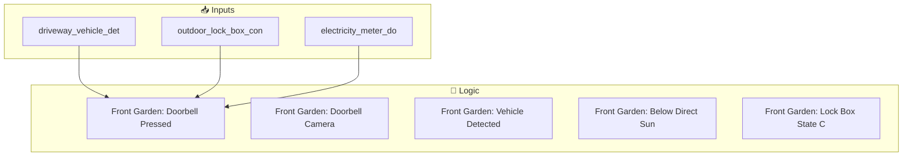
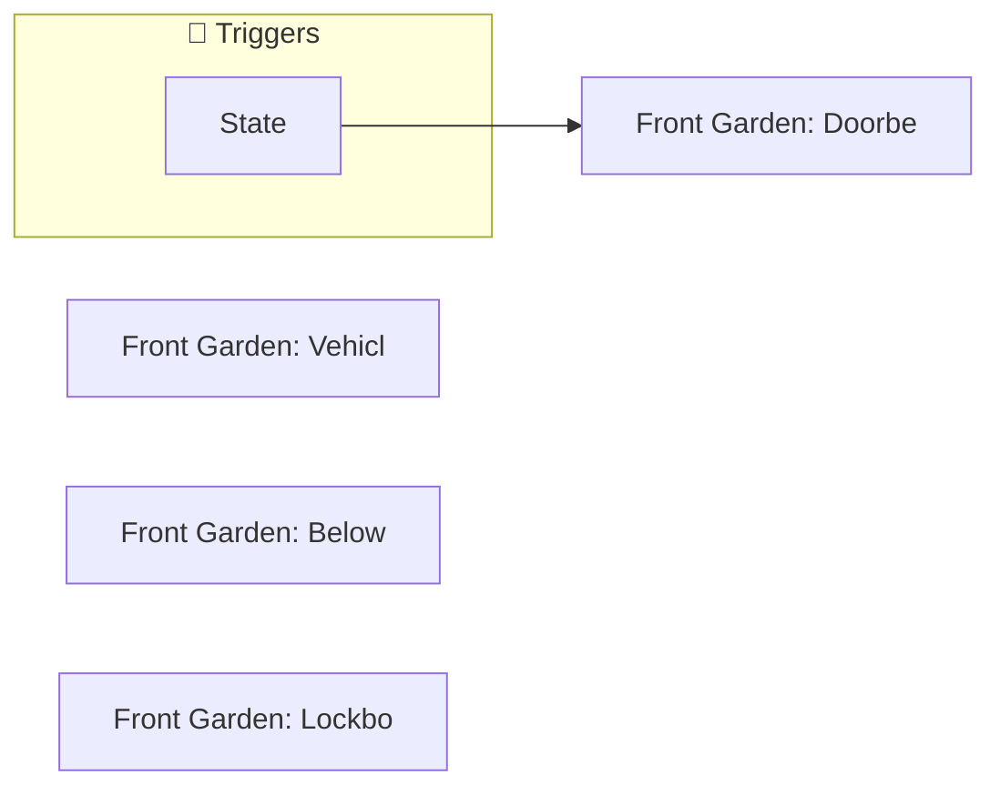
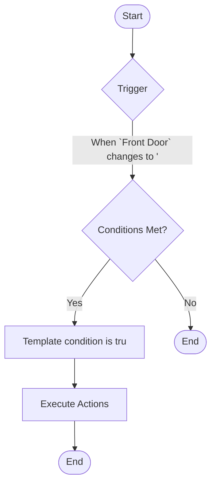
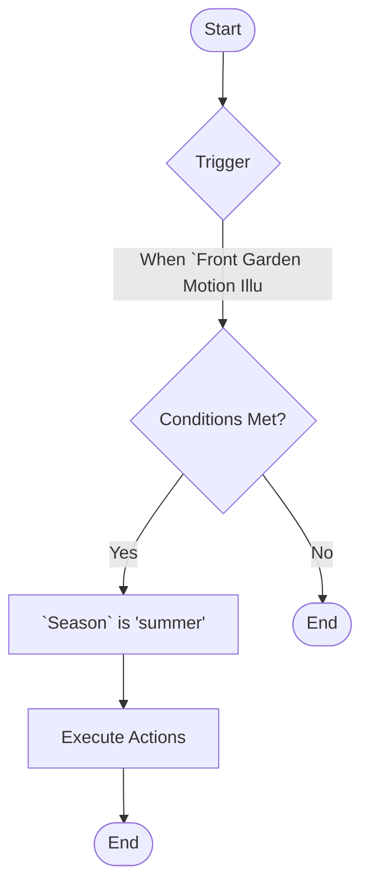

[<- Back to Rooms README](../README.md) · [Packages README](../../README.md) · [Main README](../../../README.md)

# Front Garden

This package manages 7 automations and 0 scripts for front garden.

---

## Table of Contents

- [Overview](#overview)
- [Purpose](#purpose)
- [Dependencies](#dependencies)
- [How It Works](#how-it-works)
- [Automations](#automations)
- [Entities](#entities)
- [Troubleshooting](#troubleshooting)
- [Related Files](#related-files)
- [Notes](#notes)

---

## Overview

This package provides automation for **front garden**. It includes 7 automations and 0 scripts.

### File Structure

```
packages/rooms/
├── front_garden.yaml  # Main package configuration
└── README.md                           # This documentation
```

---

## Purpose

- **Front Garden: Doorbell Pressed**: 
- **Front Garden: Doorbell Camera Updated**: 
- **Front Garden: Vehicle Detected On Driveway**: 
- **Front Garden: Below Direct Sun Light**: 
- **Front Garden: Lock Box State Changed**: 

### Package Architecture

The following diagram shows the high-level flow of this package:



---

## Dependencies

This package depends on the following components:

### Related Packages

- Front Garden

---

## How It Works

This section explains the overall behavior and logic of the package.

### Automation Logic

**Front Garden: Doorbell Pressed**
Triggered when: When `Front Door Ding` state changes

**Front Garden: Doorbell Camera Updated**
Triggered when: When `Front Door` changes to 'unavailable'

**Front Garden: Vehicle Detected On Driveway**
Triggered when: When `Driveway Vehicle Detected` changes from 'off' to 'on'

*... plus 4 additional automations. See [Automations](#automations) section for details.*

### Workflow Diagram

The following diagram illustrates the automation flow:



---

## Automations

Detailed documentation for each automation in this package.

### Front Garden: Doorbell Pressed

**Automation ID:** `1694521590171`

#### Trigger

- When `Front Door Ding` state changes

#### Actions

1. Execute actions in parallel

### Front Garden: Doorbell Camera Updated

**Automation ID:** `1621070004545`

#### Trigger

- When `Front Door` changes to 'unavailable'

#### Conditions

All conditions must be met for the automation to execute:

- Template condition is true

#### Actions

- *See YAML for action details*

#### Flow Diagram



### Front Garden: Vehicle Detected On Driveway

**Automation ID:** `1720276673719`

#### Trigger

- When `Driveway Vehicle Detected` changes from 'off' to 'on'

#### Actions

- *See YAML for action details*

### Front Garden: Below Direct Sun Light

**Automation ID:** `1660894232444`

#### Trigger

- When `Front Garden Motion Illuminance` drops below input_number.close_blinds_brightness_threshold

#### Conditions

All conditions must be met for the automation to execute:

- `Season` is 'summer'

#### Actions

- *See YAML for action details*

#### Flow Diagram



### Front Garden: Lock Box State Changed

**Automation ID:** `1714914120928`

#### Trigger

- When `Outdoor Lock Box Contact` changes from '- ' to '- '

#### Actions

- *See YAML for action details*

### Front Garden: Lockbox Sensor Disconnected

**Automation ID:** `1718364408150`

#### Trigger

- When `Outdoor Lock Box Contact` changes to 'unavailable'

#### Actions

- *See YAML for action details*

### Front Garden: Electricity Meter Door Opened

**Automation ID:** `1761115884229`

#### Trigger

- When `Electricity Meter Door Contact` changes to 'on'

#### Actions

- *See YAML for action details*

---

## Entities

Key entities used or created by this package.

### Referenced Entities

- `event.front_door_ding`
- `person.danny`
- `person.terina`
- `action: script.alexa_announce`
- `todo.shared_notifications`
- `camera.front_door`
- `binary_sensor.driveway_vehicle_detected`
- `binary_sensor.outdoor_lock_box_contact`
- `binary_sensor.electricity_meter_door_contact`

---

## Troubleshooting

Common issues and how to resolve them.

### Automation Issues

| Issue | Possible Cause | Resolution |
|-------|---------------|------------|
| Automation not triggering | Entity unavailable or condition not met | Check entity states in Developer Tools |
| Automation fires unexpectedly | Trigger too broad or condition missing | Review trigger entity and add conditions |
| Actions not executing | Service call invalid or entity offline | Verify service and entity in YAML |

### General Debugging

1. Check Home Assistant logs for errors
2. Verify all referenced entities exist in Developer Tools
3. Test automations manually using the 'Run' button
4. Review traces for executed automations to see execution path

---

## Related Files

| File | Description |
|------|-------------|
| [`packages/rooms/front_garden.yaml`](./front_garden.yaml) | Main package YAML configuration |
| [Rooms Overview](../README.md) | Overview of all room packages |
| [Main Packages README](../../README.md) | Architecture and organization guidelines |

---

## Notes

### Design Decisions

- **Front Garden: Vehicle Detected On Driveway** triggers on state transitions (edge detection) rather than continuous state
- **Front Garden: Lock Box State Changed** triggers on state transitions (edge detection) rather than continuous state
- Uses ambient light sensors for adaptive lighting that responds to natural light conditions

---

*Last updated: 2026-04-09*
