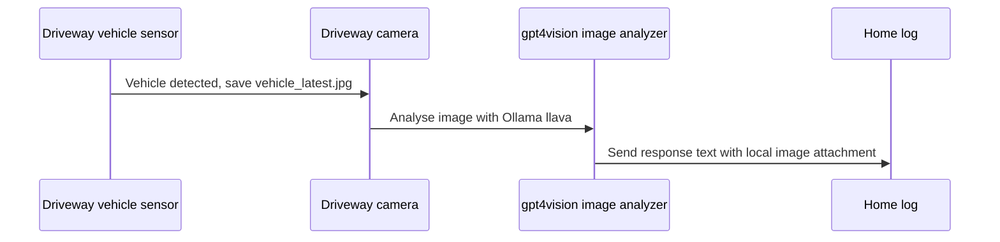

[<- Back to Rooms README](README.md) · [Packages README](../README.md) · [Main README](../../README.md)

# Front Garden Package Documentation

The front garden package watches driveway vehicles, outdoor lockbox state, electricity meter door access, and front-garden brightness. It can analyse a driveway snapshot for Tesco van detection, reopen selected blinds when direct sunlight drops in summer, and capture evidence when the electricity meter door opens.

## Quick Summary

For non-technical users, the important behavior is:

| Area | What Happens |
|------|--------------|
| Driveway vehicle | A detected driveway vehicle triggers a snapshot, local AI image analysis, and a home-log entry with the image attached. |
| Sunlight and blinds | In summer, if front-garden brightness stays below the configured threshold for 10 minutes, office blinds move to 25% and some bedroom blinds may reopen. |
| Lockbox | Lockbox state changes notify Danny and Terina; a 5-minute unavailable state notifies Danny. |
| Electricity meter | Opening the meter door captures a driveway image, sends a high-priority direct notification, and logs with the image attached. |
| Doorbell footage helper | A shell command exists to copy the latest front-door video, but no automation in this YAML calls it. |

## Package Contents

| File | Purpose | Contents |
|------|---------|----------|
| `front_garden.yaml` | Driveway AI, sunlight blind helper, lockbox and meter-door monitoring | 5 automations, 1 shell command |

## How The Front Garden Decides What To Do

```mermaid
flowchart TB
    Vehicle[binary_sensor.driveway_vehicle_detected] --> VehicleAuto[Vehicle Detected On Driveway]
    DrivewayCam[camera.driveway_high_resolution_channel] --> VehicleAuto
    VehiclePath[input_text.driveway_vehicle_latest_image_path] --> VehicleAuto
    Light[sensor.front_garden_motion_illuminance] --> Sunlight[Below Direct Sun Light]
    Season[sensor.season] --> Sunlight
    BrightThreshold[input_number.close_blinds_brightness_threshold] --> Sunlight
    Lockbox[binary_sensor.outdoor_lock_box_contact] --> LockboxAuto[Lock Box State Changed]
    Lockbox --> Offline[Lockbox Sensor Disconnected]
    MeterDoor[binary_sensor.electricity_meter_door_contact] --> MeterAuto[Electricity Meter Door Opened]
    CameraPath[input_text.camera_external_folder_path] --> MeterAuto

    VehicleAuto --> AI[gpt4vision.image_analyzer]
    VehicleAuto --> LogImage[Home log with image]
    Sunlight --> OfficeBlinds[cover.office_blinds]
    Sunlight --> BedroomBlinds[cover.bedroom_blinds]
    Sunlight --> AshleeBlinds[cover.ashlees_bedroom_blinds]
    LockboxAuto --> Notify[Direct notification]
    Offline --> Notify
    MeterAuto --> Notify
    MeterAuto --> LogImage
```

## User Controls

| Entity | Plain-English Purpose |
|--------|-----------------------|
| `input_text.driveway_vehicle_latest_image_path` | Folder used for the latest driveway vehicle snapshot. |
| `input_text.camera_external_folder_path` | Base folder used for timestamped driveway snapshots when the meter door opens. |
| `input_text.camera_internal_folder_path` | Base folder used by the doorbell footage copy shell command. |
| `input_number.close_blinds_brightness_threshold` | Brightness threshold for the summer blind helper. |
| `input_number.blind_closed_position_threshold` | Blind-position threshold used before opening bedroom blinds. |
| `input_datetime.childrens_bed_time` | Cutoff time for opening Ashlee's bedroom blinds. |

## Everyday Behavior

### Driveway Vehicle AI

`Front Garden: Vehicle Detected On Driveway` triggers when `binary_sensor.driveway_vehicle_detected` changes from `off` to `on`.

| Step | Detail |
|------|--------|
| Snapshot | Saves `vehicle_latest.jpg` under `input_text.driveway_vehicle_latest_image_path`. |
| AI analysis | Uses provider `Ollama`, model `llava`, target width `3840`, high detail, temperature `0.1`. |
| Prompt | Asks whether there is a Tesco van and to ignore other vehicles. |
| Result | Sends `ai.response_text` to `script.send_home_log_with_local_attachments` with the image attached for Danny. |

### Summer Sunlight Blind Helper

`Front Garden: Below Direct Sun Light` triggers when `sensor.front_garden_motion_illuminance` stays below `input_number.close_blinds_brightness_threshold` for 10 minutes and `sensor.season` is `summer`.

| Blind | Condition | Action |
|-------|-----------|--------|
| Office | Summer brightness trigger fires | Set `cover.office_blinds` to position `25`. |
| Bedroom | `cover.bedroom_blinds` current position is below `input_number.blind_closed_position_threshold`, before sunset, and `binary_sensor.bedroom_tv_powered_on` is `off` | Open `cover.bedroom_blinds`. |
| Ashlee's bedroom | `cover.ashlees_bedroom_blinds` current position is below `input_number.blind_closed_position_threshold` and current time is before `input_datetime.childrens_bed_time` | Open `cover.ashlees_bedroom_blinds`. |

### Lockbox Monitoring

| Automation | Trigger | Result |
|------------|---------|--------|
| `Front Garden: Lock Box State Changed` | Lockbox contact changes between known states, or becomes `unknown`/`unavailable` for 1 minute | Sends Danny and Terina a direct notification with the current lockbox state. |
| `Front Garden: Lockbox Sensor Disconnected` | Lockbox contact is `unavailable` for 5 minutes | Sends Danny a direct notification. |

### Electricity Meter Door

When `binary_sensor.electricity_meter_door_contact` turns `on`, `Front Garden: Electricity Meter Door Opened`:

| Step | Result |
|------|--------|
| 1 | Builds a timestamped `.jpg` filename. |
| 2 | Captures `camera.driveway_high_resolution_channel` into `input_text.camera_external_folder_path` under `/driveway/`. |
| 3 | Sends Danny and Terina a high-priority direct notification with quiet-hour suppression enabled. |
| 4 | Sends a home-log entry with the local image attachment and quiet-hour suppression disabled. |

## Shell Command

| Command | Purpose |
|---------|---------|
| `shell_command.copy_doorbell_footage` | Copies `front_door/latest.mp4` under `input_text.camera_internal_folder_path` to a timestamped filename using `camera.front_door` friendly name. |

Power-user note: this shell command is defined in the package, but no automation in `front_garden.yaml` calls it.

## Power-User Details

| Automation | ID | Mode | Notes |
|------------|----|------|-------|
| `Front Garden: Vehicle Detected On Driveway` | `1720276673719` | `single` | Uses `response_variable: ai` from `gpt4vision.image_analyzer`. |
| `Front Garden: Below Direct Sun Light` | `1660894232444` | `single` | Has a summer-only condition. |
| `Front Garden: Lock Box State Changed` | `1714914120928` | `single` | Handles both known-state changes and 1-minute unknown/unavailable state. |
| `Front Garden: Lockbox Sensor Disconnected` | `1718364408150` | `single` | Danny-only notification after 5 minutes unavailable. |
| `Front Garden: Electricity Meter Door Opened` | `1761115884229` | `single` | Captures snapshot before notification and logging. |

## Entity Reference

| Entity | Purpose |
|--------|---------|
| `binary_sensor.driveway_vehicle_detected` | Vehicle-detection trigger. |
| `camera.driveway_high_resolution_channel` | Driveway camera used for vehicle and meter-door snapshots. |
| `sensor.front_garden_motion_illuminance` | Front-garden brightness sensor. |
| `sensor.season` | Summer-only condition for the blind helper. |
| `binary_sensor.outdoor_lock_box_contact` | Lockbox contact and availability state. |
| `binary_sensor.electricity_meter_door_contact` | Electricity meter door contact. |
| `binary_sensor.bedroom_tv_powered_on` | Prevents bedroom blinds opening while bedroom TV is on. |
| `cover.office_blinds` | Set to 25% by summer sunlight helper. |
| `cover.bedroom_blinds` | Opened conditionally by summer sunlight helper. |
| `cover.ashlees_bedroom_blinds` | Opened conditionally before children's bedtime. |
| `camera.front_door` | Referenced by the shell command filename. |

## Troubleshooting

| Issue | Check |
|-------|-------|
| Vehicle AI result missing | Check `binary_sensor.driveway_vehicle_detected`, driveway camera availability, the image path helper, and Ollama/LLaVA availability. |
| Blinds did not reopen | Check `sensor.season` is `summer`, brightness stayed below threshold for 10 minutes, and each blind-specific condition is true. |
| Lockbox notifications repeat or look odd | Check whether `binary_sensor.outdoor_lock_box_contact` is moving through `unknown` or `unavailable`. |
| Meter-door image missing | Check `input_text.camera_external_folder_path`, the `/driveway/` folder, and `camera.driveway_high_resolution_channel`. |
| Doorbell footage was not copied | No automation calls `shell_command.copy_doorbell_footage`; run or wire it separately if needed. |
