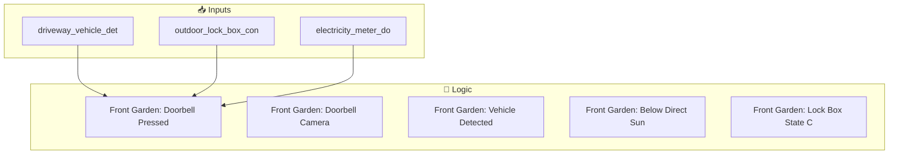

[<- Back to Rooms README](../README.md) · [Packages README](../../README.md) · [Main README](../../../README.md)

# Front Garden Package Documentation

This package manages front garden automation including 7 automations and 0 scripts.

---

## Table of Contents

- [Overview](#overview)
- [Design Decisions](#design-decisions)
- [Dependencies](#dependencies)
- [Automations](#automations)
- [Entity Reference](#entity-reference)

---

## Overview

The front garden automation system provides intelligent control and monitoring.



### File Structure

```
packages/rooms/
├── front_garden.yaml      # Main package file
└── README.md             # This documentation
```

---

## Design Decisions

Key architectural decisions captured from the YAML configuration:

- **Front Garden: Vehicle Detected On Driveway** triggers on state transitions (edge detection) rather than continuous state
- **Front Garden: Lock Box State Changed** triggers on state transitions (edge detection) rather than continuous state
- Uses ambient light sensors for adaptive lighting that responds to natural light conditions

---

## Dependencies

This package relies on the following components:

### Related Packages

- Front Garden

---

## Automations

### Front Garden: Doorbell Pressed
**ID:** `1694521590171`

**Triggers:**
- When `Front Door Ding` state changes

**Actions:**
- Execute actions in parallel

### Front Garden: Doorbell Camera Updated
**ID:** `1621070004545`

**Triggers:**
- When `Front Door` changes to 'unavailable'

**Conditions:**
- Template condition is true

**Actions:**
- *See YAML for action details*

### Front Garden: Vehicle Detected On Driveway
**ID:** `1720276673719`

**Triggers:**
- When `Driveway Vehicle Detected` changes from 'off' to 'on'

**Actions:**
- *See YAML for action details*

### Front Garden: Below Direct Sun Light
**ID:** `1660894232444`

**Triggers:**
- When `Front Garden Motion Illuminance` drops below input_number.close_blinds_brightness_threshold

**Conditions:**
- `Season` is 'summer'

**Actions:**
- *See YAML for action details*

### Front Garden: Lock Box State Changed
**ID:** `1714914120928`

**Triggers:**
- When `Outdoor Lock Box Contact` changes from '- ' to '- '

**Actions:**
- *See YAML for action details*

### Front Garden: Lockbox Sensor Disconnected
**ID:** `1718364408150`

**Triggers:**
- When `Outdoor Lock Box Contact` changes to 'unavailable'

**Actions:**
- *See YAML for action details*

### Front Garden: Electricity Meter Door Opened
**ID:** `1761115884229`

**Triggers:**
- When `Electricity Meter Door Contact` changes to 'on'

**Actions:**
- *See YAML for action details*

---

## Entity Reference

### Referenced Entities

- `event.front_door_ding`
- `person.danny`
- `person.terina`
- `action: script.alexa_announce`
- `todo.shared_notifications`
- `camera.front_door`
- `binary_sensor.driveway_vehicle_detected`
- `binary_sensor.outdoor_lock_box_contact`
- `binary_sensor.electricity_meter_door_contact`

---

## Related Documentation

| Document | Purpose |
|----------|---------|
| [Rooms Overview](../README.md) | Overview of all room packages |
| [Main Packages README](../../README.md) | Architecture and organization guidelines |

---

## Maintenance Notes

### Troubleshooting

| Issue | Check |
|-------|-------|
| Automation not triggering | Entity states and conditions |
| Script failing | Service calls and entity availability |

*Last updated: 2026-04-08*
