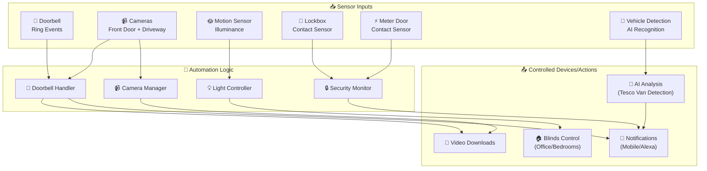
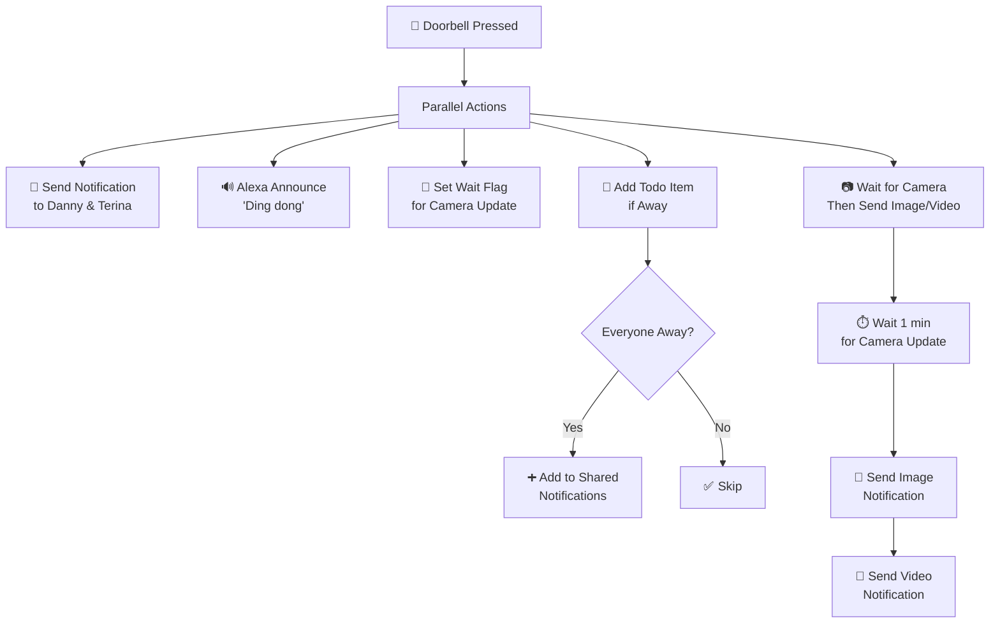
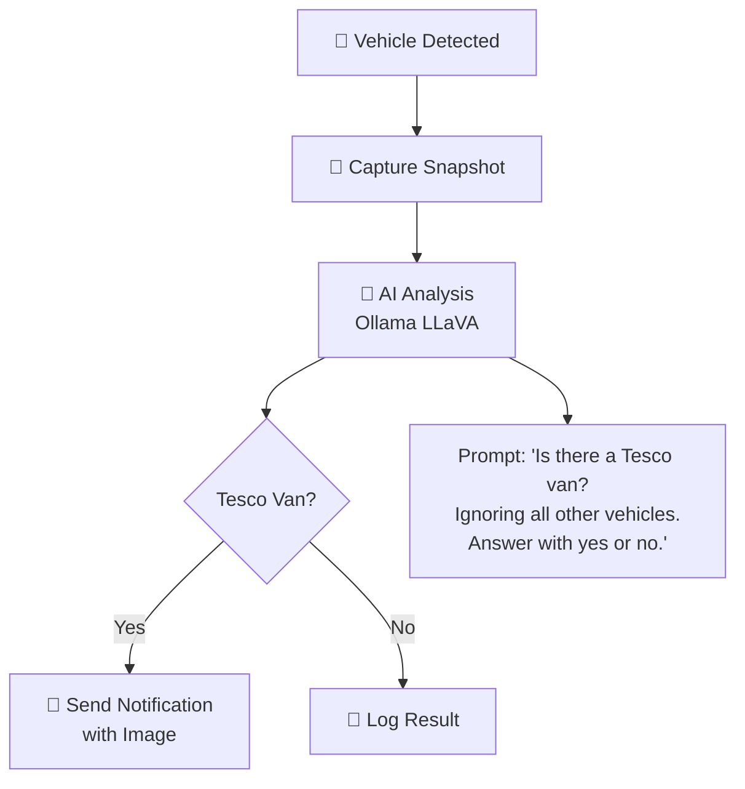
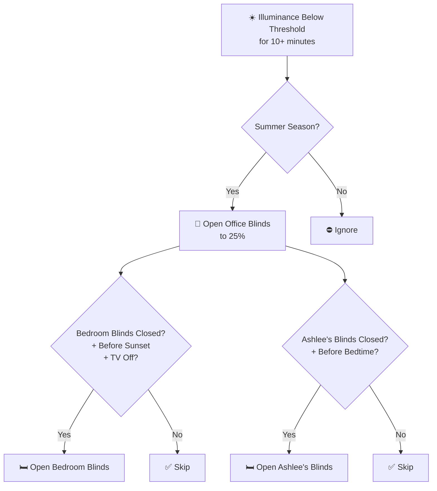
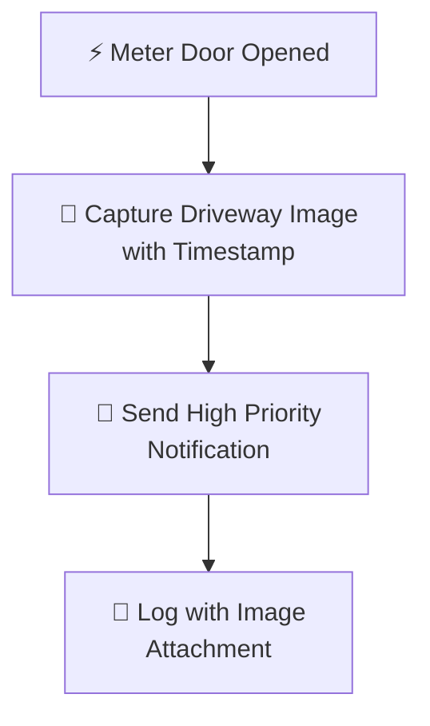
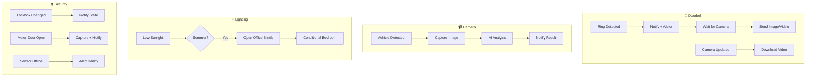

# Front Garden Package Documentation

This package manages front garden automation including doorbell notifications, camera monitoring, lighting control based on sunlight, lockbox security, and electricity meter monitoring.

---

## Table of Contents

- [Overview](#overview)
- [Design Decisions](#design-decisions)
- [Dependencies](#dependencies)
- [Architecture](#architecture)
## Overview

The front garden automation system provides intelligent doorbell notifications with camera capture, vehicle detection on the driveway, sunlight-based blind control, lockbox security monitoring, and electricity meter door surveillance.



---

## Design Decisions

Key architectural decisions captured from the YAML configuration:

- **Front Garden: Vehicle Detected On Driveway** triggers on state transitions (edge detection) rather than continuous state
- **Front Garden: Lock Box State Changed** triggers on state transitions (edge detection) rather than continuous state
- Uses ambient light sensors for adaptive lighting that responds to natural light conditions

---

## Dependencies

This package relies on the following components:

### Related Packages
- Front Garden

---

## Architecture

### File Structure

```
packages/rooms/front_garden/
├── front_garden.yaml     # Main package file
└── README.md             # This documentation
```

### Key Components

| Component | Purpose |
|-----------|---------|
| `event.front_door_ding` | Doorbell ring events |
| `camera.front_door` | Front door camera with video capture |
| `camera.driveway_high_resolution_channel` | Driveway camera for vehicle detection |
| `binary_sensor.driveway_vehicle_detected` | AI-based vehicle detection |
| `sensor.front_garden_motion_illuminance` | Sunlight level monitoring |
| `binary_sensor.outdoor_lock_box_contact` | Lockbox open/close monitoring |
| `binary_sensor.electricity_meter_door_contact` | Meter door security |

---

## Automations

### Doorbell

#### Front Garden: Doorbell Pressed
**ID:** `1694521590171`

Comprehensive doorbell handling with multi-channel notifications and camera capture.



**Triggers:**
- `event.front_door_ding` state change

**Actions:**
1. **Parallel notifications:**
   - Send direct notification to Danny and Terina
   - Alexa announcement ("Ding dong")
   - Set `input_boolean.wait_for_doorbell_camera_update` to on
   - Add todo item if nobody is home (prevents duplicates)
   - Wait for camera update and send image/video

**Todo Item Logic:**
- Only adds if `group.tracked_people` is `not_home`
- Checks for existing todo item to prevent duplicates
- Item: "🚪 🔔 Someone rung the door bell."

---

#### Front Garden: Doorbell Camera Updated
**ID:** `1621070004545`

Automatically downloads doorbell footage when camera updates.

**Triggers:**
- `camera.front_door` state change (not to `unavailable`)

**Conditions:**
- `last_video_id` attribute differs from stored `input_text.doorbell_last_video_id`

**Actions:**
1. Downloads latest video to `/front_door/latest.mp4`
2. Uses `downloader.download_file` service

**Note:** Shell command for archiving is commented out due to a Home Assistant bug (see [issue #21599](https://github.com/home-assistant/home-assistant.io/issues/21599))

---

### Camera

#### Front Garden: Vehicle Detected On Driveway
**ID:** `1720276673719`

AI-powered vehicle detection with Tesco van recognition.



**Triggers:**
- `binary_sensor.driveway_vehicle_detected` changes from `off` to `on`

**Actions:**
1. Capture snapshot from `camera.driveway_high_resolution_channel`
2. Save to configured path: `vehicle_latest.jpg`
3. Send image to Ollama LLaVA for analysis
4. Send notification with AI response and image attachment

**AI Configuration:**
| Parameter | Value |
|-----------|-------|
| Provider | Ollama |
| Model | llava |
| Max Tokens | 100 |
| Target Width | 3840 |
| Detail | high |
| Temperature | 0.1 |

---

### Lighting

#### Front Garden: Below Direct Sun Light
**ID:** `1660894232444`

Smart blind control based on sunlight levels during summer.



**Triggers:**
- `sensor.front_garden_motion_illuminance` below `input_number.close_blinds_brightness_threshold` for 10 minutes

**Conditions:**
- Season must be "summer"

**Actions:**
1. Log the sunlight level change
2. Set office blinds to 25% position
3. Open bedroom blinds if:
   - Currently below closed threshold
   - Before sunset
   - Bedroom TV is off
4. Open Ashlee's bedroom blinds if:
   - Currently below closed threshold
   - Before children's bedtime (`input_datetime.childrens_bed_time`)

---

### Lockbox

#### Front Garden: Lock Box State Changed
**ID:** `1714914120928`

Monitors outdoor lockbox for access events.

**Triggers:**
- `binary_sensor.outdoor_lock_box_contact` state changes (excluding `unknown`/`unavailable`)
- State becomes `unknown`/`unavailable` for 1 minute

**Actions:**
- Send direct notification to Danny and Terina with current state

---

#### Front Garden: Lockbox Sensor Disconnected
**ID:** `1718364408150`

Alerts when lockbox sensor goes offline.

**Triggers:**
- `binary_sensor.outdoor_lock_box_contact` becomes `unavailable` for 5 minutes

**Actions:**
- Send direct notification to Danny

---

### Electricity Meter

#### Front Garden: Electricity Meter Door Opened
**ID:** `1761115884229`

Security monitoring for electricity meter access.



**Triggers:**
- `binary_sensor.electricity_meter_door_contact` changes to `on`

**Actions:**
1. Generate timestamped filename
2. Capture snapshot from driveway camera
3. Send high-priority notification (respects quiet hours)
4. Log to home log with image attachment

---

## Shell Commands

### copy_doorbell_footage

Copies the latest doorbell video with a timestamped filename.

```yaml
copy_doorbell_footage: >-
  cp {{ states('input_text.camera_internal_folder_path') }}'/front_door/latest.mp4'
  {{ states('input_text.camera_internal_folder_path') }}'/front_door/'{{ state_attr('camera.front_door', 'friendly_name') }}_{{ as_timestamp(now())|timestamp_custom('%Y-%m-%d_%H%M%S') }}'.mp4'
```

**Status:** Currently commented out in automations due to Home Assistant bug

---

## Entity Reference

### Cameras

| Entity | Purpose |
|--------|---------|
| `camera.front_door` | Front door video doorbell |
| `camera.driveway_high_resolution_channel` | Driveway surveillance camera |

### Binary Sensors

| Entity | Purpose |
|--------|---------|
| `binary_sensor.driveway_vehicle_detected` | AI vehicle detection trigger |
| `binary_sensor.outdoor_lock_box_contact` | Lockbox open/close state |
| `binary_sensor.electricity_meter_door_contact` | Meter door open/close state |

### Sensors

| Entity | Purpose |
|--------|---------|
| `sensor.front_garden_motion_illuminance` | Outdoor light level for blind control |
| `sensor.season` | Current season for lighting logic |

### Events

| Entity | Purpose |
|--------|---------|
| `event.front_door_ding` | Doorbell ring events |

### Input Helpers (Referenced)

| Entity | Purpose |
|--------|---------|
| `input_number.close_blinds_brightness_threshold` | Sunlight threshold for blind control |
| `input_number.blind_closed_position_threshold` | Position threshold for "closed" state |
| `input_datetime.childrens_bed_time` | Bedtime limit for children's blinds |
| `input_text.doorbell_last_video_id` | Tracks last downloaded video |
| `input_text.driveway_vehicle_latest_image_path` | Path for vehicle snapshots |
| `input_text.camera_external_folder_path` | External storage path for camera images |
| `input_text.camera_internal_folder_path` | Internal storage path for camera videos |
| `input_boolean.wait_for_doorbell_camera_update` | Flag for doorbell camera sync |

### Scripts (Called)

| Script | Purpose |
|--------|---------|
| `script.send_direct_notification` | Send mobile notifications |
| `script.send_direct_notification_with_url` | Send notifications with media URLs |
| `script.send_to_home_log` | Log events to home log |
| `script.send_home_log_with_local_attachments` | Log with image attachments |
| `script.alexa_announce` | Voice announcements via Alexa |

### Covers (Controlled)

| Entity | Purpose |
|--------|---------|
| `cover.office_blinds` | Office window blinds |
| `cover.bedroom_blinds` | Master bedroom blinds |
| `cover.ashlees_bedroom_blinds` | Ashlee's bedroom blinds |

### Group (Referenced)

| Entity | Purpose |
|--------|---------|
| `group.tracked_people` | Combined presence for home/away detection |

---

## Configuration

### Required Input Helpers

Ensure these input helpers are configured in your Home Assistant instance:

```yaml
# Thresholds
input_number:
  close_blinds_brightness_threshold:
    name: Close Blinds Brightness Threshold
    min: 0
    max: 100000
    unit_of_measurement: lx

  blind_closed_position_threshold:
    name: Blind Closed Position Threshold
    min: 0
    max: 100
    unit_of_measurement: '%'

# Paths
input_text:
  doorbell_last_video_id:
    name: Doorbell Last Video ID
    max: 255

  driveway_vehicle_latest_image_path:
    name: Driveway Vehicle Latest Image Path
    max: 255

  camera_external_folder_path:
    name: Camera External Folder Path
    max: 255

  camera_internal_folder_path:
    name: Camera Internal Folder Path
    max: 255

# Flags
input_boolean:
  wait_for_doorbell_camera_update:
    name: Wait For Doorbell Camera Update

# Times
input_datetime:
  childrens_bed_time:
    name: Children's Bed Time
    has_time: true
```

### Integration Dependencies

| Integration | Purpose |
|-------------|---------|
| Downloader | Video file downloads |
| Ollama/GPT4Vision | AI image analysis |
| Alexa | Voice announcements |
| Todoist | Shared notifications list |

---

## Automation Flow Summary



---

## Related Documentation

| Document | Purpose |
|----------|---------|
| [Rooms Overview](README.md) | Overview of all room packages |
| [Main Packages README](../README.md) | Architecture and organization guidelines |

### Related Rooms

| Room | Connection |
|------|------------|
| [Office](../office/README.md) | Blind control integration |
| [Bedroom](../bedroom/README.md) | Blind control integration |

### Related Integrations

| Integration | Connection |
|-------------|------------|
| [Energy](../../integrations/energy/README.md) | Electricity meter monitoring |

---

## Maintenance Notes

### Troubleshooting

| Issue | Check |
|-------|-------|
| Doorbell notifications not working | `event.front_door_ding` entity availability |
| Camera not capturing | Camera entity state and `last_video_id` attribute |
| AI analysis failing | Ollama service availability and LLaVA model |
| Blinds not responding | Illuminance sensor and season sensor states |
| Lockbox alerts missing | Sensor battery and connectivity |

### Seasonal Considerations

- **Summer:** Blind automation active based on sunlight
- **Winter:** Blind automation disabled (manual control recommended)
- Adjust `close_blinds_brightness_threshold` based on seasonal light patterns

---

*Last updated: 2026-04-05*
