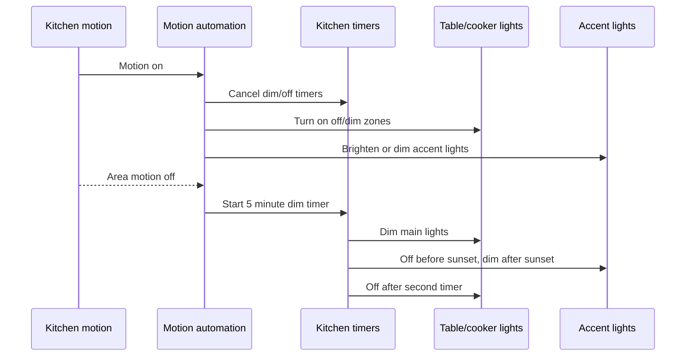

# Kitchen Setup Documentation

[<- Kitchen README](README.md) · [Rooms README](../README.md)

The kitchen setup is centered on two lighting zones, accent/RGB feedback lights, appliance power monitoring, fridge/freezer door contacts, and safety notifications.

## Device Inventory

| Category | Entity | Purpose |
|----------|--------|---------|
| Main lighting | `light.kitchen_table_white`, `light.kitchen_cooker_white`, `light.kitchen_lights` | Table/cooker task lighting and grouped main lights. |
| Accent/RGB lighting | `light.kitchen_cabinets`, `light.kitchen_down_lights`, `light.kitchen_draws`, `light.kitchen_cooker_rgb`, `light.kitchen_table_rgb`, `light.kitchen_ambient_lights`, `light.kitchen_accent_lights` | Accent lighting, door notifications, and energy-status signals. |
| Motion | `binary_sensor.kitchen_area_motion`, `binary_sensor.kitchen_motion_ld2412_presence`, `binary_sensor.kitchen_motion_ld2450_presence`, `binary_sensor.kitchen_motion_2_occupancy` | Motion/presence inputs for lighting. |
| Light level | `sensor.kitchen_motion_ltr390_light`, `sensor.kitchen_motion_2_illuminance` | Logged in lighting decisions. |
| Switch inputs | `binary_sensor.kitchen_cooker_light_input`, `binary_sensor.kitchen_table_light_input` | Physical switch toggles for cooker and table lights. |
| Fridge/freezer | `binary_sensor.kitchen_fridge_door_contact`, `binary_sensor.kitchen_freezer_door_contact`, `switch.ecoflow_kitchen_plug`, `sensor.ecoflow_kitchen_ac_out_power` | Door monitoring and fridge/freezer power availability/running state. |
| Oven | `sensor.oven_channel_1_power`, `binary_sensor.oven_powered_on`, `input_boolean.oven_preheated` | Preheat and long-on detection. |
| Dishwasher | `sensor.dishwasher_switch_0_power`, `binary_sensor.dishwasher_powered_on`, `sensor.dishwasher_tablet_stock`, `input_boolean.dishwasher_cycle_in_progress`, `input_boolean.dishwasher_clean_cycle` | Cycle tracking and tablet inventory. |
| Water softener | `sensor.water_softener_salt_level_average`, `input_number.low_water_softener_salt_level`, `input_number.no_water_softener_salt_level` | Salt warning and critical alerts. |
| Safety | `binary_sensor.kitchen_smoke_alarm_smoke`, `camera.kitchen_high_resolution_channel`, `timer.check_smoke_alarms` | Smoke-alarm snapshot, alerts, and follow-up timer. |
| Energy | `sensor.grid_power`, `sensor.growatt_sph_battery_state_of_charge`, `sensor.growatt_sph_inverter_mode`, `sensor.growatt_battery_discharge_power`, `input_number.growatt_battery_discharge_stop_soc` | Determines whether to show grid-use RGB feedback. |
| Cooking probe | `sensor.meater_probe_cook_state`, `sensor.meater_probe_target`, `sensor.meater_probe_internal`, `sensor.meater_probe_cooking` | MEATER cooking logs. |

## Lighting Setup

Important lighting entities:

| Entity | Use |
|--------|-----|
| `scene.kitchen_table_lights_on` | Turns table white light on at brightness 200. |
| `scene.kitchen_cooker_lights_on` | Turns cooker white light on at brightness 200. |
| `scene.kitchen_main_lights_dim` | Dims table and cooker white lights to brightness 10. |
| `scene.kitchen_main_lights_off` | Turns table and cooker white lights off. |
| `scene.kitchen_dim_accent_lights` | Low warm accent lighting. |
| `scene.kitchen_ambient_lights_dim` | Low ambient lighting after sunset. |
| `scene.kitchen_ambient_lights_off` | Turns grouped ambient lights off. |

## Appliance Setup

| Appliance | Setup Notes |
|-----------|-------------|
| Fridge/freezer | Door contacts must report `off` closed and `on` open. EcoFlow plug unavailability for 2 minutes is treated as a fault. |
| Oven | Preheat is inferred when `sensor.oven_channel_1_power` drops below 100 W while `input_boolean.oven_preheated` is off. The oven is considered powered when template power is at least 14 W. |
| Dishwasher | The template sensor turns on when power is above 3 W for 1 minute and off when below 4 W for 20 seconds. The cycle helper is reset after the dishwasher has been off for 31 minutes. |
| Kettle | Boiled state is detected when `sensor.kettle_status` changes from `heating` to `standby`. |
| Water softener | The salt sensor is distance-style: larger values mean lower salt, so alert templates compare with `>=` thresholds. |

## Maintenance Checks

| Check | Why |
|------|-----|
| Trigger each motion sensor in Developer Tools | Confirms all four sensors can start lighting. |
| Open fridge and freezer doors for a short test | Confirms contact polarity and logging. |
| Watch dishwasher power during a run | Confirms the 3 W and 4 W thresholds still match the appliance. |
| Watch oven power during preheat | Confirms the below-100 W preheat drop is still reliable. |
| Test smoke alarm path carefully | Confirms camera snapshot path and notification services. |
| Review `sensor.dishwasher_tablet_stock` after a run | Confirms stock API/update still works. |

## Troubleshooting

| Problem | Likely Cause |
|---------|--------------|
| Motion lights do not turn on | `input_boolean.enable_kitchen_motion_triggers` is off, or all relevant lights are already above the automation thresholds. |
| No-motion lights shut down too soon | Check whether `binary_sensor.kitchen_area_motion` is clearing while mmWave sensors still show presence; the timer starts from the area motion sensor. |
| Fridge/freezer alert repeats | A door contact may be stuck `on`, or the EcoFlow kitchen plug may be unavailable. |
| Oven preheat alert fires at the wrong time | Re-check the oven power curve and adjust the YAML threshold separately; this document does not change YAML. |
| Dishwasher completion delayed | Current reset waits for `binary_sensor.dishwasher_powered_on` to stay off for 31 minutes. |
| RGB grid indicator appears unexpectedly | Check grid import, battery state of charge, battery discharge power, and inverter mode conditions together. |
