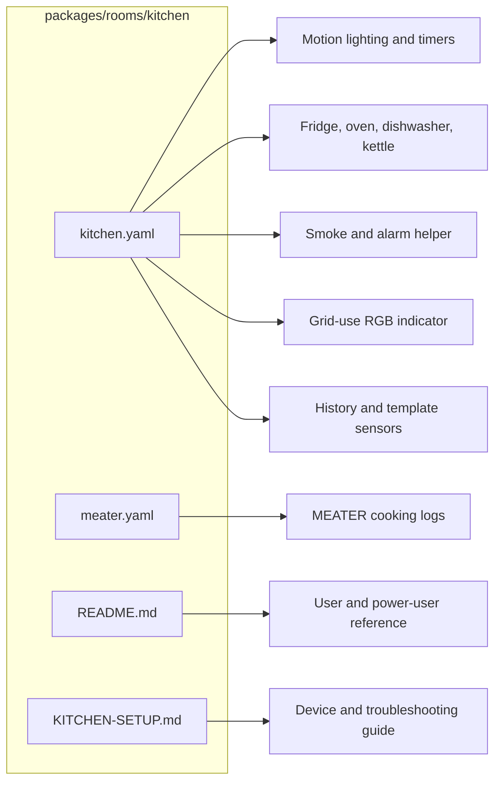
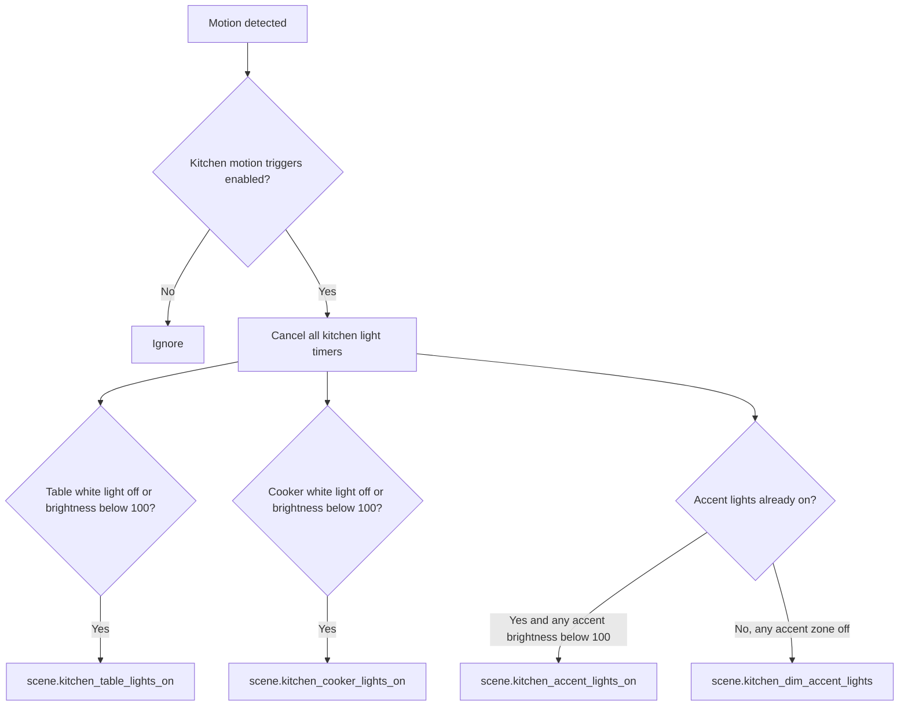

[<- Back to Rooms README](../README.md) · [Packages README](../../README.md) · [Main README](../../../README.md)

# Kitchen Package Documentation

The kitchen package keeps the kitchen usable without much manual control. It turns the right lighting zones on when motion is detected, dims and turns them off after the room clears, monitors fridge/freezer doors, tracks cooking appliances, announces useful appliance events, and uses the RGB lights for safety and energy signals.

This documentation covers both YAML files in this folder:

| File | Purpose | Contents |
|------|---------|----------|
| `kitchen.yaml` | Main kitchen behavior | 27 automations, 16 scenes, 6 scripts, 13 history/mould sensors, 6 template sensor groups |
| `meater.yaml` | MEATER probe logging | 2 automations |

## Quick Summary

For non-technical users, the important behavior is:

| Area | What Happens |
|------|--------------|
| Motion lighting | Movement turns on table, cooker, and accent lighting when those zones are off or dim. No movement starts a staged dim/off sequence. |
| Manual switches | Cooker and table wall switch inputs toggle their matching white lights. |
| Fridge/freezer | Door opens/closes are logged, long-open doors create notifications and Alexa announcements, and EcoFlow plug unavailability alerts Danny. |
| Oven | Preheat detection notifies people at home, resets after the oven is off, and warns if the oven stays on after preheat. |
| Dishwasher | Cycle state is tracked, tablets are consumed from stock, low stock is notified, and completion is announced or logged depending on presence. |
| Safety | Smoke alarm events snapshot the kitchen camera, notify the household, announce on Alexa, and start the smoke-alarm check timer. |
| Energy signals | If the kitchen is occupied while grid import is high and battery conditions allow, RGB lights signal the grid-use event. |
| Cooking probe | MEATER start and target-temperature events are logged. |

## How The Kitchen Decides What To Do

```mermaid
flowchart TB
    Motion[Kitchen motion and presence sensors] --> Lighting[Motion lighting]
    Switches[Cooker and table switch inputs] --> Manual[Manual light toggles]
    Timers[Kitchen light timers] --> Shutdown[Dim and off sequence]
    Doors[Fridge and freezer contacts] --> DoorMonitor[Door monitoring]
    EcoFlow[EcoFlow kitchen plug] --> FridgePower[Fridge/freezer power alert]
    Oven[Oven power sensors] --> OvenLogic[Oven preheat and long-on alerts]
    Dishwasher[Dishwasher power sensors] --> DishwasherLogic[Cycle and tablet tracking]
    Salt[Water softener salt sensor] --> SaltAlerts[Salt alerts]
    Grid[Grid power and battery sensors] --> EnergySignal[RGB energy signal]
    Smoke[Kitchen smoke alarm] --> SmokeActions[Camera snapshot and urgent alerts]
    MEATER[MEATER probe sensors] --> CookingLog[Cooking logs]

    Lighting --> WhiteLights[Table and cooker white lights]
    Lighting --> AccentLights[Cabinet, down, and drawer accent lights]
    Shutdown --> WhiteLights
    Shutdown --> AccentLights
    Manual --> WhiteLights
    DoorMonitor --> Notifications[Home log, direct notifications, Alexa]
    OvenLogic --> Notifications
    DishwasherLogic --> Notifications
    SaltAlerts --> Notifications
    EnergySignal --> RGB[Kitchen cooker/table RGB]
    SmokeActions --> Notifications
```

## Main Files

### `kitchen.yaml`

| Section | YAML Objects | Summary |
|---------|--------------|---------|
| Lighting | 8 automations, 16 scenes, 4 scripts | Handles scheduled lighting, motion lighting, timers, physical switch toggles, and reusable light scripts. |
| Appliance doors | 4 automations | Logs fridge/freezer doors, escalates long-open doors, and watches the EcoFlow fridge/freezer plug. |
| Water softener | 2 automations | Warns for low and no salt states. |
| Oven | 3 automations, 1 script | Detects preheat, resets the preheat helper, and announces long-on events. |
| Dishwasher | 4 automations, 1 script | Tracks cycle state, completion, tablet usage, and tablet stock. |
| General/safety | 6 automations | Paper drawer alert, grid-use RGB signalling, smoke alarm response, kettle boiled announcement, and alarm-mode motion logging. |
| Sensors | 13 history/mould sensors, 6 template groups | Tracks appliance runtime/open time and creates running/alert binary sensors. |

### `meater.yaml`

The MEATER package logs cooking starts and target-temperature events from `sensor.meater_probe_cook_state`, `sensor.meater_probe_target`, `sensor.meater_probe_internal`, and `sensor.meater_probe_cooking`.

## User Controls

| Entity | Plain-English Purpose |
|--------|-----------------------|
| `input_boolean.enable_kitchen_motion_triggers` | Master switch for kitchen motion lighting and no-motion timers. |
| `input_boolean.enable_oven_automations` | Enables oven preheat/reset automation. |
| `input_boolean.enable_dishwasher_automations` | Enables dishwasher cycle state tracking. |
| `input_boolean.oven_preheated` | Internal helper set when preheat is detected. |
| `input_boolean.dishwasher_cycle_in_progress` | Internal helper for active dishwasher cycles. |
| `input_boolean.dishwasher_clean_cycle` | Clean-cycle helper that prevents tablet stock consumption for that run. |
| `input_number.kitchen_light_level_threshold` | Referenced in motion lighting log text for light-level context. |
| `input_number.kitchen_light_level_2_threshold` | Referenced in motion lighting log text for secondary light-level context. |
| `input_number.low_water_softener_salt_level` | Warning threshold for water softener salt distance/level. |
| `input_number.no_water_softener_salt_level` | Critical threshold for water softener salt distance/level. |

## Everyday Behavior

### Motion Lighting

`Kitchen: Motion Detected - Lights` listens to four motion/presence entities:

| Entity |
|--------|
| `binary_sensor.kitchen_area_motion` |
| `binary_sensor.kitchen_motion_ld2412_presence` |
| `binary_sensor.kitchen_motion_ld2450_presence` |
| `binary_sensor.kitchen_motion_2_occupancy` |

No-motion handling is staged:

| Step | Trigger | Result |
|------|---------|--------|
| 1 | `binary_sensor.kitchen_area_motion` changes from `on` to `off` | Starts `timer.kitchen_cooker_light_dim` for 5 minutes. |
| 2 | Cooker or table dim timer finishes | Turns on `scene.kitchen_main_lights_dim`, starts `timer.kitchen_cooker_light_off` for 5 minutes, and adjusts ambient lights by sun state. |
| 3 | Cooker or table off timer finishes | Turns on `scene.kitchen_main_lights_off`; after sunset and before 23:59:59 it also turns ambient lights off. |

Power-user note: the timer event automation listens for both cooker and table dim/off timers, but the current start path only starts `timer.kitchen_cooker_light_dim` and then `timer.kitchen_cooker_light_off`.

### Scheduled Lighting And Switches

| Automation | Behavior |
|------------|----------|
| `Kitchen: Turn Off Lights At Night` | At 23:30, turns `light.kitchen_lights` off via `scene.kitchen_main_lights_off` if the group is on. |
| `Kitchen: Turn Off Lights In The Morning` | Has weekday/weekend trigger branches, but the current top-level condition only allows Saturday/Sunday, so the weekday branch will not run as written. |
| `Kitchen: Timed Turn On Lights (Dim)` | At sunset and 06:45, turns on dim accent lights when someone is home and home mode is not `Guest`. |
| `Kitchen: Cooker Light Switch Toggle` | Toggles `light.kitchen_cooker_white` when `binary_sensor.kitchen_cooker_light_input` changes. |
| `Kitchen: Table Light Switch Toggle` | Toggles `light.kitchen_table_white` when `binary_sensor.kitchen_table_light_input` changes. |

### Appliances

| Appliance | Entities | Behavior |
|-----------|----------|----------|
| Fridge/freezer doors | `binary_sensor.kitchen_fridge_door_contact`, `binary_sensor.kitchen_freezer_door_contact` | Logs opens/closes. Long-open alerts notify directly and announce on Alexa. Fridge has 4, 30, 45, and 60 minute triggers; freezer has a 4 minute trigger. |
| Fridge/freezer power | `switch.ecoflow_kitchen_plug` | If unavailable for 2 minutes, logs and notifies Danny. |
| Water softener | `sensor.water_softener_salt_level_average` | Sends low-salt and no-salt direct notifications to Danny and Terina. |
| Oven | `sensor.oven_channel_1_power`, `binary_sensor.oven_powered_on`, `input_boolean.oven_preheated` | Detects preheat below 100 W, notifies people at home, resets after 7 minutes off, and announces if preheated state remains on for 1 hour 30 minutes while the oven is powered. |
| Dishwasher | `binary_sensor.dishwasher_powered_on`, `input_boolean.dishwasher_cycle_in_progress`, `sensor.dishwasher_tablet_stock` | Tracks cycle start/finish, consumes one tablet except in clean-cycle mode, warns when stock drops below 9, and handles completion notification. |
| Kettle | `sensor.kettle_status` | Announces and logs when state changes from `heating` to `standby`. |

### Safety, Energy, And Alarm Helpers

| Automation | Behavior |
|------------|----------|
| `Kitchen: Using Power From The Grid` | When grid power rises above 100 W, kitchen motion is on, RGB lights are off, and battery conditions match, turns RGB pink or pulses pink. |
| `Kitchen: Stops using Power From The Grid` | When grid power drops below 100 W and both kitchen RGB lights are on while the front door is closed, turns the RGB lights off. |
| `Kitchen: Smoke Alarm` | Takes a camera snapshot, announces an urgent warning, sends the snapshot to the home log, and starts `timer.check_smoke_alarms`. |
| `Kitchen: Paper Draw Opened` | Sends a direct notification when `binary_sensor.kitchen_paper_draw_contact` opens. |
| `Kitchen: Alarm Armed Home Mode & Motion Detected` | Logs kitchen motion while the house alarm is armed home and `group.jd_computer` is off. |

## Scenes And Scripts

| Type | Count | Important Examples |
|------|-------|--------------------|
| Scenes | 16 | Main lights dim/off, accent on/dim/off, ambient dim/off, table/cooker on, blue/red/pink RGB scenes. |
| Scripts | 6 | `kitchen_cancel_all_light_timers`, `kitchen_oven_preheated_notification`, `dishwashing_complete_notification`, `kitchen_pulse_ambient_light_pink`. |

## Sensors

| Sensor Type | Count | Purpose |
|-------------|-------|---------|
| `history_stats` | 12 | Dishwasher runtime, fridge open time, and fridge/freezer runtime over today/yesterday/week/month windows. |
| `mold_indicator` | 1 | Kitchen mould indicator using kitchen temperature/humidity and outdoor temperature. |
| Template binary sensors | 6 | Kettle, dishwasher, fridge/freezer, oven, low salt, and no salt states. |

## Troubleshooting

| Symptom | Check |
|---------|-------|
| Motion lights do nothing | Confirm `input_boolean.enable_kitchen_motion_triggers` is on and one of the four kitchen motion entities is actually changing to `on`. |
| Lights dim but never turn fully off | Check `timer.kitchen_cooker_light_off`; motion returning cancels all kitchen light timers. |
| Table timer entities appear unused | The timer event automation listens for table timers, but the current no-motion start path starts cooker timers. This is expected from the current YAML. |
| Oven notifications missing | Confirm `input_boolean.enable_oven_automations` is on and `sensor.oven_channel_1_power` is available. |
| Dishwasher stock not changing | Check `input_boolean.dishwasher_clean_cycle`; when it is on, the cycle is logged as clean mode and the helper is reset instead of consuming a tablet. |
| Grid RGB signal stays on | `Kitchen: Stops using Power From The Grid` requires both kitchen RGB lights on and `binary_sensor.front_door` off. |
| Smoke snapshot missing | Check `camera.kitchen_high_resolution_channel` and `input_text.camera_external_folder_path`. |
