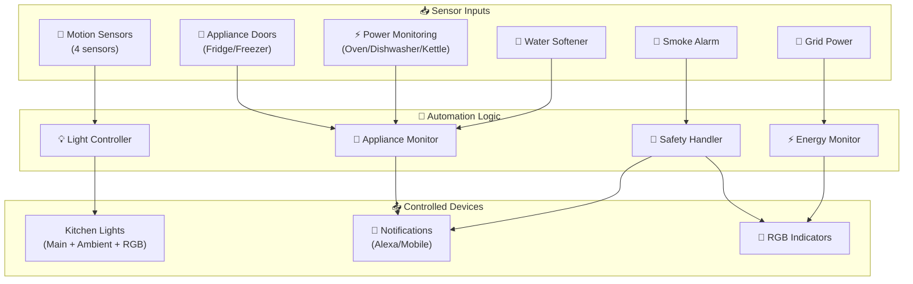
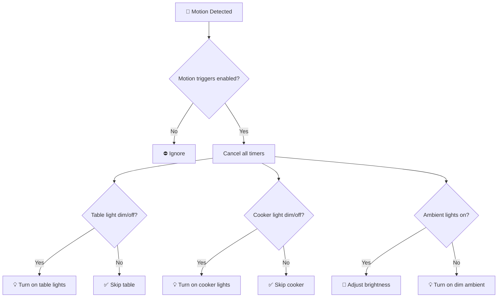
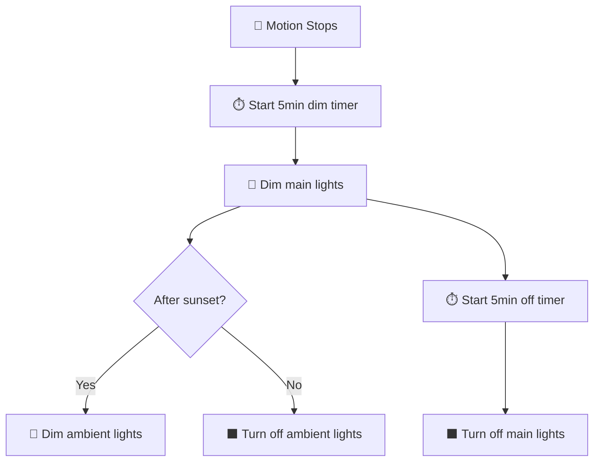
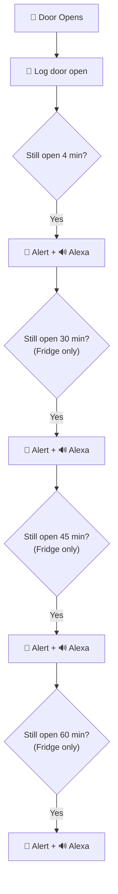
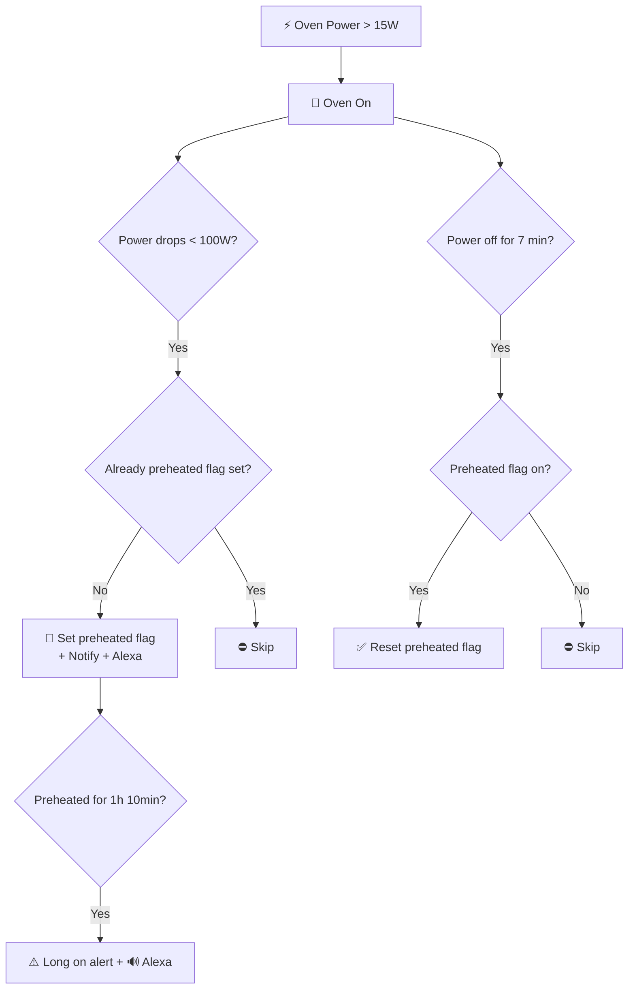
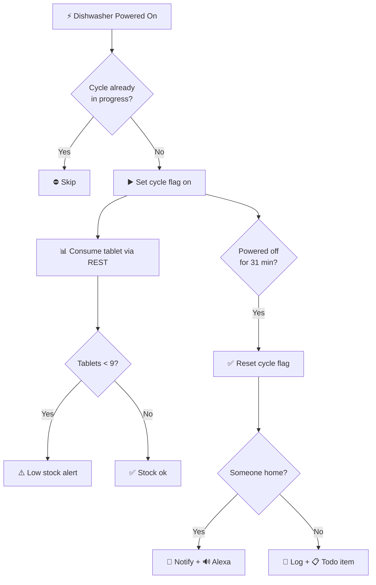
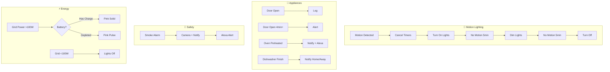

[<- Back to Rooms README](../README.md) · [Packages README](../../README.md) · [Main README](../../../README.md)

# Kitchen Package Documentation

This package manages the kitchen automation including lighting control, appliance monitoring, and safety notifications.

---

## Table of Contents

- [Overview](#overview)
- [Architecture](#architecture)
- [Automations](#automations)
  - [Lighting Control](#lighting-control)
  - [Appliance Monitoring](#appliance-monitoring)
  - [Safety & Notifications](#safety--notifications)
  - [Energy Management](#energy-management)
- [Scenes](#scenes)
- [Scripts](#scripts)
- [Sensors](#sensors)
- [Configuration](#configuration)
- [Entity Reference](#entity-reference)

---

## Overview

The kitchen automation system provides intelligent control of lighting, monitors major appliances, and delivers safety alerts through RGB indicators and voice announcements.



---

## Design Decisions

Key architectural decisions captured from the YAML configuration:

- **Kitchen: Motion Detected - Lights** has a master enable switch for easy disabling
- **Kitchen: No Motion - Start Timers** triggers on state transitions (edge detection) rather than continuous state
- **Kitchen: No Motion - Start Timers** has a master enable switch for easy disabling
- **Kitchen: No Motion - Timer Events** has a master enable switch for easy disabling
- **Kitchen: Cooker Light Switch Toggle** triggers on state transitions (edge detection) rather than continuous state

---

## Dependencies

This package relies on the following components:

### Integrations
- `EcoFlow`

---

## Architecture

### File Structure

```
packages/rooms/kitchen/
├── kitchen.yaml          # Main package file
└── meater.yaml           # MEATER probe integration (separate)
```

### Key Components

| Component | Purpose |
|-----------|---------|
| `binary_sensor.kitchen_area_motion` | Primary motion detection |
| `binary_sensor.kitchen_motion_*` | Additional motion sensors (LD2412, LD2450) |
| `light.kitchen_cooker_white` | Main cooker area lighting |
| `light.kitchen_table_white` | Table area lighting |
| `light.kitchen_*_rgb` | RGB ambient lights for notifications |
| `binary_sensor.*_door_contact` | Fridge/freezer door monitoring |
| `binary_sensor.dishwasher_powered_on` | Dishwasher cycle detection |
| `binary_sensor.oven_powered_on` | Oven usage detection |

---

## Automations

### Lighting Control

#### Kitchen: Motion Detected - Lights
**ID:** `1606158191303`

Comprehensive motion-activated lighting with zone-based control.



**Triggers:**
- Any kitchen motion sensor changes to `on`

**Conditions:**
- `input_boolean.enable_kitchen_motion_triggers` must be `on`

**Logic:**
1. Cancels all light timers
2. Turns on table lights if off or dim (<100 brightness)
3. Turns on cooker lights if off or dim
4. Adjusts ambient lights based on current state

---

#### Kitchen: No Motion - Start Timers
**ID:** `1737283018711`

Starts countdown when motion stops.

**Triggers:**
- Kitchen area motion changes from `on` to `off`

**Actions:**
- Starts `timer.kitchen_cooker_light_dim` for 5 minutes

---

#### Kitchen: No Motion - Timer Events
**ID:** `1737283018712`

Handles dim and off timer completions with smart ambient management.

**Timer Flow:**



**Ambient Light Behavior:**
| Time | Action |
|------|--------|
| Before sunset | Turn off ambient lights on dim timer |
| After sunset | Dim ambient lights on dim timer |

---

#### Kitchen: Turn Off Lights At Night
**ID:** `1583797341647`

Scheduled shutdown at 23:30.

---

#### Kitchen: Timed Turn On Lights (Dim)
**ID:** `1588197104336`

Evening ambient lighting activation.

**Triggers:**
- Sunset event
- 06:45 daily

**Conditions:**
- Not in Guest mode
- Someone is home

---

### Appliance Monitoring

#### Kitchen: Appliance Door Monitoring

Three automations handle fridge/freezer door states:

| Automation | ID | Purpose |
|------------|-----|---------|
| Appliance Door Opened | `1737283018713` | Log door open |
| Appliance Door Closed | `1737283018714` | Log door close |
| Appliance Door Open For Long Period | `1737283018715` | Alert if open too long |



**Alert Thresholds (Fridge):**
- 4 minutes
- 30 minutes
- 45 minutes
- 1 hour

**Alert Thresholds (Freezer):**
- 4 minutes

**Actions on Alert:**
- Send direct notification
- Alexa announcement (non-quiet hours)

---

#### Oven Lifecycle



---

#### Kitchen: Oven Preheated
**ID:** `1694521590170`

Detects when oven reaches temperature.

**Triggers:**
- Oven power drops below 100W (heating element cycles off)

**Conditions:**
- `input_boolean.oven_preheated` is off
- Oven automations enabled
- Not coming from unavailable state

**Actions:**
- Send notification to people home
- Set `input_boolean.oven_preheated` to on
- Alexa announcement (quiet hours respected)

---

#### Kitchen: Oven On For Long Time
**ID:** `1763292351760`

Safety alert for oven left on.

**Triggers:**
- Oven preheated for 1 hour 10 minutes

**Actions:**
- Log message
- Alexa announcement

---

#### Kitchen: Dishwasher Cycle Management



| Automation | ID | Purpose |
|------------|-----|---------|
| Dishwasher Cycle Starts | `1694521590172` | Detect cycle start |
| Reset Dishwasher Cycle | `1694521864038` | Detect cycle complete |
| Dishwasher Started | `1595679010797` | Track tablet usage |
| Dishwasher Finished | `1595679010798` | Send completion notice |

**Cycle Detection:**
- **Start:** Dishwasher powered on + cycle not in progress
- **Complete:** Powered off for 31 minutes

**Tablet Tracking:**
- Consumes dishwasher tablet via REST command
- Updates stock sensor
- Alerts when < 9 tablets remaining

---

#### Kitchen: Kettle Boiled
**ID:** `1759577733332`

Simple kettle completion notification.

**Triggers:**
- Kettle status changes from `heating` to `standby`

**Actions:**
- Log message
- Alexa announcement (quiet hours respected)

---

### Safety & Notifications

#### Kitchen: Smoke Alarm
**ID:** `1757836826541`

Critical safety automation with camera capture.

**Triggers:**
- Kitchen smoke alarm triggers

**Actions:**
1. Captures camera snapshot with timestamp
2. Alexa announcement (no quiet hour suppression)
3. Sends notification with image attachment
4. Starts `timer.check_smoke_alarms` for 1 minute

---

#### Kitchen: Water Softener Monitoring

| Automation | ID | Trigger |
|------------|-----|---------|
| Low Water Softener Salt | `1688681085048` | Above threshold for 2 hours |
| No Water Softener Salt | `1688681085049` | At threshold level |

---

### Energy Management

#### Kitchen: Using Power From The Grid
**ID:** `1735567472488`

Visual indicator for grid power usage.

**Triggers:**
- Grid power above 100W

**Conditions:**
- Motion detected in kitchen
- RGB lights are off
- Battery SOC above discharge stop threshold
- Not in "Battery first" mode

**Actions:**
- If battery has charge: Turn RGB lights pink
- If battery depleted: Pulse pink lights

---

#### Kitchen: Stops using Power From The Grid
**ID:** `1735567472489`

Clears grid power indicator.

**Triggers:**
- Grid power below 100W

**Conditions:**
- RGB lights are on
- Front door is closed

**Actions:**
- Turn off RGB indicator lights

---

## Scenes

### Main Lighting Scenes

| Scene | Purpose | Brightness |
|-------|---------|------------|
| `kitchen_main_lights_dim` | Dimmed main lights | 10 |
| `kitchen_main_lights_off` | All main lights off | Off |
| `kitchen_table_lights_on` | Table area bright | 200 |
| `kitchen_cooker_lights_on` | Cooker area bright | 200 |

### Ambient Lighting Scenes

| Scene | Purpose |
|-------|---------|
| `kitchen_accent_lights_on` | Full brightness accent |
| `kitchen_dim_accent_lights` | Dim accent (26 brightness) |
| `kitchen_accent_lights_off` | Accent lights off |
| `kitchen_ambient_lights_dim` | Dim cabinet/down/draw lights |
| `kitchen_ambient_lights_off` | All ambient off |

### RGB Notification Scenes

| Scene | Color | Use Case |
|-------|-------|----------|
| `kitchen_cooker_ambient_light_to_blue` | Blue | Info notifications |
| `kitchen_table_ambient_light_to_blue` | Blue | Info notifications |
| `kitchen_cooker_ambient_light_to_pink` | Pink | Warning/Grid power |
| `kitchen_table_ambient_light_to_pink` | Pink | Warning/Grid power |
| `kitchen_cooker_light_to_red` | Red | Critical/Smoke alarm |
| `kitchen_table_light_to_red` | Red | Critical/Smoke alarm |

---

## Scripts

### Kitchen Cancel All Light Timers
**Alias:** `kitchen_cancel_all_light_timers`

Cancels all kitchen light-related timers:
- `timer.kitchen_cooker_light_dim`
- `timer.kitchen_cooker_light_off`
- `timer.kitchen_table_light_dim`
- `timer.kitchen_table_light_off`

---

### Kitchen Oven Preheated Notification
**Alias:** `kitchen_oven_preheated_notification`

Sends notification to people currently home.

**Fields:**
- `message` (required)
- `title` (optional)

---

### Dishwashing Complete Notification
**Alias:** `dishwashing_complete_notification`

Smart notification with home/away detection.

**Behavior:**
- **Someone home:** Direct notification + Alexa announcement
- **Nobody home:** Log to home log + add to todo list

---

### Kitchen Pulse Ambient Light Pink
**Alias:** `kitchen_pulse_ambient_light_pink`

Pulses RGB lights pink 5 times for attention.

**Use Case:** Battery depleted but still using grid power

---

### Light Toggle Scripts

| Script | Purpose |
|--------|---------|
| `kitchen_toggle_kitchen_ambient_lights` | Toggle ambient light group |
| `kitchen_toggle_accent_lights` | Toggle accent light group |

---

## Sensors

### History Stats Sensors

#### Dishwasher Runtime Tracking

| Sensor | Period |
|--------|--------|
| `sensor.dishwasher_running_time_today` | Midnight to now |
| `sensor.dishwasher_running_time_last_24_hours` | Rolling 24h |
| `sensor.dishwasher_running_time_yesterday` | Previous day |
| `sensor.dishwasher_running_time_this_week` | Since Monday |
| `sensor.dishwasher_running_time_last_30_days` | Rolling 30 days |

#### Fridge/Freezer Tracking

| Sensor | Purpose |
|--------|---------|
| `sensor.fridge_opened_today` | Time fridge door open today |
| `sensor.fridge_opened_yesterday` | Time fridge door open yesterday |
| `sensor.fridge_freezer_running_time_*` | Various periods |

### Template Binary Sensors

| Sensor | Detection Logic |
|--------|-----------------|
| `binary_sensor.kettle_powered_on` | Power >= 10W |
| `binary_sensor.dishwasher_powered_on` | Power >= 4W for 1 min |
| `binary_sensor.fridge_freezer_powered_on` | Power 10-100W |
| `binary_sensor.oven_powered_on` | Power >= 15W |
| `binary_sensor.low_water_softener_salt` | Above threshold |
| `binary_sensor.no_water_softener_salt` | At threshold |

### Mold Indicator

**Sensor:** `sensor.kitchen_mould_indicator`

Uses indoor temperature/humidity vs outdoor temperature to calculate mold risk.

**Inputs:**
- Indoor: `sensor.kitchen_motion_temperature` / `sensor.kitchen_motion_humidity`
- Outdoor: `sensor.gw2000a_outdoor_temperature`
- Calibration factor: 2.01

---

## Configuration

### Input Booleans

| Entity | Purpose |
|--------|---------|
| `input_boolean.enable_kitchen_motion_triggers` | Master switch for motion lighting |
| `input_boolean.oven_preheated` | Tracks oven preheat state |
| `input_boolean.enable_oven_automations` | Enable oven notifications |
| `input_boolean.dishwasher_cycle_in_progress` | Tracks dishwasher cycle |
| `input_boolean.enable_dishwasher_automations` | Enable dishwasher tracking |
| `input_boolean.dishwasher_clean_cycle` | Flag for clean cycle mode |

### Input Numbers

| Entity | Purpose |
|--------|---------|
| `input_number.kitchen_light_level_threshold` | Motion light threshold (sensor 1) |
| `input_number.kitchen_light_level_2_threshold` | Motion light threshold (sensor 2) |
| `input_number.low_water_softener_salt_level` | Low salt warning threshold |
| `input_number.no_water_softener_salt_level` | Empty salt threshold |

### Timers

| Timer | Duration | Purpose |
|-------|----------|---------|
| `timer.kitchen_cooker_light_dim` | 5 min | Delay before dimming cooker lights |
| `timer.kitchen_cooker_light_off` | 5 min | Delay before turning off cooker lights |
| `timer.kitchen_table_light_dim` | 5 min | Delay before dimming table lights |
| `timer.kitchen_table_light_off` | 5 min | Delay before turning off table lights |
| `timer.check_smoke_alarms` | 1 min | Smoke alarm check interval |

---

## Entity Reference

### Lights

| Entity | Type | Purpose |
|--------|------|---------|
| `light.kitchen_cooker_white` | Main | Cooker area task lighting |
| `light.kitchen_table_white` | Main | Table area task lighting |
| `light.kitchen_cooker_rgb` | RGB | Cooker ambient/notification |
| `light.kitchen_table_rgb` | RGB | Table ambient/notification |
| `light.kitchen_cabinets` | Ambient | Cabinet lighting |
| `light.kitchen_down_lights` | Ambient | Downlights |
| `light.kitchen_draws` | Ambient | Drawer lighting |
| `light.kitchen_accent_lights` | Group | All accent lights |
| `light.kitchen_ambient_lights` | Group | All ambient lights |
| `light.kitchen_lights` | Group | All kitchen lights |

### Binary Sensors

| Entity | Purpose |
|--------|---------|
| `binary_sensor.kitchen_area_motion` | Area motion detection |
| `binary_sensor.kitchen_motion_ld2412_presence` | LD2412 sensor |
| `binary_sensor.kitchen_motion_ld2450_presence` | LD2450 sensor |
| `binary_sensor.kitchen_motion_2_occupancy` | Secondary motion |
| `binary_sensor.kitchen_fridge_door_contact` | Fridge door |
| `binary_sensor.kitchen_freezer_door_contact` | Freezer door |
| `binary_sensor.kitchen_cooker_light_input` | Cooker switch |
| `binary_sensor.kitchen_table_light_input` | Table switch |
| `binary_sensor.kitchen_paper_draw_contact` | Paper drawer |
| `binary_sensor.kitchen_smoke_alarm_smoke` | Smoke detection |

### Sensors

| Entity | Purpose |
|--------|---------|
| `sensor.kitchen_motion_ltr390_light` | Illuminance (sensor 1) |
| `sensor.kitchen_motion_2_illuminance` | Illuminance (sensor 2) |
| `sensor.kitchen_motion_temperature` | Temperature |
| `sensor.kitchen_motion_humidity` | Humidity |
| `sensor.water_softener_salt_level_average` | Salt level |
| `sensor.dishwasher_switch_0_power` | Dishwasher power |
| `sensor.oven_channel_1_power` | Oven power |
| `sensor.kettle_plug_power` | Kettle power |
| `sensor.ecoflow_kitchen_ac_out_power` | Fridge/freezer power |
| `sensor.dishwasher_tablet_stock` | Tablet inventory |

### Switches

| Entity | Purpose |
|--------|---------|
| `switch.ecoflow_kitchen_plug` | Fridge/freezer plug |
| `binary_sensor.kitchen_fridge_door_contact` | Fridge door state |
| `binary_sensor.kitchen_freezer_door_contact` | Freezer door state |

---

## Automation Flow Summary



---

## Related Documentation

| Document | Purpose |
|----------|---------|
| [KITCHEN-SETUP.md](KITCHEN-SETUP.md) | Hardware setup and device configuration |
| [Rooms Overview](../README.md) | Overview of all room packages |
| [Main Packages README](../../README.md) | Architecture and organization guidelines |

### Related Rooms

| Room | Connection |
|------|------------|
| [Porch](../porch/README.md) | Front door notifications trigger kitchen RGB lights |
| [Utility](../utility/README.md) | Shared appliance monitoring patterns |

### Related Integrations

| Integration | Connection |
|-------------|------------|
| [Energy](../../integrations/energy/README.md) | Grid power monitoring for RGB notifications |
| [HVAC](../../integrations/hvac/README.md) | Smoke alarm integration |

### REST Commands

The dishwasher tablet consumption relies on:
```yaml
rest_command.consume_finish_lemon_dishwasher_tablet
```

Ensure this is configured in your REST package.

---

## Maintenance Notes

### Troubleshooting

| Issue | Check |
|-------|-------|
| Lights not responding to motion | `input_boolean.enable_kitchen_motion_triggers` state |
| Oven notifications not working | `input_boolean.enable_oven_automations` state |
| Dishwasher not tracking | Power sensor availability |
| RGB lights stuck on | Grid power automation state |

### Seasonal Adjustments

- **Summer:** May want to adjust morning light turn-off times
- **Winter:** Consider earlier sunset trigger for ambient lights

---

*Last updated: 2026-04-08*
