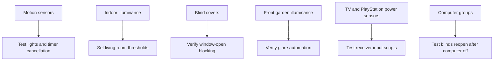

# Living Room Setup Documentation

[<- Living Room README](README.md) · [Rooms README](../README.md)

The living room setup combines motion sensors, lamps, ceiling lights, motorized blinds, media power monitoring, and computer presence. The automation is intentionally split between comfort lighting, glare control, and media convenience.

## Device Inventory

| Category | Entity | Purpose |
|----------|--------|---------|
| Lamps | `light.living_room_lamp_left`, `light.living_room_lamp_right`, `light.living_room_lamps` | Main ambient lamp pair and group. |
| Ceiling lights | `light.lounge_ceiling`, `light.living_room_ceiling`, left/right ceiling bulb entities | Full-room lighting and grouped ceiling control. |
| TV lighting | `light.tv_backlight` | Ambient TV backlight turned off with TV shutdown. |
| Motion | `binary_sensor.living_room_area_motion`, `binary_sensor.lounge_motion`, `binary_sensor.living_room_motion_occupancy`, `binary_sensor.apollo_r_pro_1_w_ef755c_ld2412_presence` | Motion and presence inputs for lighting. |
| Light level | `sensor.apollo_r_pro_1_w_ef755c_ltr390_light`, `sensor.living_room_motion_illuminance`, `sensor.front_garden_motion_illuminance` | Indoor lighting decisions and outdoor glare decisions. |
| Blinds | `cover.living_room_blinds_left`, `cover.living_room_blinds_middle`, `cover.living_room_blinds_right`, `binary_sensor.living_room_windows` | Blind position and window-open safety. |
| Media | `binary_sensor.tv_powered_on`, `sensor.tv_plug_power`, `binary_sensor.playstation_powered_on`, `sensor.playstation_plug_power`, `remote.living_room`, `switch.harmony_hub_plug` | TV/console activity and Harmony Hub management. |
| Computers | `group.family_computer`, `group.terinas_work_computer`, `device_tracker.doug` | Glare-aware blind logic and presence logging. |
| Manual input | `binary_sensor.living_room_ceiling_lights_input_0` | Physical ceiling light switch input. |
| Cooling | `switch.server_fan` | Long-running fan logging. |

## Setup Flow

## Maintenance Checks

| Check | Why |
|------|-----|
| Trigger each living room motion entity | Confirms all motion paths can start lighting. |
| Watch `timer.living_room_lamps_dim` and `timer.living_room_lamps_off` | Confirms the 2 minute plus 5 minute no-motion sequence. |
| Open a living room window before a blind test | Confirms blind automations are blocked when windows are open. |
| Toggle TV and PlayStation power | Confirms media state sensors and input scripts still match the hardware. |
| Toggle the ceiling switch input | Confirms manual ceiling control. |
| Check computer groups | Blind glare behavior depends on accurate family/work computer presence. |

## Troubleshooting

| Problem | Likely Cause |
|---------|--------------|
| Lamps flash yellow instead of staying on | The automation matched its signal branch. Check lamp state/brightness and illuminance thresholds. |
| Blinds close while using a computer | Outdoor brightness and computer presence matched glare rules. Disable `input_boolean.enable_living_room_blind_automations` for a long manual session. |
| Blinds do not close at night | Check window sensor state, blind automation enable helper, and sun/time triggers. |
| Harmony restart does not happen | The restart automation avoids running when the TV is on. |
| TV backlight does not turn off | Verify `binary_sensor.tv_powered_on` changes to off and `light.tv_backlight` is available. |
