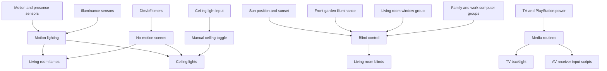
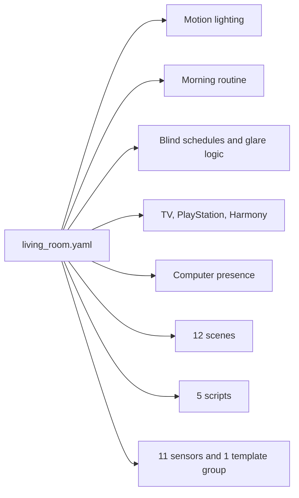
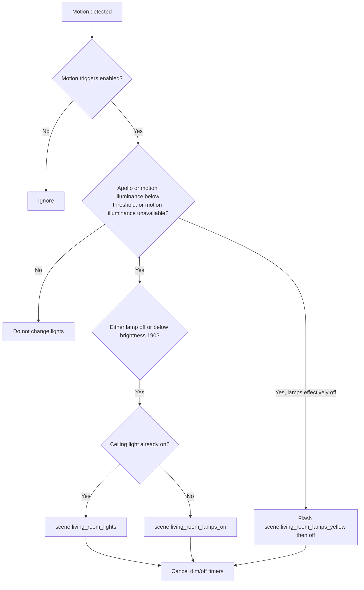

[<- Back to Rooms README](../README.md) · [Packages README](../../README.md) · [Main README](../../../README.md)

# Living Room Package Documentation

The living room package makes the room work as a relaxed TV, family, and daytime workspace. It manages motion lighting, staged no-motion dimming, glare-aware blind movement, TV and Harmony Hub support, ceiling switch handling, and computer presence routines.

This documentation covers the YAML file in this folder:

| File | Purpose | Contents |
|------|---------|----------|
| `living_room.yaml` | Main living room behavior | 23 automations, 12 scenes, 5 scripts, 11 sensors, 1 template group |

## Quick Summary

For non-technical users, the important behavior is:

| Area | What Happens |
|------|--------------|
| Motion lighting | Movement turns on lamps or full lighting when the room is dark enough. No movement starts a 2 minute dim timer, then a 5 minute off timer. |
| Morning routine | Living room or stairs motion can start the morning script when the alarm is armed home and the morning routine is enabled. |
| Blinds | Blinds open in the morning, close in stages in the evening, and adjust for sun/glare when computers are active. |
| TV and media | TV power changes are logged, the TV backlight is turned off after TV shutdown, and PlayStation activity can select the game input. |
| Harmony Hub | The Harmony Hub plug is restarted weekly when the TV is off. |
| Computers | Terina's work laptop changes are logged and computer-off events can open blinds during the day. |
| Manual control | The ceiling light input toggles the ceiling light group. |
| Server fan | A long-running server fan creates a home-log entry. |

## How The Living Room Decides What To Do

## Main File

| Section | YAML Objects | Summary |
|---------|--------------|---------|
| Motion lighting | 5 automations | Turns lights on, dims after 2 minutes no motion, turns off after another 5 minutes, and handles a lights-on/no-motion edge case. |
| Morning/server | 2 automations | Starts the morning routine and logs a server fan that has been running longer than 1 hour. |
| Blinds | 9 automations | Morning/evening positions, direct-sun adjustments, outdoor-brightness glare control, and computer-off opening. |
| Media/manual | 4 automations, 2 scripts | Restarts Harmony, reacts to TV power, turns off TV backlight, selects receiver inputs, and toggles ceiling lights. |
| Computer presence | 3 automations | Logs Terina's work laptop on/off and reacts when computers turn off. |
| Scenes/sensors | 12 scenes, 11 sensors, 1 template group | Lighting scenes plus usage/runtime sensors and helper templates. |

## User Controls

| Entity | Plain-English Purpose |
|--------|-----------------------|
| `input_boolean.enable_living_room_motion_triggers` | Master switch for living room motion lighting and no-motion timers. |
| `input_boolean.enable_morning_routine` | Allows the morning routine to run from living room/stairs motion. |
| `input_boolean.enable_living_room_blind_automations` | Master switch for automatic blind changes. |
| `input_number.living_room_light_level_2_threshold` | Apollo light threshold used by motion lighting. |
| `input_number.living_room_light_level_4_threshold` | Living room motion illuminance threshold used by motion lighting. |

## Everyday Behavior

### Motion Lighting

`Living Room: Motion Detected` listens to four motion/presence inputs:

| Entity |
|--------|
| `binary_sensor.living_room_area_motion` |
| `binary_sensor.lounge_motion` |
| `binary_sensor.living_room_motion_occupancy` |
| `binary_sensor.apollo_r_pro_1_w_ef755c_ld2412_presence` |

No-motion handling is staged:

| Step | Trigger | Result |
|------|---------|--------|
| 1 | `binary_sensor.living_room_area_motion` changes to `off` | Starts `timer.living_room_lamps_dim` for 2 minutes. |
| 2 | Dim timer finishes | Starts `timer.living_room_lamps_off` for 5 minutes and applies a dim scene for lamps, ceiling, or both. |
| 3 | Off timer finishes | Applies the matching off scene for lamps, ceiling, or both. |

### Blinds

The package controls three living room blinds and avoids moving them if the living room windows are open.

| Automation | Behavior |
|------------|----------|
| `Living Room: Open Blinds In The Morning` | Morning partial open. |
| `Living Room: Open Blinds In The Morning 2` | Later morning full open. |
| `Living Room: Close Blinds In The Evening` | Evening/sunset partial close. |
| `Living Room: Close Blinds In The Evening 2` | Later evening/sunset full close. |
| `Living Room: No Direct Sun Light In The Morning` | Adjusts when morning sun has moved away. |
| `Living Room: No Direct Sun Light In The Afternoon` | Adjusts during afternoon sun conditions. |
| `Living Room: Bright Outside` | Partially closes blinds for glare when outdoor brightness and computer conditions match. |
| `Living Room: Really Bright Outside` | Closes more aggressively for strong glare. |
| `Living Room: Outside Went Darker` | Opens blinds again when outside brightness drops and computers are off. |
| `Living Room: Computer Turned Off` | Opens blinds after computers have been off long enough during daytime. |

### TV, Media, And Computers

| Automation/Script | Behavior |
|-------------------|----------|
| `Living Room: TV Turned On` | Logs TV activity and can select the game input when PlayStation state requires it. |
| `Living Room: TV Turned Off` | Logs shutdown and turns off `light.tv_backlight` if needed. |
| `Living Room: Restart Harmony Hub` | Restarts `switch.harmony_hub_plug` weekly when safe. |
| `script.living_room_select_game_input` | Selects the AV receiver game input. |
| `script.living_room_select_vcr_dvr_input` | Selects the alternate AV receiver input. |
| `Living Room: Terina's Work Laptop Turned On/Off` | Logs laptop presence and runs related checks. |
| `Living Room: Computer Turned Off` | Coordinates blinds after computer activity ends. |

## Scenes And Scripts

| Type | Count | Important Examples |
|------|-------|--------------------|
| Scenes | 12 | Full lights, lamps only, ceiling only, dim variants, off variants, yellow signal, green scene. |
| Scripts | 5 | AV receiver input scripts, green/red lounge flashes, and `nfc_bedroom_right`. |

## Troubleshooting

| Symptom | Check |
|---------|-------|
| Motion does not turn lights on | Confirm `input_boolean.enable_living_room_motion_triggers` is on and one illuminance sensor is below its threshold or `sensor.living_room_motion_illuminance` is unavailable. |
| Lights turn off while someone is present | Check `binary_sensor.living_room_area_motion`; this is the no-motion timer trigger. |
| Blinds do not move | Confirm `input_boolean.enable_living_room_blind_automations` is on and `binary_sensor.living_room_windows` is not blocking movement. |
| TV backlight stays on | Check `binary_sensor.tv_powered_on` and `light.tv_backlight`; the off automation depends on TV power state. |
| Game input does not switch | Check PlayStation power detection and the Harmony/receiver script entities. |
