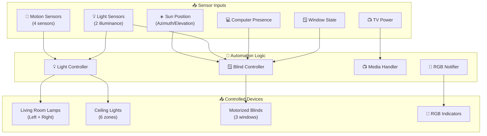
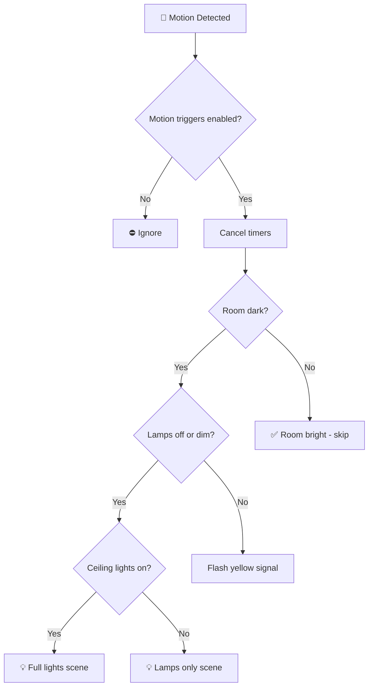
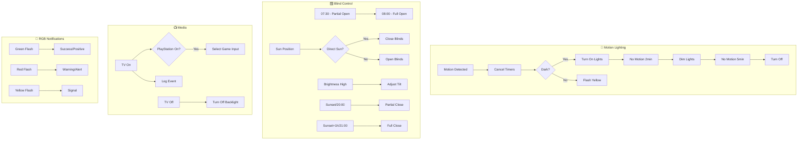

[<- Back to Rooms README](../README.md) · [Packages README](../../README.md) · [Main README](../../../README.md)

# Living Room Package Documentation

This package manages the living room automation including motion-based lighting, RGB color scenes for notifications, TV/computer presence detection, and automated blind control.

---

## Table of Contents

- [Overview](#overview)
- [Architecture](#architecture)
- [Automations](#automations)
  - [Motion Lighting](#motion-lighting)
  - [Alarm & Morning Routine](#alarm--morning-routine)
  - [Blind Control](#blind-control)
  - [Switches & Media](#switches--media)
  - [Device Presence](#device-presence)
- [Scenes](#scenes)
- [Scripts](#scripts)
- [Sensors](#sensors)
- [Configuration](#configuration)
- [Entity Reference](#entity-reference)

---

## Overview

The living room automation system provides intelligent motion-activated lighting with multi-stage dimming, RGB color notifications, automated blind control based on sun position and brightness, and media device integration.



---

## Architecture

### File Structure

```
packages/rooms/living_room/
├── living_room.yaml      # Main package file
└── LIVING-ROOM-SETUP.md  # Legacy setup documentation
```

### Key Components

| Component | Purpose |
|-----------|---------|
| `binary_sensor.living_room_area_motion` | Primary motion detection |
| `binary_sensor.lounge_motion` | Secondary motion sensor |
| `binary_sensor.living_room_motion_occupancy` | Hue motion sensor |
| `binary_sensor.apollo_r_pro_*_ld2412_presence` | mmWave presence sensor |
| `light.living_room_lamp_left/right` | RGB floor lamps |
| `light.living_room_left/right_*` | Ceiling spotlights (6 total) |
| `cover.living_room_blinds_*` | Motorized blinds (3 windows) |
| `binary_sensor.tv_powered_on` | TV state detection |
| `group.family_computer` | Family PC presence |
| `group.terinas_work_computer` | Work laptop presence |

---

## Automations

### Motion Lighting

#### Living Room: Motion Detected
**ID:** `1583956425622`

Comprehensive motion-activated lighting with intelligent brightness detection.



**Triggers:**
- Any living room motion sensor changes to `on`

**Conditions:**
- `input_boolean.enable_living_room_motion_triggers` must be `on`

**Logic:**
1. Cancels dim and off timers
2. Checks illuminance from multiple sensors
3. If dark and lamps off/dim: turns on appropriate lights
4. If dark but room already bright: flashes yellow as signal

**Brightness Thresholds:**
- Apollo light sensor < `input_number.living_room_light_level_2_threshold`
- Hue motion illuminance < `input_number.living_room_light_level_4_threshold`

---

#### Living Room: No Motion
**ID:** `1606170045632`

Starts countdown when motion stops.

**Triggers:**
- Living room area motion changes to `off`

**Actions:**
- Starts `timer.living_room_lamps_dim` for 2 minutes

---

#### Living Room: No Motion After Short Time Dim Lights
**ID:** `1606170045630`

Handles dim timer completion with smart light management.

**Timer Flow:**
```
Motion Stops
    ↓
[2 min] Dim Timer
    ↓
Dim lights + Start off timer
    ↓
[5 min] Off Timer
    ↓
Turn off lights
```

**Actions:**
- Starts `timer.living_room_lamps_off` for 5 minutes
- Applies appropriate dim scene based on which lights are on:
  - Both lamps and ceiling: `scene.living_room_dim_lights`
  - Lamps only: `scene.living_room_dim_lamps`
  - Ceiling only: `scene.living_room_dim_ceiling_lights`

---

#### Living Room: No Motion For Long Time
**ID:** `1605567425876`

Turns off lights after extended no-motion period.

**Triggers:**
- `timer.living_room_lamps_off` finishes

**Actions:**
- Turns off appropriate lights based on current state
- Uses scenes: `living_room_lights_off`, `living_room_lamps_off`, `living_room_ceiling_lights_off`

---

#### Living Room: Lamps On And No Motion (DEPRECATED)
**ID:** `1714512650107`

Legacy automation for HA restart scenarios.

**Note:** Marked as deprecated. Handles edge case where lights were on before HA restart.

---

### Alarm & Morning Routine

#### Living Room: Motion Detected In The Morning
**ID:** `1588859622571`

Triggers morning routine when motion detected during armed_home state.

**Triggers:**
- Lounge motion or stairs motion changes to `on`

**Conditions:**
- Morning routine enabled (`input_boolean.enable_morning_routine`)
- Someone is home
- Alarm is in `armed_home` state
- Time between 05:00 and 23:00

**Actions:**
- Calls `script.morning_script`

---

### Blind Control

The living room features sophisticated automated blind control based on sun position, outdoor brightness, and computer presence.

#### Living Room: Open Blinds In The Morning
**ID:** `1677711735249`

Partial blind opening at 07:30.

**Conditions:**
- Blind automations enabled
- Windows are closed

**Actions:**
- Sets tilt position to 25 (partial open)

---

#### Living Room: Open Blinds In The Morning 2
**ID:** `1677711735250`

Full blind opening at 08:00.

**Actions:**
- Sets tilt position to 50 (fully open)

---

#### Living Room: Close Blinds In The Evening
**ID:** `1677969986112`

Partial blind closing at sunset or 20:00.

**Conditions:**
- Blind automations enabled
- Windows are closed
- Blinds are currently open (>25 tilt)

**Actions:**
- Sets tilt position to 25 (partial close)

---

#### Living Room: Close Blinds In The Evening 2
**ID:** `1677969986113`

Full blind closing at sunset+1h or 21:00.

**Actions:**
- Sets tilt position to 0 (fully closed)

---

#### Living Room: No Direct Sun Light In The Morning
**ID:** `1680528200298`

Opens blinds when morning sun passes.

**Triggers:**
- Sun azimuth drops below morning threshold

**Conditions:**
- After 08:10
- Before sunset
- Windows closed

**Logic:**
When morning sun is no longer directly hitting the windows, opens blinds fully.

---

#### Living Room: No Direct Sun Light In The Afternoon
**ID:** `1680528200296`

Opens blinds when afternoon sun passes.

**Triggers:**
- Sun azimuth above afternoon threshold
- OR sun elevation above threshold

**Logic:**
When afternoon sun angle is no longer direct, opens blinds fully.

---

#### Living Room: Bright Outside
**ID:** `1678300398735`

Partially closes blinds during bright conditions.

**Triggers:**
- Front garden illuminance above low threshold for 1 minute

**Conditions:**
- Between sunrise and sunset
- After 08:00:30
- Sun in "danger zone" (direct sunlight angles)
- Computer(s) present
- Blinds not already at 25

**Actions:**
- Closes middle and right blinds to 25 tilt

---

#### Living Room: Really Bright Outside
**ID:** `1678300398734`

Fully closes blinds during very bright conditions.

**Triggers:**
- Front garden illuminance above high threshold for 1 minute

**Actions:**
- Closes middle and right blinds fully (0 tilt)

---

#### Living Room: Outside Went Darker
**ID:** `1678637987423`

Opens blinds when brightness drops and no computers present.

**Triggers:**
- Front garden illuminance below low threshold for 5 minutes

**Conditions:**
- Both family computer and work laptop are `not_home`

**Actions:**
- Opens all blinds fully

---

### Switches & Media

#### Living Room: Server Fan Running Longer Than 1 Hour
**ID:** `1611063957341`

Monitors server fan and offers to turn it off.

**Triggers:**
- Server fan on for 1 hour

**Actions:**
- Logs message
- Sends actionable notification with Yes/No buttons

---

#### Living Room: Restart Harmony Hub
**ID:** `1610918759041`

Weekly Harmony Hub restart to prevent issues.

**Triggers:**
- 03:00 every Monday

**Conditions:**
- TV is off

**Actions:**
- Powers off Harmony Hub plug
- Waits 1 minute
- Powers back on

---

#### Living Room: TV Turned On
**ID:** `1610388192224`

Handles TV power-on events.

**Actions:**
- Logs event
- If PlayStation is on: selects game input via `script.living_room_select_game_input`

---

#### Living Room: TV Turned Off
**ID:** `1610388192225`

Handles TV power-off events.

**Triggers:**
- TV powered off for 30 seconds

**Actions:**
- Logs event
- Turns off TV backlight (WLED) if on

---

#### Living Room: Ceiling Light Switch Flipped
**ID:** `1754839043037`

Toggles ceiling lights via physical switch.

**Triggers:**
- Ceiling light input changes state

**Actions:**
- Toggles between `scene.living_room_ceiling_lights_on` and `scene.living_room_ceiling_lights_off`

---

### Device Presence

#### Living Room: Terina's Work Laptop Turned Off/On
**ID:** `1654005357582` / `1654005357583`

Monitors work laptop presence state changes.

**Actions:**
- Logs event
- Calls `script.check_terinas_work_laptop_status`

---

#### Living Room: Computer Turned Off
**ID:** `1678741966793`

Opens blinds when all computers leave.

**Triggers:**
- Family computer OR work laptop leaves for 5 minutes

**Conditions:**
- Both computers now `not_home`
- During daytime (sunrise to sunset, after 08:00:30)
- Blind automations enabled

**Actions:**
- Opens all blinds fully

---

## Scenes

### Main Lighting Scenes

| Scene | ID | Purpose | Entities |
|-------|-----|---------|----------|
| `living_room_lights_on` | `1582387315374` | All lights on | Lamps + 6 ceiling spots |
| `living_room_lamps_on` | `1582387315375` | Lamps only | Left + Right lamps |
| `living_room_ceiling_lights_on` | `1582387315376` | Ceiling only | 6 ceiling spots |
| `living_room_lights_off` | `1582455234238` | All lights off | All 8 lights |
| `living_room_lamps_off` | `1582455234239` | Lamps off | Left + Right lamps |
| `living_room_ceiling_lights_off` | `1701618167194` | Ceiling off | 6 ceiling spots |

### Dimmed Lighting Scenes

| Scene | ID | Brightness | Purpose |
|-------|-----|------------|---------|
| `living_room_dim_lights` | `1606169827098` | Lamps: 76, Ceiling: 13 | All lights dimmed |
| `living_room_dim_lamps` | `1606169827099` | 76 | Lamps dimmed |
| `living_room_dim_ceiling_lights` | `1701618167193` | 13 | Ceiling dimmed |

### RGB Color Scenes

| Scene | ID | Color | RGB Value | Purpose |
|-------|-----|-------|-----------|---------|
| `living_room_lamps_yellow` | `1718481446172` | Yellow | 255, 245, 2 | Signal/notification flash |
| `living_room_ceiling_lights_yellow` | `1718554412210` | Yellow | 250, 255, 17 | Ceiling notification |
| `living_room_lights_green` | `1634579522178` | Green | 1, 255, 0 | Success/positive indicator |

**Note:** `scene.lounge_lights_red` (Red - 255, 0, 5) is referenced in scripts but defined in `scenes.yaml` (ID: `1635691197137`).

---

## Scripts

### Receiver Control

#### Living Room Receiver Select Game Input
**Alias:** `living_room_select_game_input`

Changes Onkyo receiver to BD/DVD input for gaming.

**Sequence:**
1. Log intent
2. Wait 13 seconds
3. Send InputBd/Dvd command
4. Log completion

---

#### Living Room Receiver Select VCR/DVR Input
**Alias:** `living_room_select_vcr_dvr_input`

Handles complex input switching for Samsung TV + Onkyo receiver.

**Note:** Works around HDMI input select issue when both devices power on.

**Sequence:**
1. Change Onkyo to BD/DVD
2. Change Samsung TV to HDMI2
3. Re-confirm Onkyo input

---

### RGB Notification Scripts

#### Living Room: Flash Lounge Lights Green
**Alias:** `living_room_flash_lounge_lights_green`

Briefly flashes lamps green for positive notification.

**Sequence:**
1. Create snapshot of current lamp state
2. Turn on green scene
3. Wait 500ms
4. Restore previous state

**Use Case:** Success confirmations, positive alerts

---

#### Living Room: Flash Lights Red
**Alias:** `lounge_flash_lounge_lights_red`

Briefly flashes lamps red for warning/alert.

**Sequence:**
1. Create snapshot of current lamp state
2. Turn on red scene (`scene.lounge_lights_red`)
3. Wait 500ms
4. Restore previous state

**Use Case:** Warnings, errors, attention needed

---

### NFC Scripts

#### NFC Bedroom Right
**Alias:** `nfc_bedroom_right`

NFC tag handler for turning everything off.

**Actions:**
- Logs message
- Calls `script.turn_everything_off`

---

## Sensors

### History Stats Sensors

#### TV Running Time Tracking

| Sensor | Period |
|--------|--------|
| `sensor.tv_running_time_today` | Midnight to now |
| `sensor.tv_running_time_last_24_hours` | Rolling 24h |
| `sensor.tv_running_time_yesterday` | Previous day |
| `sensor.tv_running_time_this_week` | Since Monday |
| `sensor.tv_running_time_last_30_days` | Rolling 30 days |

#### Family PC Uptime Tracking

| Sensor | Period |
|--------|--------|
| `sensor.family_pc_uptime_today` | Midnight to now |
| `sensor.family_pc_uptime_last_24_hours` | Rolling 24h |
| `sensor.pc_uptime_yesterday` | Previous day |
| `sensor.family_pc_uptime_this_week` | Since Monday |
| `sensor.family_pc_uptime_last_30_days` | Rolling 30 days |

### Template Binary Sensors

| Sensor | Detection Logic | Icon |
|--------|-----------------|------|
| `binary_sensor.playstation_powered_on` | Power > 15W | mdi:controller(-off) |
| `binary_sensor.tv_powered_on` | Power > 10W | mdi:television-classic(-off) |

### Mold Indicator

**Sensor:** `sensor.living_room_mould_indicator`

Calculates mold risk based on indoor vs outdoor conditions.

**Inputs:**
- Indoor: `sensor.living_room_motion_temperature` / `sensor.living_room_motion_humidity`
- Outdoor: `sensor.gw2000a_outdoor_temperature`
- Calibration factor: 1.5

---

## Configuration

### Input Booleans

| Entity | Purpose |
|--------|---------|
| `input_boolean.enable_living_room_motion_triggers` | Master switch for motion lighting |
| `input_boolean.enable_living_room_blind_automations` | Master switch for blind control |
| `input_boolean.enable_morning_routine` | Enable morning routine trigger |
| `input_boolean.enable_direct_notifications` | Enable actionable notifications |

### Input Numbers

| Entity | Purpose |
|--------|---------|
| `input_number.living_room_light_level_2_threshold` | Apollo sensor light threshold |
| `input_number.living_room_light_level_4_threshold` | Hue motion light threshold |
| `input_number.living_room_blinds_morning_sun_azimuth_threshold` | Morning sun angle threshold |
| `input_number.living_room_blinds_afternoon_sun_azimuth_threshold` | Afternoon sun angle threshold |
| `input_number.living_room_blinds_afternoon_sun_elevation_threshold` | Afternoon sun elevation threshold |
| `input_number.blind_low_brightness_threshold` | Low brightness threshold |
| `input_number.blind_high_brightness_threshold` | High brightness threshold |

### Timers

| Timer | Duration | Purpose |
|-------|----------|---------|
| `timer.living_room_lamps_dim` | 2 min | Delay before dimming lights |
| `timer.living_room_lamps_off` | 5 min | Delay before turning off lights |

---

## Entity Reference

### Lights

| Entity | Type | Purpose |
|--------|------|---------|
| `light.living_room_lamp_left` | RGB Lamp | Left floor lamp |
| `light.living_room_lamp_right` | RGB Lamp | Right floor lamp |
| `light.living_room_left` | Ceiling | Left spotlight 1 |
| `light.living_room_left_2` | Ceiling | Left spotlight 2 |
| `light.living_room_left_3` | Ceiling | Left spotlight 3 |
| `light.living_room_right` | Ceiling | Right spotlight 1 |
| `light.living_room_right_2` | Ceiling | Right spotlight 2 |
| `light.living_room_right_3` | Ceiling | Right spotlight 3 |
| `light.living_room_lamps` | Group | Both floor lamps |
| `light.living_room_ceiling` | Group | All 6 ceiling spots |
| `light.tv_backlight` | WLED | TV ambient lighting |

### Covers

| Entity | Purpose |
|--------|---------|
| `cover.living_room_blinds_left` | Left window blind |
| `cover.living_room_blinds_middle` | Middle window blind |
| `cover.living_room_blinds_right` | Right window blind |

### Binary Sensors

| Entity | Purpose |
|--------|---------|
| `binary_sensor.living_room_area_motion` | Area motion detection |
| `binary_sensor.lounge_motion` | Lounge motion sensor |
| `binary_sensor.living_room_motion_occupancy` | Hue motion sensor |
| `binary_sensor.apollo_r_pro_1_w_ef755c_ld2412_presence` | mmWave presence |
| `binary_sensor.living_room_windows` | Window open/closed state |
| `binary_sensor.living_room_ceiling_lights_input_0` | Physical switch state |
| `binary_sensor.tv_powered_on` | TV power state |
| `binary_sensor.playstation_powered_on` | PlayStation power state |

### Sensors

| Entity | Purpose |
|--------|---------|
| `sensor.apollo_r_pro_1_w_ef755c_ltr390_light` | Apollo illuminance |
| `sensor.living_room_motion_illuminance` | Hue motion illuminance |
| `sensor.living_room_motion_temperature` | Temperature |
| `sensor.living_room_motion_humidity` | Humidity |
| `sensor.front_garden_motion_illuminance` | Outdoor brightness |
| `sensor.tv_plug_power` | TV power consumption |
| `sensor.playstation_plug_power` | PlayStation power consumption |
| `sensor.living_room_mould_indicator` | Mold risk indicator |

### Switches

| Entity | Purpose |
|--------|---------|
| `switch.server_fan` | Server cooling fan |
| `switch.harmony_hub_plug` | Harmony Hub power |

---

## Automation Flow Summary



---

## Related Documentation

| Document | Purpose |
|----------|---------|
| [LIVING-ROOM-SETUP.md](LIVING-ROOM-SETUP.md) | Legacy setup details and hardware configuration |
| [Rooms Overview](../README.md) | Overview of all room packages |
| [Main Packages README](../../README.md) | Architecture and organization guidelines |

### Shared Configuration

- Blind thresholds are shared with other rooms via `input_number.blind_*` entities (defined in office package)
- RGB notification scenes may be triggered by other room automations

### Related Rooms

| Room | Connection |
|------|------------|
| [Office](../office/README.md) | Shares computer presence groups for blind control |
| [Stairs](../stairs/README.md) | Motion triggers morning routine when alarm armed_home |

---

## Maintenance Notes

### Troubleshooting

| Issue | Check |
|-------|-------|
| Lights not responding to motion | `input_boolean.enable_living_room_motion_triggers` state |
| Blinds not moving | `input_boolean.enable_living_room_blind_automations` state |
| Motion detected but lights don't turn on | Illuminance sensor values vs thresholds |
| Blinds closing during wrong times | Sun azimuth/elevation values |
| TV input not switching | Harmony Hub connectivity |

### Seasonal Adjustments

- **Summer:** May need to adjust sun azimuth thresholds for earlier/later sun angles
- **Winter:** Consider if blind opening times need adjustment for shorter days

---

*Last updated: 2026-03-01*
