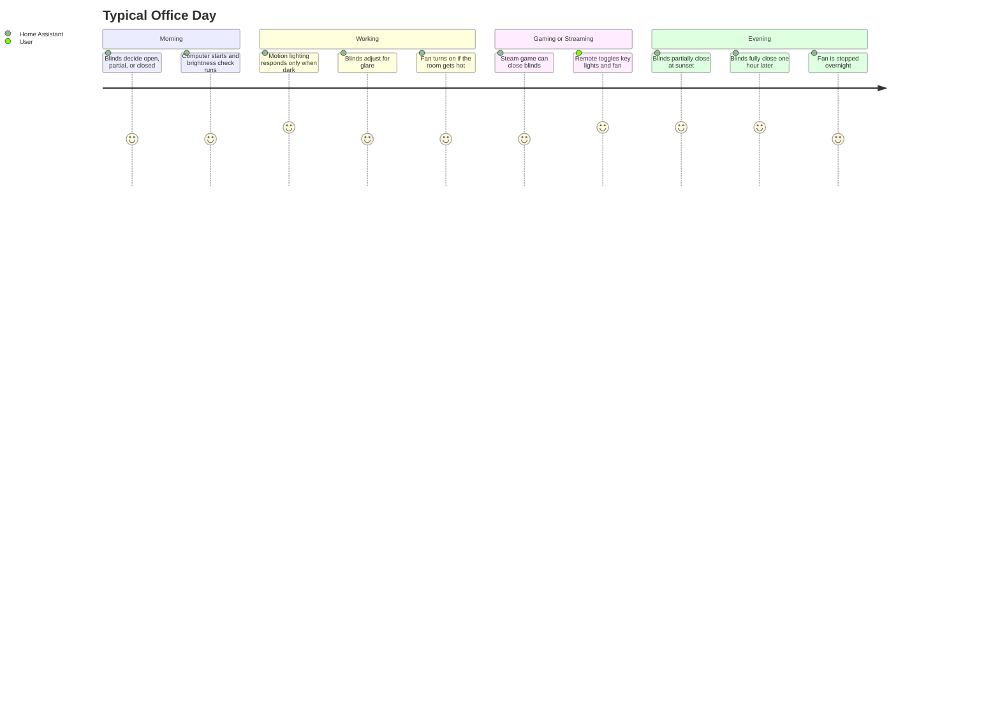
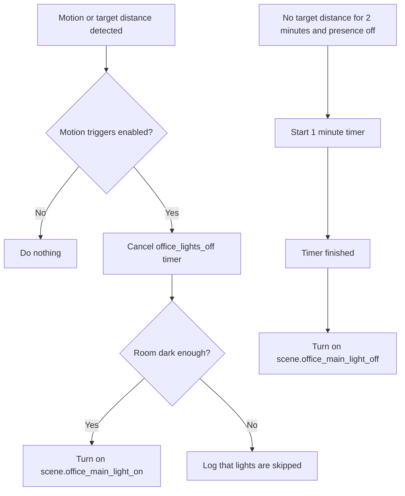
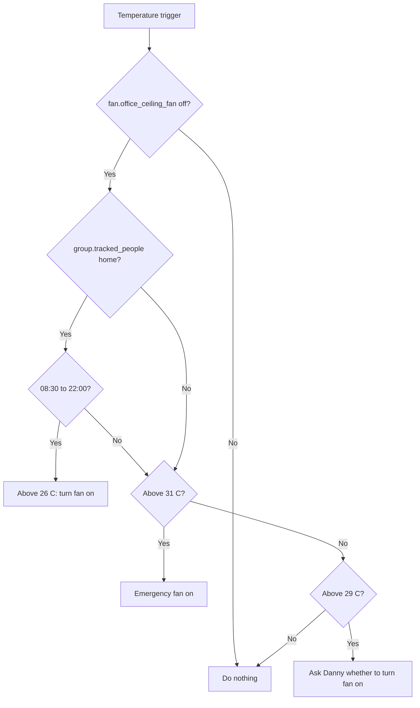
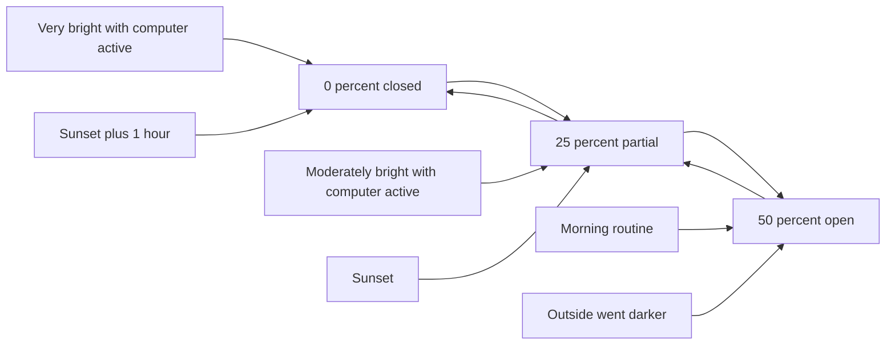
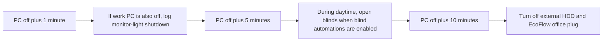
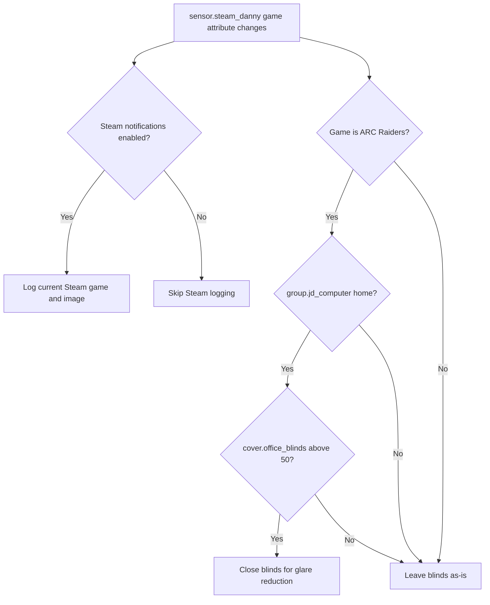

# Office Setup Documentation

**Room:** Office, work, gaming, and streaming space
**YAML files:** `office.yaml`, `steam.yaml`
**Last updated:** 2026-06-27

This guide explains what is installed in the office and how the automations are expected to behave. It is written for someone using the room first, then gives enough detail for a Home Assistant power user to troubleshoot or tune the YAML.

## Device Inventory

```mermaid
flowchart TB
    subgraph Room[Office]
        Desk[Desk and computers]
        WindowArea[Window and blinds]
        Ceiling[Ceiling fan and main light]
        CameraLights[Elgato key lights]
        MotionSensor[Motion, distance, illuminance sensor]
        Door[Office door contact]
        Remote[MQTT remote]
    end

    Desk --> PCGroups[group.jd_computer and group.dannys_work_computer]
    Desk --> ExternalHDD[switch.external_hdd]
    Desk --> Steam[sensor.steam_danny]
    WindowArea --> Blinds[cover.office_blinds]
    WindowArea --> WindowSensor[binary_sensor.office_windows]
    Ceiling --> MainLight[light.office_ceiling_fan]
    Ceiling --> Fan[fan.office_ceiling_fan]
    CameraLights --> KeyLights[light.office_key_lights]
    MotionSensor --> Presence[binary_sensor.office_motion_2_presence]
    MotionSensor --> Distance[sensor.office_motion_2_target_distance]
    MotionSensor --> Lux[sensor.office_motion_2_illuminance]
    Door --> DoorHelper[input_boolean.alarm_office_door]
    Remote --> KeyLights
    Remote --> Fan
```

| Category | Entity | Role |
|----------|--------|------|
| Main light | `light.office_ceiling_fan` | Main office light, controlled by motion scenes and bright-room logic. |
| Key lights | `light.office_key_lights`, `light.elgato_key_light_left`, `light.elgato_key_light_right` | Streaming/video lighting, manually toggled by MQTT remote. |
| Motion | `binary_sensor.office_motion_2_presence` | Main presence signal for motion lighting. |
| Distance | `sensor.office_motion_2_target_distance` | mmWave-style distance signal used to start and cancel no-motion handling. |
| Room brightness | `sensor.office_motion_2_illuminance`, `sensor.office_area_mean_light_level` | Decides whether lights are needed. |
| Outdoor brightness | `sensor.front_garden_motion_illuminance` | Shared brightness source for blind glare decisions. |
| Temperature | `sensor.office_area_mean_temperature` | Drives automatic fan behavior. |
| Fan | `fan.office_ceiling_fan` | Cooling fan controlled by temperature, remote, and overnight shutoff automations. |
| Blinds | `cover.office_blinds` | Motorized tilt blinds, using 0, 25, and 50 percent tilt positions. |
| Window | `binary_sensor.office_windows` | Prevents blind closure while the window is open. |
| Personal PC | `group.jd_computer` | Main PC presence group for work/gaming routines. |
| Work PC | `group.dannys_work_computer` | Work computer presence group. |
| Backup drive | `switch.external_hdd` | Turned off when the personal PC has been off for a while. |
| Steam | `sensor.steam_danny` | Steam online and game activity source. |
| Fly zapper | `switch.fly_zapper` | Turns itself off after 2 hours. |
| Office door | `binary_sensor.office_door_contact`, `input_boolean.alarm_office_door` | Simple door-arm helper and logging. |
| House alarm | `alarm_control_panel.house_alarm` | Used by office motion alarm logging. |

## What Users Should Expect

| Situation | Expected Office Behavior |
|-----------|--------------------------|
| You walk into a dark office | The main light turns on and the light-off timer is cancelled. |
| You walk into a bright office | The system logs that light was skipped rather than turning on unnecessary lighting. |
| You leave the office | After 2 minutes of no presence plus a 1-minute timer, the main light turns off. |
| The room gets hot | The fan turns on automatically at 26 C when someone is home during the day. At 29 C it can notify Danny. At 31 C it can force the fan on. |
| It is morning | Blinds open, partially open, or stay closed depending on brightness and active computers. |
| It is sunset | Blinds partially close, then fully close one hour later. |
| The window is open | Blind closure is skipped to avoid damage or awkward movement. |
| The personal PC turns on | A brightness check runs and logs GoXLR activity. |
| The personal PC has been off for 10 minutes | Backup-drive and EcoFlow shutdown scripts run. |
| Steam starts a tracked game | The blinds close if they are open enough to create glare. |
| The fly zapper is left on | It turns itself off after 2 hours. |
| The remote open button is pressed | Office key lights toggle. |
| The remote close button is pressed | The office fan toggles. |

## Key Workflows

### Motion Lighting

Power-user details:

| Setting | Value |
|---------|-------|
| Main enable helper | `input_boolean.enable_office_motion_triggers` |
| Presence trigger | `binary_sensor.office_motion_2_presence` to `on` |
| Distance trigger | `sensor.office_motion_2_target_distance` above `0.1` |
| No-motion trigger | `sensor.office_motion_2_target_distance` below `0.01` for 2 minutes and presence off |
| Off timer | `timer.office_lights_off`, started for 1 minute |
| Brightness threshold | `input_number.office_light_level_threshold` |

### Temperature And Fan

The office fan is controlled by temperature and also has two overnight safety shutoffs.

| Automation | Trigger | Result |
|------------|---------|--------|
| `Office: High Temperature` | Temperature above 26 C, 29 C for 1 minute, or 31 C for 1 minute | Runs a tiered `choose` block that can turn on the fan or notify Danny. |
| `Office: Turn Off Fan Overnight` | 02:00 | Turns off `fan.office_ceiling_fan`. |
| `Office: Fan Turns Off at 3am` | 03:00 | Turns off `fan.office_ceiling_fan` via `switch.turn_off`. |

The 26 C branch is first. If someone is home between 08:30 and 22:00 and the fan is off, it turns the fan on before the later warning/emergency branches are considered.

### Blind Management

Tilt positions used by the package:

| Tilt Position | Meaning |
|---------------|---------|
| `0` | Closed |
| `25` | Partial tilt for glare/privacy |
| `50` | Open |

The blind system combines time, sun position, outdoor brightness, window state, and computer state.

| Trigger | Behavior |
|---------|----------|
| 08:00 | Morning routine decides between closed, 25 percent, and 50 percent based on brightness and whether a computer is on. |
| Sunset | Partially closes to 25 percent if the window is closed. |
| Sunset plus 1 hour | Fully closes to 0 percent if the window is closed. |
| Window closes at night | Closes blinds if earlier closure was skipped because the window was open. |
| Sun moves past morning threshold | Opens blinds after direct morning sun is no longer a glare problem. |
| Sun crosses afternoon thresholds | Opens blinds after afternoon direct sun is no longer a glare problem. |
| Outdoor brightness rises | Partially or fully closes blinds when a computer is active. |
| Outdoor brightness drops | Opens blinds when glare is no longer likely. |

Power-user tuning helpers:

| Helper | Purpose |
|--------|---------|
| `input_boolean.enable_office_blind_automations` | Master switch for blind automation. |
| `input_number.blind_low_brightness_threshold` | Lower outdoor brightness threshold. |
| `input_number.blind_high_brightness_threshold` | High outdoor brightness threshold. |
| `input_number.office_blinds_morning_sun_azimuth_threshold` | Morning sun position threshold. |
| `input_number.office_blinds_afternoon_sun_azimuth_threshold` | Afternoon sun azimuth threshold. |
| `input_number.office_blinds_afternoon_sun_elevation_threshold` | Afternoon sun elevation threshold. |

### Computer And Steam

| Event | Automation | Behavior |
|-------|------------|----------|
| Personal PC comes online | `Office: Computer Turned On` | Logs GoXLR activity and runs `script.office_check_brightness`. |
| Personal PC goes offline for 1 minute | `Office: Computer Turned Off` | Logs monitor-light shutdown if the work computer is also off. |
| Personal PC goes offline for 5 minutes during daytime | `Office: Computer Turned Off After Sunrise` | Opens blinds if blind automation is enabled. |
| Personal PC goes offline for 10 minutes | `Office: Computer Turned Off For A Period Of Time` | Runs backup-drive and EcoFlow shutdown scripts. |
| Steam game changes to `ARC Raiders` | `Office: Playing Computer Games` | Closes blinds if the personal PC is home and blinds are more than 50 percent open. |
| Steam status changes | `Steam: Status Change` | Logs Steam status when Steam notifications are enabled. |
| Steam game attribute changes | `Steam: Playing Game` | Logs the current game and image when Steam notifications are enabled. |

### Remote And Device Controls

| Device | Automation | Behavior |
|--------|------------|----------|
| MQTT remote open action | `Office: Remote Keylight` | Toggles `light.office_key_lights`. |
| MQTT remote close action | `Office: Remote Fan` | Toggles `fan.office_ceiling_fan`. |
| Fly zapper | `Office: Fly Zapper` | Turns `switch.fly_zapper` off after 2 hours. |
| External HDD | `script.office_turn_off_backup_drive` | Turns `switch.external_hdd` off when the personal PC is not home. |

### Alarm Helpers

| Automation | Behavior |
|------------|----------|
| `Office: Alarm Armed Home Mode & Motion Detected` | Logs office motion when the alarm is armed home. |
| `Office: Arm Office Door` | Arms the office door only if the contact sensor says it is closed. |
| `Office: Trigger Armed Door` | Logs an opened armed door and turns off the arm helper. |

## Scenes

| Scene | Purpose |
|-------|---------|
| `scene.office_main_light_on` | Bright main ceiling light. |
| `scene.office_main_light_off` | Main ceiling light off. |
| `scene.office_dim_main_lights` | Very dim warm main light. |
| `scene.office_turn_off_all_lights` | Ceiling fan light and key lights off. |
| `scene.office_sun_light` | Older daylight-style office light scene. |
| `scene.office_doorbell_notification` | Green notification scene. |
| `scene.office_front_door_open_notification` | Blue notification scene. |
| `scene.office_front_garden_motion_notification` | Purple notification scene. |

Referenced but not defined in `office.yaml`:

| Scene | Used By |
|-------|---------|
| `scene.office_room_brightness_above_threshold` | `Office: Light On And Bright Room` |

## Scripts

| Script | What It Does |
|--------|--------------|
| `script.office_turn_off_backup_drive` | Safely turns off the external HDD when the personal PC is no longer home. |
| `script.office_check_brightness` | If glare conditions match, sets blinds to 25 percent tilt. |
| `script.office_open_blinds` | Sets blinds to 50 percent tilt. |
| `script.office_close_blinds` | Sets blinds to 0 percent tilt. |
| `script.ecoflow_office_turn_off_plug` | External dependency used when the personal PC has been off for 10 minutes. |

## Sensors Created By The Package

| Sensor | Tracks | Period |
|--------|--------|--------|
| PC Uptime Today | `group.jd_computer` | Today from midnight |
| PC Uptime Last 24 Hours | `group.jd_computer` | Rolling 24 hours |
| PC Uptime Yesterday | `group.jd_computer` | Previous day |
| PC Uptime This Week | `group.jd_computer` | Current week from Monday |
| PC Uptime Last 30 Days | `group.jd_computer` | Rolling 30 days |
| Work Computer Uptime Today | `group.dannys_work_computer` | Today from midnight |
| Work Computer Uptime Yesterday | `group.dannys_work_computer` | Previous day |
| Work Computer Uptime This Week | `group.dannys_work_computer` | Current week from Monday |
| Work Computer Uptime Last 30 Days | `group.dannys_work_computer` | Rolling 30 days |

## Troubleshooting

| Problem | Check |
|---------|-------|
| Motion lights do not turn on | `input_boolean.enable_office_motion_triggers`, room illuminance, threshold value, and whether the light is already bright. |
| Motion lights do not turn off | `binary_sensor.office_motion_2_presence`, `sensor.office_motion_2_target_distance`, and `timer.office_lights_off`. |
| Blinds do not move | `input_boolean.enable_office_blind_automations`, `binary_sensor.office_windows`, current tilt position, and sun/brightness thresholds. |
| Blinds close unexpectedly | Outdoor brightness thresholds, active computer state, and sun azimuth/elevation threshold values. |
| Fan does not turn on automatically | Temperature sensor, `group.tracked_people`, time of day, and whether `fan.office_ceiling_fan` is already on. |
| Steam messages do not appear | `input_boolean.enable_steam_notifications`, `sensor.steam_danny`, and the Steam integration. |
| Remote buttons do nothing | MQTT device availability and the device action subtypes `open` and `close`. |

## File Summary

| Metric | Count |
|--------|-------|
| YAML files | 2 |
| Automations | 29 |
| Scenes | 8 |
| Scripts | 4 |
| Sensors | 9 |
