[<- Back to Rooms README](../README.md) · [Packages README](../../README.md) · [Main README](../../../README.md)

# Office Package Documentation

The office package makes the office behave like a work, gaming, and streaming space without needing much manual control. It turns lights on only when needed, manages glare with the blinds, keeps the room cooler with the ceiling fan, reacts to PC and Steam activity, and records useful computer uptime statistics.

This documentation covers both YAML files in this folder:

| File | Purpose | Contents |
|------|---------|----------|
| `office.yaml` | Main office behavior | 27 automations, 8 scenes, 4 scripts, 9 sensors |
| `steam.yaml` | Steam activity logging | 2 automations |

## Quick Summary

For non-technical users, the important behavior is:

| Area | What Happens |
|------|--------------|
| Motion lighting | Movement turns the main light on only when the room is dark enough. No movement starts a short timer before the light turns off. |
| Blinds | Blinds open in the morning, close in stages at sunset, and adjust during the day to reduce glare. Window-open safety stops blind closure. |
| Temperature | The ceiling fan turns on automatically when the room gets hot and someone is home. Higher temperatures create alerts or emergency fan-on behavior. |
| Computers | PC presence changes trigger brightness checks, blind changes, and shutdown helper scripts. |
| Gaming | Starting configured Steam games can close blinds to reduce screen glare. Steam status and game changes are logged. |
| Remote control | An MQTT remote toggles key lights and the fan. |
| Safety and security | Office door and alarm helper automations log armed-door activity. |
| Usage tracking | History sensors track personal and work computer uptime. |

## How The Office Decides What To Do

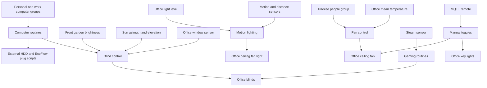

## Main Files

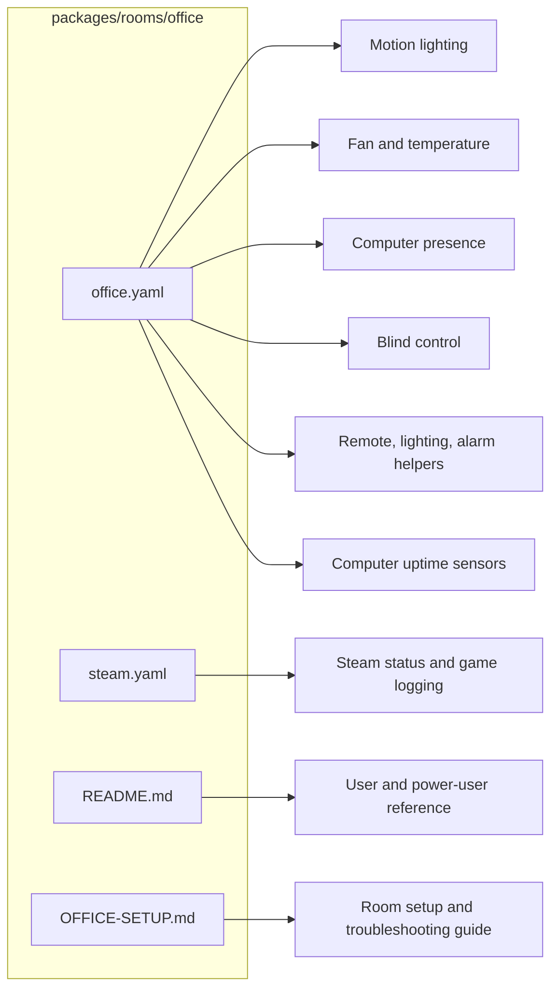

### `office.yaml`

The main package is organized by behavior:

| Section | YAML Objects | Summary |
|---------|--------------|---------|
| Motion | 3 automations | Turns lighting on and off based on presence, distance, room brightness, and a timer. |
| Fan and temperature | 3 automations | Handles temperature thresholds and overnight fan shutdowns. |
| Computer presence | 5 automations | Reacts to PC on/off state and Steam gaming state. |
| Blinds | 9 automations, 3 scripts | Opens, closes, and partially closes blinds based on time, sun, brightness, window state, and computer state. |
| Lighting and devices | 4 automations, 8 scenes | Handles bright-room light reduction, fly zapper timeout, remote key light control, and remote fan control. |
| Alarm helpers | 3 automations | Logs alarmed motion and office-door arming events. |
| Support scripts | 4 scripts | Reusable blind and backup-drive actions. |
| Uptime sensors | 9 sensors | Tracks personal PC and work PC usage over useful time windows. |

### `steam.yaml`

The Steam package is intentionally small. It listens to `sensor.steam_danny` and logs status or game changes when `input_boolean.enable_steam_notifications` is enabled.

## User Controls

| Entity | Plain-English Purpose |
|--------|-----------------------|
| `input_boolean.enable_office_motion_triggers` | Master switch for motion lighting. Turn this off if the office lights should stop reacting to movement. |
| `input_boolean.enable_office_blind_automations` | Master switch for automatic blind movement. Turn this off before manually positioning blinds for a long session. |
| `input_boolean.enable_steam_notifications` | Master switch for Steam status and game logging. |
| `input_boolean.alarm_office_door` | Arms a simple office-door alert. If the door opens while armed, the event is logged and the helper turns itself off. |

## Everyday Behavior

### Motion Lighting

When motion or target distance indicates someone is in the office, `Office: Motion Detected` cancels the light-off timer and checks the room brightness.

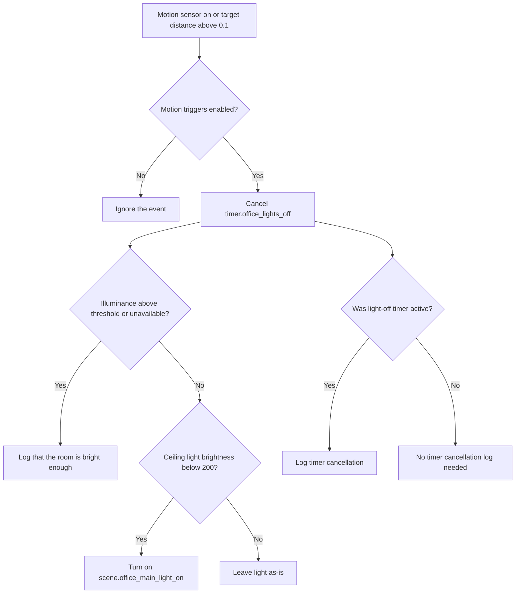

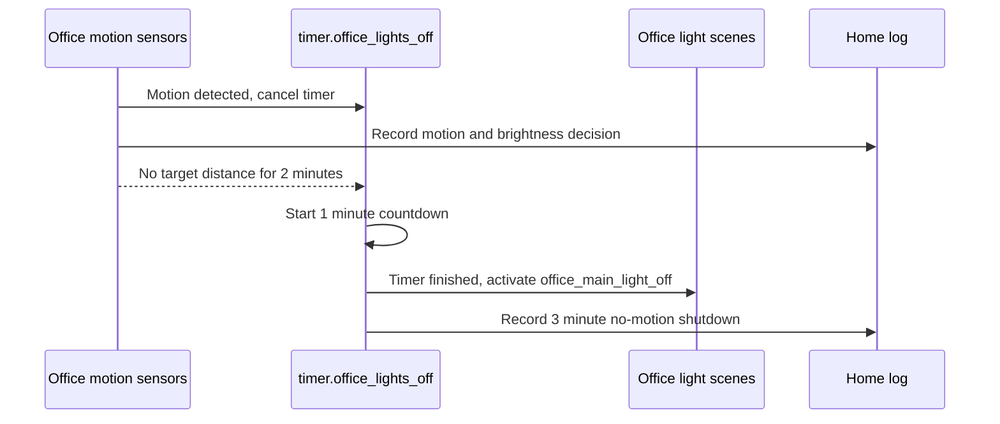

| Situation | Result |
|-----------|--------|
| Room is bright enough | Logs that the lights were skipped. |
| Room is dark and the ceiling light is below brightness 200 | Turns on `scene.office_main_light_on`. |
| Room is bright and the lights are below threshold | Turns on `scene.office_main_light_off` to avoid wasting light. |
| Light-off timer is active | Logs that motion returned and the timer is cancelled. |

No-motion handling is deliberately delayed:

| Step | Trigger | Result |
|------|---------|--------|
| 1 | `sensor.office_motion_2_target_distance` below `0.01` for 2 minutes and presence off | Starts `timer.office_lights_off` for 1 minute. |
| 2 | `timer.office_lights_off` finishes | Turns on `scene.office_main_light_off`. |

### Temperature And Fan

The office uses `sensor.office_area_mean_temperature` and `fan.office_ceiling_fan`.

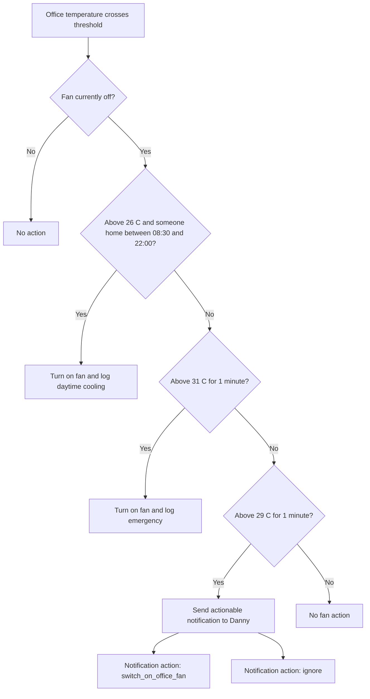

| Temperature | Conditions | Result |
|-------------|------------|--------|
| Above 26 C | Someone is home, between 08:30 and 22:00, fan is off | Fan turns on automatically. |
| Above 29 C for 1 minute | Fan is off and the 26 C branch did not already match | Danny receives an actionable notification asking whether to turn the fan on. |
| Above 31 C for 1 minute | Fan is off and earlier branches did not match | Fan turns on as an emergency response. |
| 02:00 | Fan is on | `Office: Turn Off Fan Overnight` turns it off with `fan.turn_off`. |
| 03:00 | Fan is on | `Office: Fan Turns Off at 3am` turns it off with `switch.turn_off`. |

Power-user note: `Office: High Temperature` uses `choose`, so the first matching branch wins. The 26 C daytime branch is evaluated before the 31 C emergency and 29 C notification branches.

### Computer And Gaming

The package treats `group.jd_computer` as the main personal PC and `group.dannys_work_computer` as the work computer.

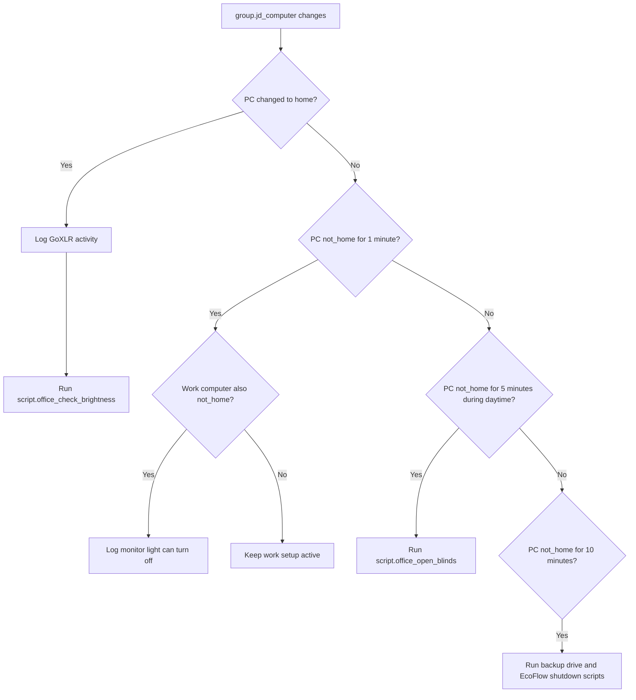

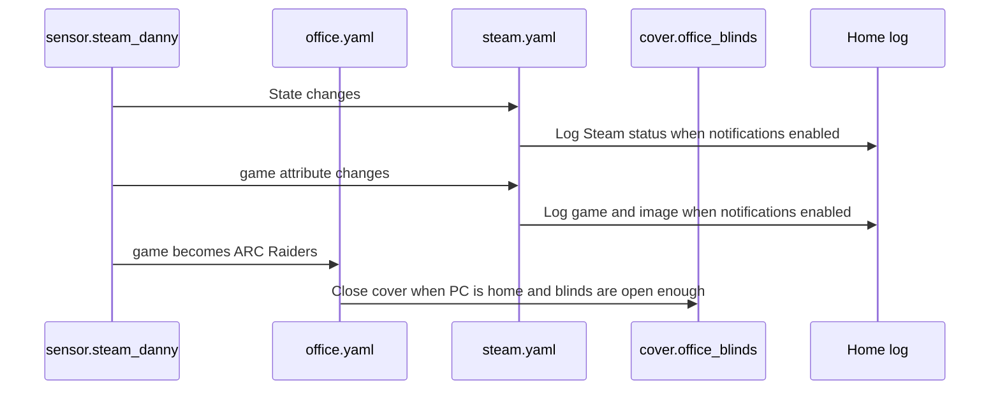

| Event | Result |
|-------|--------|
| Personal PC changes from `not_home` to `home` | Logs GoXLR activity and runs `script.office_check_brightness`. |
| Personal PC changes from `home` to `not_home` for 1 minute | If the work computer is also not home, logs that the monitor light can be turned off. |
| Personal PC is off for 5 minutes during daytime | Opens office blinds if blind automations are enabled. |
| Personal PC is off for 10 minutes | Logs shutdown messages, runs `script.office_turn_off_backup_drive`, and runs `script.ecoflow_office_turn_off_plug`. |
| Steam game attribute becomes `ARC Raiders` | Closes blinds if the personal PC is home and blinds are more than 50 percent open. |

The Steam-specific `steam.yaml` file also logs:

| Automation | Trigger | Condition | Result |
|------------|---------|-----------|--------|
| `Steam: Status Change` | Any state change on `sensor.steam_danny` | Steam notifications enabled | Sends a home-log entry with the current Steam status and avatar/image URL. |
| `Steam: Playing Game` | `sensor.steam_danny` `game` attribute changes | Game attribute exists and Steam notifications enabled | Sends a home-log entry with the game name and game image URL. |

### Blinds

The office blinds use tilt positions rather than a simple open/closed model.

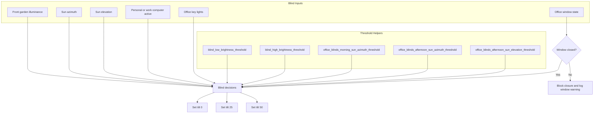

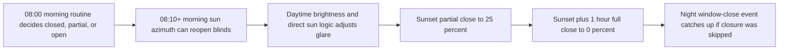

| Tilt | Meaning In This Package |
|------|-------------------------|
| `0` | Closed. |
| `25` | Partially open or partially closed for glare/privacy. |
| `50` | Open. |

The main inputs are outdoor brightness, sun position, computer state, and whether the office window is open.

| Automation | Trigger | Result |
|------------|---------|--------|
| `Office: Open Blinds In The Morning` | 08:00 | Keeps blinds closed if very bright and a computer is on, partially opens if moderately bright and a computer is on, otherwise opens to 50 percent. |
| `Office: Partially Close Office Blinds At Sunset` | Sunset | Sets tilt to 25 percent, unless the office window is open. |
| `Office: Fully Close Office Blinds At Night` | Sunset plus 1 hour | Closes to 0 percent, unless the office window is open. |
| `Office: Window Closed At Night` | Window closes for 1 minute during the dark period | Catches up by closing blinds after a window-open block. |
| `Office: No Direct Sun Light In The Morning` | Sun azimuth drops below the morning threshold | Opens blinds once morning direct sun is out of the way. |
| `Office: No Direct Sun Light In The Afternoon` | Sun azimuth or elevation crosses afternoon thresholds | Opens blinds once afternoon direct sun is out of the way and key lights are off. |
| `Office: Bright Outside` | Outdoor brightness exceeds low threshold for 1 minute | Runs `script.office_check_brightness`, which may set tilt to 25 percent. |
| `Office: Really Bright Outside` | Outdoor brightness exceeds high threshold for 1 minute | Closes blinds to reduce glare when a computer is active. |
| `Office: Outside Went Darker` | Outdoor brightness stays below low threshold for 5 minutes | Opens blinds when it is no longer too bright. |

Window safety is handled by checking `binary_sensor.office_windows`. A state of `on` means open, so blind closure is skipped where closure could be unsafe.

### Lighting, Remote, And Devices

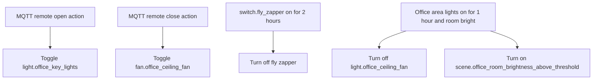

| Automation | What It Does |
|------------|--------------|
| `Office: Light On And Bright Room` | If office area lights have been on for 1 hour during daylight and the room is already bright, turns off the ceiling light and activates `scene.office_room_brightness_above_threshold`. |
| `Office: Fly Zapper` | Turns `switch.fly_zapper` off after it has been on for 2 hours. |
| `Office: Remote Keylight` | MQTT remote `open` action toggles `light.office_key_lights`. |
| `Office: Remote Fan` | MQTT remote `close` action toggles `fan.office_ceiling_fan`. |

Power-user note: `scene.office_room_brightness_above_threshold` is referenced here but is not defined in `office.yaml`; it must be provided elsewhere, such as UI scenes or another package.

### Alarm Helpers

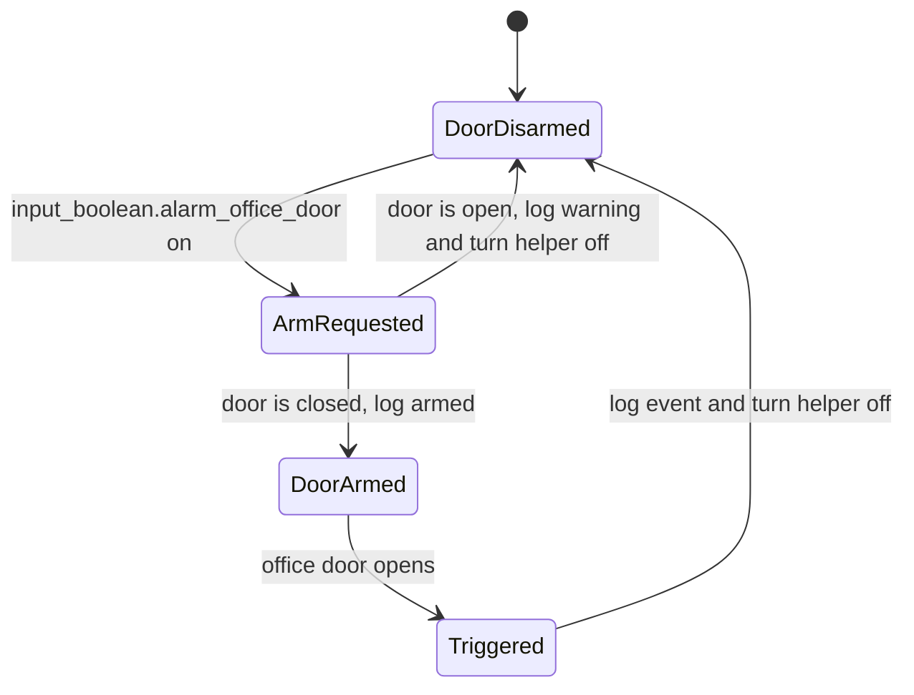

| Automation | What It Does |
|------------|--------------|
| `Office: Alarm Armed Home Mode & Motion Detected` | Logs office motion while the house alarm is armed home and the computer is expected to be off. |
| `Office: Arm Office Door` | When `input_boolean.alarm_office_door` is enabled, checks the door is closed before treating it as armed. |
| `Office: Trigger Armed Door` | If the armed office door opens, logs the event and turns off `input_boolean.alarm_office_door`. |

## Technical Reference

### Automations

| ID | Alias | File |
|----|-------|------|
| `1606428361967` | Office: Motion Detected | `office.yaml` |
| `1587044886896` | Office: No Motion Detected | `office.yaml` |
| `1587044886897` | Office: Office Light Off Timer Finished | `office.yaml` |
| `1622584959878` | Office: High Temperature | `office.yaml` |
| `1728046359271` | Office: Fan Turns Off at 3am | `office.yaml` |
| `1619865008647` | Office: Computer Turned On | `office.yaml` |
| `1606256309890` | Office: Computer Turned Off For A Period Of Time | `office.yaml` |
| `1678741966796` | Office: Computer Turned Off | `office.yaml` |
| `1678741966794` | Office: Computer Turned Off After Sunrise | `office.yaml` |
| `1768737131768` | Office: Playing Computer Games | `office.yaml` |
| `1622374444832` | Office: Open Blinds In The Morning | `office.yaml` |
| `1622374233312` | Office: Partially Close Office Blinds At Sunset | `office.yaml` |
| `1622374233310` | Office: Fully Close Office Blinds At Night | `office.yaml` |
| `1622666920056` | Office: Window Closed At Night | `office.yaml` |
| `1680528200295` | Office: No Direct Sun Light In The Morning | `office.yaml` |
| `1680528200297` | Office: No Direct Sun Light In The Afternoon | `office.yaml` |
| `1678300398737` | Office: Bright Outside | `office.yaml` |
| `1678300398736` | Office: Really Bright Outside | `office.yaml` |
| `1678637987424` | Office: Outside Went Darker | `office.yaml` |
| `1719349686247` | Office: Light On And Bright Room | `office.yaml` |
| `1721434316175` | Office: Fly Zapper | `office.yaml` |
| `1722108194998` | Office: Remote Keylight | `office.yaml` |
| `1722108194999` | Office: Remote Fan | `office.yaml` |
| `1779792048943` | Office: Turn Off Fan Overnight | `office.yaml` |
| `1613264719942` | Office: Alarm Armed Home Mode & Motion Detected | `office.yaml` |
| `1622973276606` | Office: Arm Office Door | `office.yaml` |
| `1622973478458` | Office: Trigger Armed Door | `office.yaml` |
| `1619254173099` | Steam: Status Change | `steam.yaml` |
| `1619254173097` | Steam: Playing Game | `steam.yaml` |

### Scenes Defined In `office.yaml`

| Scene ID | Name | Purpose |
|----------|------|---------|
| `1600795089307` | Office: Turn On Main Light | Turns on the ceiling fan light at bright cool-white settings. |
| `1606247204381` | Office Turn Off Main Light | Turns off the ceiling fan light. |
| `1612921949654` | Office Dim Main Lights | Warm, very dim ceiling fan light. |
| `1606247529306` | Office Turn Off All Lights | Turns off ceiling fan light and both Elgato key lights. |
| `1606170296807` | Office Sun Light | Older daylight-style scene for the office light entity. |
| `1600776152370` | Office: Doorbell Notification | Green office light notification. |
| `1613476289811` | Office: Front Door Open Notification | Blue office light notification. |
| `1613476535744` | Office: Front Garden Motion Notification | Purple office light notification. |

### Scripts Defined In `office.yaml`

| Script | Purpose |
|--------|---------|
| `script.office_turn_off_backup_drive` | Turns off `switch.external_hdd` if the personal PC is not home. |
| `script.office_check_brightness` | Partially closes blinds to 25 percent when outdoor brightness and sun position indicate glare. |
| `script.office_open_blinds` | Sets `cover.office_blinds` tilt to 50 percent. |
| `script.office_close_blinds` | Sets `cover.office_blinds` tilt to 0 percent. |

### Sensors Defined In `office.yaml`

| Sensor | Entity Tracked | Window |
|--------|----------------|--------|
| PC Uptime Today | `group.jd_computer` | Midnight to now |
| PC Uptime Last 24 Hours | `group.jd_computer` | Rolling 24 hours |
| PC Uptime Yesterday | `group.jd_computer` | Previous day window ending at midnight |
| PC Uptime This Week | `group.jd_computer` | Current week from Monday midnight |
| PC Uptime Last 30 Days | `group.jd_computer` | Rolling 30 days ending at midnight |
| Work Computer Uptime Today | `group.dannys_work_computer` | Midnight to now |
| Work Computer Uptime Yesterday | `group.dannys_work_computer` | Previous day window ending at midnight |
| Work Computer Uptime This Week | `group.dannys_work_computer` | Current week from Monday midnight |
| Work Computer Uptime Last 30 Days | `group.dannys_work_computer` | Rolling 30 days ending at midnight |

## Important Entities

| Type | Entities |
|------|----------|
| Motion and presence | `binary_sensor.office_motion_2_presence`, `sensor.office_motion_2_target_distance`, `binary_sensor.office_area_motion` |
| Brightness | `sensor.office_motion_2_illuminance`, `sensor.office_area_mean_light_level`, `sensor.front_garden_motion_illuminance` |
| Temperature | `sensor.office_area_mean_temperature` |
| Lights | `light.office_ceiling_fan`, `light.office_area_lights`, `light.office_key_lights`, `light.elgato_key_light_left`, `light.elgato_key_light_right` |
| Fan | `fan.office_ceiling_fan` |
| Blinds and windows | `cover.office_blinds`, `binary_sensor.office_windows` |
| Computers | `group.jd_computer`, `group.dannys_work_computer`, `device_tracker.udm_pro` |
| Steam | `sensor.steam_danny` |
| Devices | `switch.external_hdd`, `switch.fly_zapper` |
| Alarm | `alarm_control_panel.house_alarm`, `input_boolean.alarm_office_door`, `binary_sensor.office_door_contact` |

## Configuration Inputs

| Entity | Used For |
|--------|----------|
| `input_number.office_light_level_threshold` | Decides whether motion should turn office lighting on. |
| `input_number.blind_low_brightness_threshold` | Lower brightness threshold for blind opening and partial closure logic. |
| `input_number.blind_high_brightness_threshold` | High brightness threshold for stronger glare responses. |
| `input_number.office_blinds_morning_sun_azimuth_threshold` | Defines when morning direct sun is no longer an issue. |
| `input_number.office_blinds_afternoon_sun_azimuth_threshold` | Defines afternoon sun position for blind decisions. |
| `input_number.office_blinds_afternoon_sun_elevation_threshold` | Defines afternoon sun elevation for blind decisions. |
| `timer.office_lights_off` | One-minute off delay after no-motion detection. |

## Maintenance Notes

| Symptom | First Things To Check |
|---------|-----------------------|
| Motion does not turn on lights | `input_boolean.enable_office_motion_triggers`, `sensor.office_motion_2_illuminance`, `input_number.office_light_level_threshold`, `timer.office_lights_off`. |
| Lights stay on too long | `sensor.office_motion_2_target_distance`, `binary_sensor.office_motion_2_presence`, and whether `timer.office_lights_off` is firing. |
| Blinds do not close | `input_boolean.enable_office_blind_automations`, `binary_sensor.office_windows`, tilt position attributes on `cover.office_blinds`. |
| Blinds move at the wrong sunlight time | The three office blind sun threshold input numbers and `sensor.front_garden_motion_illuminance`. |
| Fan does not auto-start | `sensor.office_area_mean_temperature`, `group.tracked_people`, and current time. |
| Steam logs are missing | `input_boolean.enable_steam_notifications`, `sensor.steam_danny`, and Steam integration state. |

## Related Documentation

| Document | Purpose |
|----------|---------|
| [OFFICE-SETUP.md](OFFICE-SETUP.md) | Room setup, device inventory, and operational guide. |
| [Rooms Overview](../README.md) | Overview of room packages. |
| [Energy](../../integrations/energy/README.md) | EcoFlow scripts used by computer shutdown behavior. |
| [Messaging](../../integrations/messaging/README.md) | Notification scripts used by temperature and logging flows. |
| [ESPHome](../../integrations/esphome_README.md) | ESPHome integration notes. |

*Last updated: 2026-06-27*
