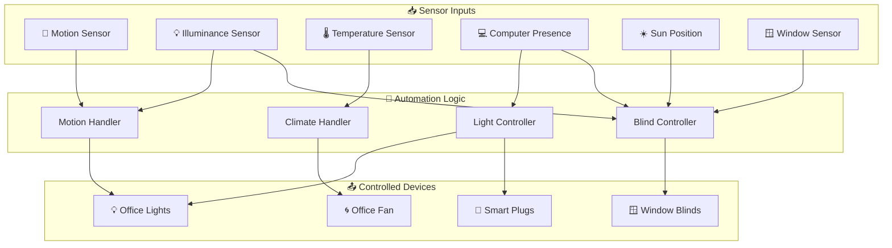
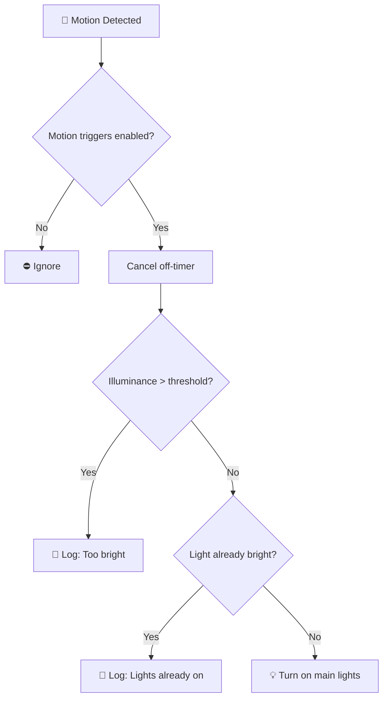
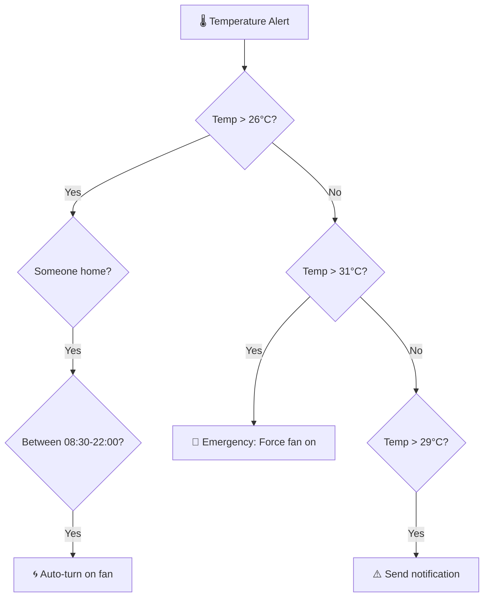
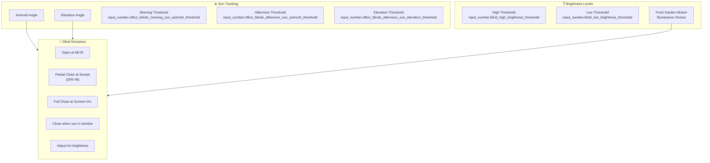
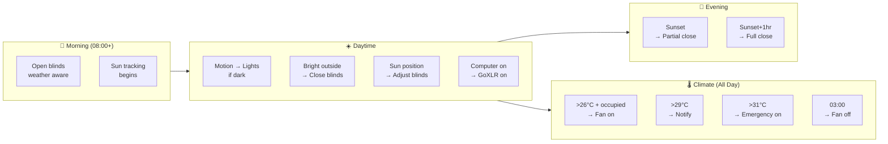

[<- Back to Rooms README](../README.md) · [Packages README](../../README.md) · [Main README](../../../README.md)

# Office Package Documentation

This package manages the office room automation in the Home Assistant configuration. It includes motion-based lighting, climate control, computer presence detection, automated blinds based on sun position, and various utility automations.

---

## Table of Contents

- [Overview](#overview)
- [Architecture](#architecture)
- [Automations](#automations)
  - [Motion Detection](#motion-detection)
  - [Climate Control](#climate-control)
  - [Computer Presence](#computer-presence)
  - [Blind Control](#blind-control)
  - [Lighting](#lighting)
  - [Utilities](#utilities)
- [Scenes](#scenes)
- [Scripts](#scripts)
- [Sensors](#sensors)
- [ESPHome Device](#esphome-device)
- [Configuration](#configuration)
- [Entity Reference](#entity-reference)

---

## Overview

The office automation system provides intelligent control of lighting, climate, and blinds based on:

- **Motion detection** with illuminance-aware lighting
- **Computer presence** for work mode detection
- **Sun position tracking** for optimal blind positioning
- **Temperature monitoring** for automatic fan control
- **Time-based scheduling** for energy efficiency



---

## Architecture

### File Structure

```
packages/rooms/office/
└── office.yaml          # Main package file (automations, scenes, scripts, sensors)

esphome/
└── office.yaml          # ESP32 device configuration for office presence detection
```

### Key Components

| Component | Purpose |
|-----------|---------|
| `binary_sensor.office_motion_2_presence` | Primary motion detection |
| `sensor.office_motion_2_illuminance` | Ambient light level for adaptive lighting |
| `sensor.office_motion_2_target_distance` | Presence distance for occupancy detection |
| `sensor.office_area_mean_temperature` | Average temperature for climate control |
| `cover.office_blinds` | Motorized blind control |
| `group.jd_computer` | JD's computer presence detection |
| `group.dannys_work_computer` | Danny's work computer presence |

---

## Automations

### Motion Detection

#### Office: Motion Detected
**ID:** `1606428361967`

Intelligent motion-activated lighting that considers ambient brightness and current light levels.



**Triggers:**
- Motion sensor state changes to `on`
- Target distance above 0.1m (someone entering)

**Conditions:**
- `input_boolean.enable_office_motion_triggers` must be `on`

**Logic:**
1. Cancels any pending light-off timer
2. Checks ambient illuminance against threshold
3. If dark AND lights are dim/off → turns on main lights
4. If bright → logs debug message and skips

---

#### Office: No Motion Detected
**ID:** `1587044886896`

Starts a countdown timer when no motion is detected for 2 minutes.

**Triggers:**
- Target distance below 0.01m for 2 minutes
- Motion sensor state is `off`

**Actions:**
- Starts `timer.office_lights_off` for 1 minute
- Logs debug message

---

#### Office: Office Light Off Timer Finished
**ID:** `1587044886897`

Turns off lights when the no-motion timer expires.

**Triggers:**
- `timer.office_lights_off` finishes

**Actions:**
- Turns off main lights via scene
- Logs the 3-minute total no-motion period (2min detection + 1min timer)

---

### Climate Control

#### Office: High Temperature
**ID:** `1622584959878`

Multi-tier temperature response system with escalating actions.



**Trigger Thresholds:**
| Temperature | Action | Priority |
|-------------|--------|----------|
| > 26°C | Auto-on if occupied (08:30-22:00) | Normal |
| > 29°C for 1min | Send actionable notification | Warning |
| > 31°C for 1min | Emergency: Always turn on | Critical |

**Notification Actions:**
- **Yes:** Turns on fan via `switch_on_office_fan` action
- **No:** Dismisses notification

---

#### Office: Fan Turns Off at 3am
**ID:** `1728046359271`

Scheduled fan shutdown for energy saving.

**Triggers:**
- Daily at 03:00:00

**Conditions:**
- Fan is currently `on`

**Actions:**
- Turns off `switch.office_fan`

---

### Computer Presence

#### Office: Computer Turned On
**ID:** `1619865008647`

Activates office mode when JD's computer comes online.

**Triggers:**
- `group.jd_computer` changes from `not_home` to `home`

**Actions:**
- Turns on GoXLR audio interface
- Runs brightness check script

---

#### Office: Computer Turned Off For A Period Of Time
**ID:** `1606256309890`

Comprehensive shutdown sequence when computer is off for 10+ minutes.

**Triggers:**
- `group.jd_computer` off for 10 minutes

**Conditions:**
- UDM Pro is available (not `unavailable`)

**Actions:**
- Logs "Turned off for more than 10 minutes"
- Turns off desk lights
- Turns off GoXLR
- Runs backup drive shutdown script
- Runs EcoFlow office plug shutdown

---

#### Office: Computer Turned Off
**ID:** `1678741966796`

Quick response when computer goes offline.

**Triggers:**
- `group.jd_computer` off for 1 minute

**Actions:**
- If work computer also off → turns off monitor light

---

#### Office: Computer Turned Off After Sunrise
**ID:** `1678741966794`

Opens blinds when computer shuts down during daytime.

**Triggers:**
- `group.jd_computer` off for 5 minutes

**Conditions:**
- Blind automations enabled
- After sunrise and after 08:00
- Before sunset

**Actions:**
- Opens office blinds

---

#### Office: Playing Computer Games
**ID:** `1768737131768`

Closes blinds when gaming to reduce glare.

**Triggers:**
- Steam sensor shows "ARC Raiders" game active

**Conditions:**
- JD's computer is home
- Blinds are more than 50% open

**Actions:**
- Closes blinds

---

### Blind Control

The blind system uses sun position (azimuth and elevation) combined with outdoor brightness to optimize natural lighting while preventing glare.



#### Office: Open Blinds In The Morning
**ID:** `1622374444832`

Morning blind routine at 08:00 with weather-aware logic.

**Triggers:**
- Daily at 08:00:00

**Logic:**
1. Fetches hourly weather forecast
2. Gets clock emoji for logging
3. **If very bright AND computer on** → Keeps blinds closed
4. **If moderately bright AND computer on** → Partially opens (25% tilt)
5. **Default** → Fully opens blinds

---

#### Office: Partially Close Office Blinds At Sunset
**ID:** `1622374233312`

First stage of evening blind closure.

**Triggers:**
- Sunset event

**Conditions:**
- Blind automations enabled
- Blinds more than 25% open

**Logic:**
- If window is open → logs warning, does not close
- Otherwise → sets tilt to 25%

---

#### Office: Fully Close Office Blinds At Night
**ID:** `1622374233310`

Second stage complete closure.

**Triggers:**
- Sunset + 1 hour

**Conditions:**
- Blind automations enabled
- Blinds more than 0% open

**Logic:**
- If window is open → logs warning
- Otherwise → fully closes blinds

---

#### Office: Window Closed At Night
**ID:** `1622666920056`

Catches up on blind closure if window was open at sunset.

**Triggers:**
- Window sensor changes from `on` to `off` (closed)

**Conditions:**
- Blind automations enabled
- Between 1 hour before sunset and sunrise

**Actions:**
- Closes blinds

---

#### Office: No Direct Sun Light In The Morning
**ID:** `1680528200295`

Opens blinds when morning sun has moved past the window.

**Triggers:**
- Sun azimuth drops below morning threshold

**Conditions:**
- Blind automations enabled
- Blinds less than 50% open
- After 08:10
- Before sunset
- Window is closed

---

#### Office: No Direct Sun Light In The Afternoon
**ID:** `1680528200297`

Opens blinds when afternoon sun is no longer direct.

**Triggers:**
- Sun azimuth above afternoon threshold
- OR sun elevation above afternoon threshold

**Conditions:**
- Blind automations enabled
- Azimuth and elevation both above thresholds
- Blinds less than 50% open
- Window closed
- Key lights are off

---

#### Office: Bright Outside
**ID:** `1678300398737`

Partially closes blinds when it's bright but sun isn't directly in window.

**Triggers:**
- Outdoor illuminance above low threshold for 1 minute

**Conditions:**
- Between sunrise and sunset
- After 08:10
- Between morning and afternoon sun positions
- Window closed
- Either computer is home

**Actions:**
- Runs `script.office_check_brightness`

---

#### Office: Really Bright Outside
**ID:** `1678300398736`

Fully closes blinds during peak brightness.

**Triggers:**
- Outdoor illuminance above high threshold for 1 minute

**Conditions:**
- Between sunrise and sunset
- After 08:00
- Blind automations enabled
- Blinds more than 0% open
- Between morning and afternoon sun positions
- Window closed
- Either computer is home

**Actions:**
- Fully closes blinds

---

#### Office: Outside Went Darker
**ID:** `1678637987424`

Opens blinds when outdoor brightness drops.

**Triggers:**
- Outdoor illuminance below low threshold for 5 minutes

**Conditions:**
- Between sunrise and sunset
- After 08:00
- Blinds less than 50% open
- Blind automations enabled
- Window closed
- Key lights off
- Sun elevation above threshold

**Actions:**
- Opens blinds

---

### Lighting

#### Office: Light On And Bright Room
**ID:** `1719349686247`

Auto-dims lights when room is already bright.

**Triggers:**
- Office lights on for 1 hour

**Conditions:**
- Between sunrise and sunset
- Room light level above threshold

**Actions:**
- Turns off ceiling fan light
- Activates "brightness above threshold" scene
- Brief delay, then turns off office_4 light

---

#### Office: Fly Zapper
**ID:** `1721434316175`

Safety timer for fly zapper device.

**Triggers:**
- Fly zapper on for 2 hours

**Actions:**
- Turns off fly zapper

---

#### Office: Remote Keylight
**ID:** `1722108194998`

MQTT remote control for key lights.

**Triggers:**
- MQTT device action "open"

**Actions:**
- Toggles `light.office_key_lights`

---

#### Office: Remote Fan
**ID:** `1722108194999`

MQTT remote control for fan.

**Triggers:**
- MQTT device action "close"

**Actions:**
- Toggles `switch.office_fan`

---

#### Office: Front Door Status On For Long Time
**ID:** `1743186662871`

Turns off office light if front door has been closed for 3 minutes.

**Triggers:**
- `light.office_light` on for 3 minutes

**Conditions:**
- Front door is closed (`off`)

**Actions:**
- Turns off `light.office_light`

---

### Utilities

The package includes various utility automations for device management and notifications.

---

## Scenes

| Scene ID | Name | Purpose |
|----------|------|---------|
| `1600795089307` | Office: Turn On Main Light | Bright white light (252 brightness, 5012K) |
| `1606247204381` | Office Turn Off Main Light | Turns off ceiling fan light |
| `1612921949654` | Office Dim Main Lights | Warm dim light (13 brightness, 2000K) |
| `1606247529306` | Office Turn Off All Lights | Turns off all office lights including key lights |
| `1606170296807` | Office Sun Light | Natural daylight simulation |
| `1600776152370` | Office: Doorbell Notification | Green flash notification |
| `1613476289811` | Office: Front Door Open Notification | Blue flash notification |
| `1613476535744` | Office: Front Garden Motion Notification | Purple flash notification |
| `1720024018791` | Office: Room Brightness Above Threshold | Yellow indicator light |
| `1721636570804` | Office Set Light To Red | Red indicator light |

---

## Scripts

### Office Turn Off Backup Drive
**Alias:** `office_turn_off_backup_drive`

Safely shuts down external HDD when computer is off.

**Conditions:**
- External HDD is on
- JD's computer is not home

**Actions:**
- Logs shutdown
- Turns off `switch.external_hdd`

---

### Office Check Brightness
**Alias:** `office_check_brightness`

Intelligent brightness-based blind adjustment.

**Conditions:**
- Outdoor illuminance above high threshold
- Between morning and afternoon sun positions
- Blind automations enabled
- Blinds more than 25% open
- Window closed

**Actions:**
- Logs brightness levels and sun position
- Sets blinds to 25% tilt

---

### Office Open Blinds
**Alias:** `office_open_blinds`

**Actions:**
- Sets `cover.office_blinds` tilt to 50%

---

### Office Close Blinds
**Alias:** `office_close_blinds`

**Actions:**
- Sets `cover.office_blinds` tilt to 0%

---

## Sensors

### History Stats Sensors

Tracks computer uptime for JD's computer and Danny's work computer:

| Sensor | Entity | Period |
|--------|--------|--------|
| PC Uptime Today | `group.jd_computer` | Midnight to now |
| PC Uptime Last 24 Hours | `group.jd_computer` | Rolling 24 hours |
| PC Uptime Yesterday | `group.jd_computer` | Previous 24 hours |
| PC Uptime This Week | `group.jd_computer` | Since Monday midnight |
| PC Uptime Last 30 Days | `group.jd_computer` | Rolling 30 days |
| Work Computer Uptime Today | `group.dannys_work_computer` | Midnight to now |
| Work Computer Uptime Yesterday | `group.dannys_work_computer` | Previous 24 hours |
| Work Computer Uptime This Week | `group.dannys_work_computer` | Since Monday midnight |
| Work Computer Uptime Last 30 Days | `group.dannys_work_computer` | Rolling 30 days |

---

## ESPHome Device

The office ESP32 device provides presence detection and monitoring.

### Hardware
- **Board:** ESP32-DevKitC
- **Framework:** ESP-IDF

### Features
- WiFi signal strength monitoring
- Device uptime tracking
- Disconnection counter (persistent across reboots)
- Bluetooth proxy capability (via `bluetooth_base` package)

### Sensors
| Sensor | Description | Update Interval |
|--------|-------------|-----------------|
| WiFi Signal Strength | dBm measurement | 10 seconds |
| Uptime | Device runtime | 60 seconds |
| Disconnect Count | WiFi disconnection events | Event-driven |

### Configuration
```yaml
api:
  encryption:
    key: !secret office_api_encryption_key

ota:
  - platform: esphome
    password: !secret office_ota_password
```

---

## Configuration

### Input Booleans

| Entity | Purpose |
|--------|---------|
| `input_boolean.enable_office_motion_triggers` | Master switch for motion-based lighting |
| `input_boolean.enable_office_blind_automations` | Master switch for blind automations |

### Input Numbers

| Entity | Purpose | Used In |
|--------|---------|---------|
| `input_number.office_light_level_threshold` | Illuminance threshold for lights | Motion detection, auto-dim |
| `input_number.blind_high_brightness_threshold` | High brightness trigger | Blind closure |
| `input_number.blind_low_brightness_threshold` | Low brightness trigger | Blind adjustment |
| `input_number.office_blinds_morning_sun_azimuth_threshold` | Morning sun avoidance | Blind control |
| `input_number.office_blinds_afternoon_sun_azimuth_threshold` | Afternoon sun avoidance | Blind control |
| `input_number.office_blinds_afternoon_sun_elevation_threshold` | Elevation threshold | Blind control |

### Timer

| Entity | Duration | Purpose |
|--------|----------|---------|
| `timer.office_lights_off` | 1 minute | Delay before turning lights off after no motion |

---

## Entity Reference

### Lights
- `light.office_ceiling_fan` - Main ceiling light
- `light.office_2` - Secondary office light
- `light.office_4` - Office light 4 (notification/indicator)
- `light.office_key_lights` - Elgato key lights (left/right)
- `light.office_area_lights` - Group of area lights
- `light.office_light` - General office light entity

### Switches
- `switch.office_fan` - Office cooling fan
- `switch.external_hdd` - External backup drive
- `switch.fly_zapper` - Fly zapper device

### Sensors
- `binary_sensor.office_motion_2_presence` - Motion detection
- `sensor.office_motion_2_illuminance` - Ambient light
- `sensor.office_motion_2_target_distance` - Presence distance
- `sensor.office_area_mean_temperature` - Room temperature
- `sensor.office_area_mean_light_level` - Room brightness
- `binary_sensor.office_windows` - Window open/closed
- `sensor.front_garden_motion_illuminance` - Outdoor brightness

### Covers
- `cover.office_blinds` - Motorized window blinds

### Groups
- `group.jd_computer` - JD's computer presence
- `group.dannys_work_computer` - Danny's work computer presence
- `group.tracked_people` - Home occupancy

### Device Trackers
- `device_tracker.udm_pro` - UDM Pro availability

### Person
- `person.danny` - Danny's person entity (for notifications)

---

## Automation Flow Summary



---

## Related Documentation

| Document | Purpose |
|----------|---------|
| [OFFICE-SETUP.md](OFFICE-SETUP.md) | Hardware setup and device configuration |
| [Rooms Overview](../README.md) | Overview of all room packages |
| [Main Packages README](../../README.md) | Architecture and organization guidelines |

### Related Rooms

| Room | Connection |
|------|------------|
| [Living Room](../living_room/README.md) | Shares computer presence groups for blind control |
| [Porch](../porch/README.md) | Front door notifications trigger office lights |

### Related Integrations

| Integration | Connection |
|-------------|------------|
| [Energy](../../integrations/energy/README.md) | EcoFlow office plug management |
| [ESPHome](../../README.md) | Office ESP32 device configuration |

---

## Maintenance Notes

### Troubleshooting

| Issue | Check |
|-------|-------|
| Lights not responding to motion | `input_boolean.enable_office_motion_triggers` state |
| Blinds not moving | `input_boolean.enable_office_blind_automations` state, window sensor |
| Fan not auto-turning on | Temperature thresholds, occupancy state |
| Computer automations not firing | Group state, network connectivity |

### Seasonal Adjustments

Consider adjusting these input_numbers seasonally:
- `input_number.office_blinds_morning_sun_azimuth_threshold`
- `input_number.office_blinds_afternoon_sun_azimuth_threshold`
- `input_number.blind_high_brightness_threshold`
- `input_number.blind_low_brightness_threshold`

### Log Levels

Most automations use "Debug" log level. Set to "Normal" or "Warning" in production to reduce noise.

---

*Last updated: March 2026*
