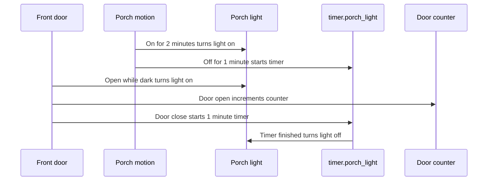

# Porch Setup Documentation

[<- Porch README](README.md) · [Rooms README](../README.md)

The porch setup is intentionally small: one main light, one motion sensor, the front-door contact, a wall-switch input, a timer, a counter, and helper scripts for door and alarm feedback.

## Device Inventory

| Category | Entity | Purpose |
|----------|--------|---------|
| Motion | `binary_sensor.porch_motion_occupancy` | Motion input for porch light automation and entry direction. |
| Light level | `sensor.porch_motion_illuminance` | Determines whether door opening should turn on the porch light. |
| Lighting | `light.porch` | Main porch light used for entry lighting and status colors. |
| Door | `binary_sensor.front_door` | Front-door open/closed state. |
| Manual input | `binary_sensor.porch_main_light_input` | Physical switch input for manual porch light toggle. |
| Timer | `timer.porch_light` | One-minute off timer. |
| Counter | `counter.front_door_opened_closed` | Front-door event counter reset by 20 second timeout automations. |
| Notification lights | `light.stairs_ambient`, `light.kitchen_cooker_rgb`, `light.kitchen_table_rgb` | Visual door-open indicators. |
| Alarm feedback | `alarm_control_panel.house_alarm`, `script.set_alarm_to_disarmed_mode`, living room flash scripts | Used by the NFC front-door script. |
| Heating | `climate.hive_receiver_heat` | Open-door warning when heating starts. |

## Setup Flow

## Scenes

| Scene | Purpose |
|-------|---------|
| `scene.porch_lights_off` | Turns the porch light off. |
| `scene.porch_light_on` | Warm white porch light at brightness 178. |
| `scene.porch_green_light` | Green status color. |
| `scene.porch_red_light` | Red status color. |
| `scene.porch_blue_light` | Blue status color. |
| `scene.front_door_open_notification` | Sets `light.stairs_ambient` blue for door-open notification. |

## Maintenance Checks

| Check | Why |
|------|-----|
| Hold porch motion on for 2 minutes | Confirms the delayed motion-on branch. |
| Let porch motion clear for 1 minute | Confirms timer start. |
| Open the front door in low light | Confirms illuminance-triggered door lighting. |
| Close the front door | Confirms timer start and notification cleanup. |
| Toggle `binary_sensor.porch_main_light_input` | Confirms wall-switch control. |
| Run `script.nfc_front_door` with alarm armed in a safe test | Confirms NFC alarm-disarm path and visual feedback. |

## Troubleshooting

| Problem | Likely Cause |
|---------|--------------|
| Door-open light does not turn on | `sensor.porch_motion_illuminance` may be 100 or above. |
| Motion lighting is slow | This is intentional: motion must remain on for 2 minutes before the light turns on. |
| Entry direction is wrong | The template only looks at porch motion state when the front door changes. |
| Counter does not reset immediately | Reset automations wait for the door to remain open or closed for 20 seconds. |
| Door notification lights remain on | Check `script.front_door_closed_notification` and the kitchen/stairs light entities it turns off. |
