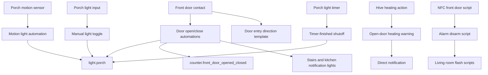
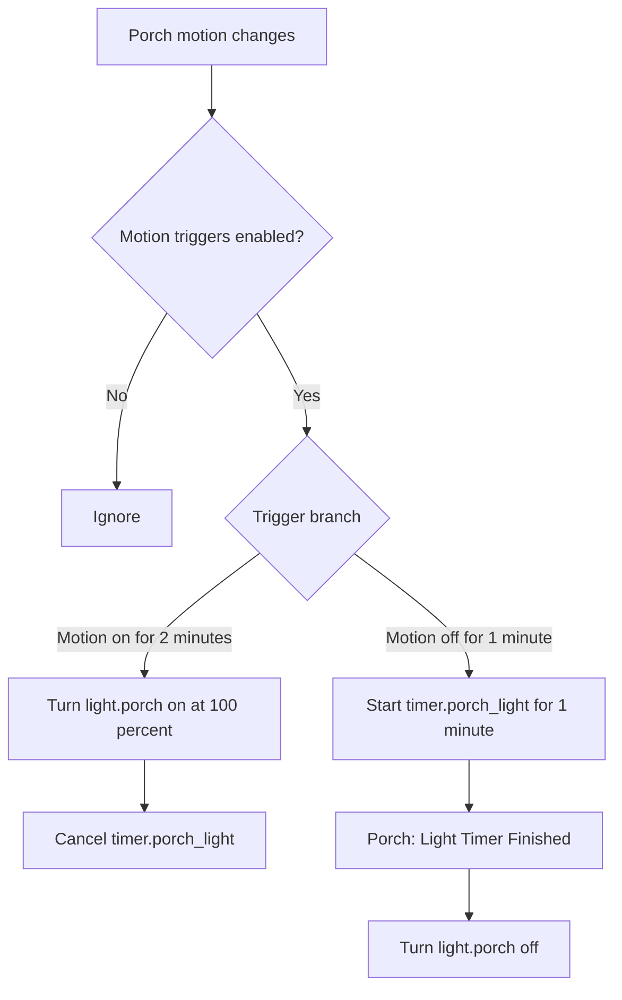

[<- Back to Rooms README](../README.md) · [Packages README](../../README.md) · [Main README](../../../README.md)

# Porch Package Documentation

The porch package manages entrance lighting, front-door state notifications, manual light control, NFC alarm disarming, and a simple heating warning when the front door is open.

This documentation covers the YAML file in this folder:

| File | Purpose | Contents |
|------|---------|----------|
| `porch.yaml` | Main porch behavior | 12 automations, 6 scenes, 5 scripts, 1 template sensor group |

## Quick Summary

For non-technical users, the important behavior is:

| Area | What Happens |
|------|--------------|
| Motion lighting | Porch motion on for 2 minutes turns the porch light on. Motion off for 1 minute starts a 1 minute off timer. |
| Door lighting | Opening the front door turns on the porch light if it is dark. Closing the door starts the porch light timer. |
| Door notifications | Opening the door while someone is home turns on visual notification lights; closing the door clears them. |
| Entry direction | A template sensor reports `entering` or `leaving` from porch motion state when the door changes. |
| Manual switch | The porch wall switch toggles `light.porch` and cancels the porch light timer. |
| Safety shutoff | If the porch light is on for 5 minutes while the door is closed and no timer is active, it is turned off. |
| NFC | The NFC script disarms the house alarm if it is armed and flashes living room lights as feedback. |
| Heating | If heating starts while the front door is open, a direct notification suggests closing the door or turning heating off. |

## How The Porch Decides What To Do

## Main File

| Section | YAML Objects | Summary |
|---------|--------------|---------|
| Motion lighting | 2 automations | Consolidated motion on/off handling and timer-finished shutoff. |
| Door handling | 7 automations, 2 scripts, 1 scene | Logs entry/exit clues, turns lights on if dark, manages a front-door counter, and handles visual notification lights. |
| Light control | 2 automations, 4 porch scenes, 2 scripts | Manual switch, 5 minute safety shutoff, colored porch scenes, override flash, and lock-status stop helper. |
| Heating | 1 automation | Warns if heating starts while the front door is open. |
| NFC/template | 1 script, 1 template group | NFC alarm disarm feedback and door entry direction sensor. |

## User Controls

| Entity | Plain-English Purpose |
|--------|-----------------------|
| `input_boolean.enable_porch_motion_triggers` | Master switch for porch motion lighting. |
| `timer.porch_light` | One-minute light-off timer used after motion clears or the front door closes. |
| `counter.front_door_opened_closed` | Tracks front-door opens/closes for entry/exit context and is reset by timeout automations. |

## Everyday Behavior

### Motion Lighting

### Front Door

| Automation | Behavior |
|------------|----------|
| `Porch: Some One Leaving` | Logs `Someone leaving` if porch motion is on when the door opens, otherwise logs `Someone entering`. |
| `Porch: Front Door Opened` | If `sensor.porch_motion_illuminance` is below 100, turns on `scene.porch_light_on` and cancels the porch timer. Always increments the door counter and waits 2 seconds for camera timing. |
| `Porch: Front Door Opened Once For More than 20 seconds` | If the door has stayed open for 20 seconds and the counter is below 2, resets the counter. |
| `Porch: Front Door Open Indicator` | When someone is home, runs `script.front_door_open_notification`. |
| `Porch: Front Door Closed For More than 20 seconds` | Resets the front-door counter. |
| `Porch: Front Door Closed` | Logs the close and runs `script.front_door_closed_notification`. |
| `Porch: Front Door Closed And Start Timer` | Starts the 1 minute porch timer and turns off `scene.stairs_light_off` as a fallback if `light.stairs` is on. |

### Scripts And Scenes

| Type | Count | Important Examples |
|------|-------|--------------------|
| Scenes | 6 | Porch off/on, porch green/red/blue, front-door open notification for `light.stairs_ambient`. |
| Scripts | 5 | `front_door_open_notification`, `front_door_closed_notification`, `nfc_front_door`, `porch_override_notification`, `stop_lock_status_light`. |

Power-user notes:

| Detail | Current YAML Behavior |
|--------|-----------------------|
| NFC | `script.nfc_front_door` disarms `alarm_control_panel.house_alarm` via `script.set_alarm_to_disarmed_mode` when the alarm is not already disarmed. |
| Lock status | `script.stop_lock_status_light` stops `script.front_door_lock_status` and turns off `light.porch`; no porch automation directly triggers from a lock entity in this file. |
| Entry direction | `sensor.door_entry_direction` is recalculated when `binary_sensor.front_door` changes, using porch motion `on` as `leaving` and `off` as `entering`. |

## Troubleshooting

| Symptom | Check |
|---------|-------|
| Motion does not turn the light on | Confirm `input_boolean.enable_porch_motion_triggers` is on and `binary_sensor.porch_motion_occupancy` stays on for 2 minutes. |
| Light turns off too soon | Check whether `timer.porch_light` was started by motion-off or door-close behavior. |
| Light stays on | Check `Porch: Light On And Door Is Shut`; it only runs when the door is closed and `timer.porch_light` is not active. |
| Door notification lights do not clear | Run or inspect `script.front_door_closed_notification`; it turns off stairs ambient and kitchen RGB lights. |
| NFC does not disarm | Check `alarm_control_panel.house_alarm` state and the shared `script.set_alarm_to_disarmed_mode`. |
| Heating warning missing | The Hive climate entity must change `hvac_action` from `idle` to `heating` while climate state is `auto` and `binary_sensor.front_door` is on. |
