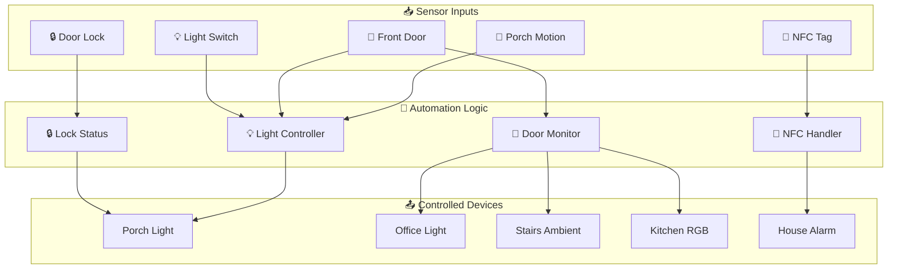
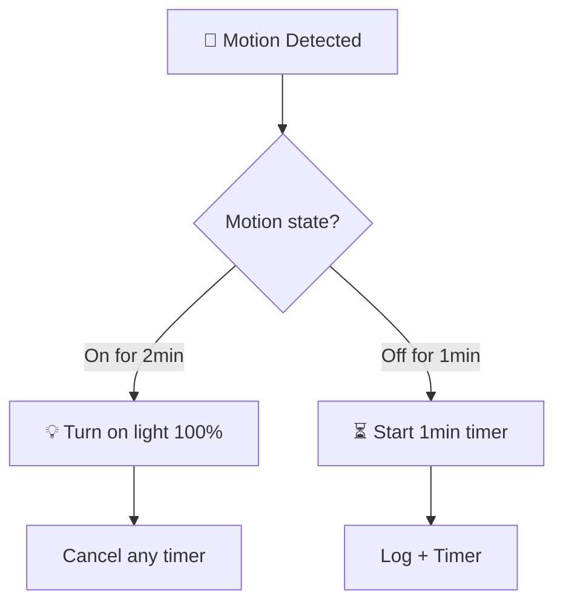
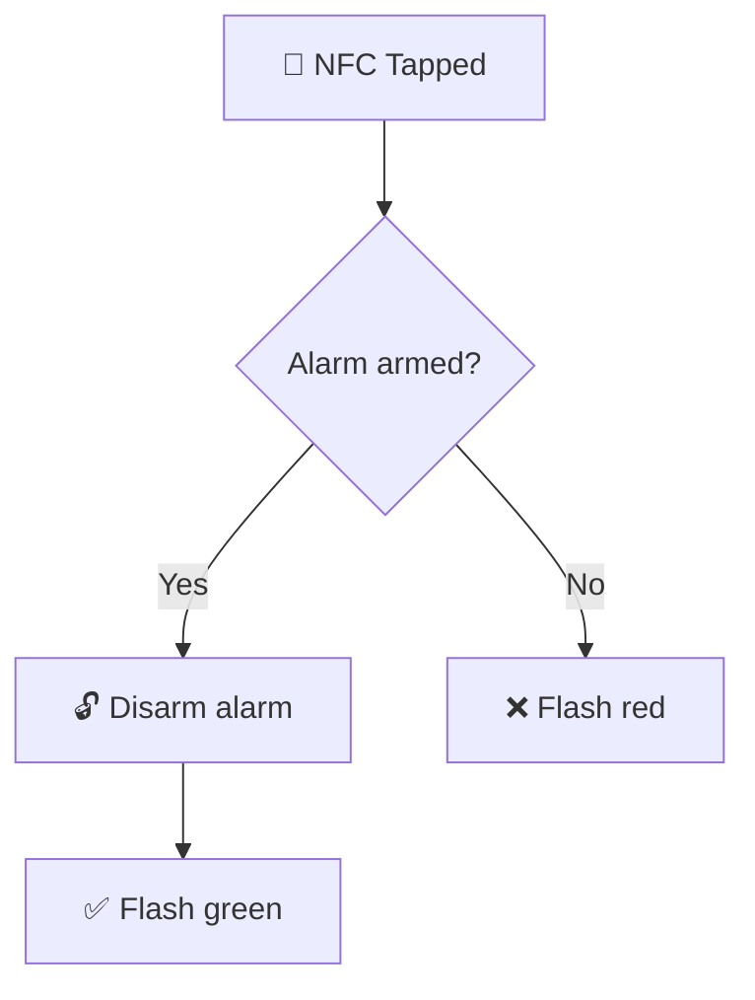
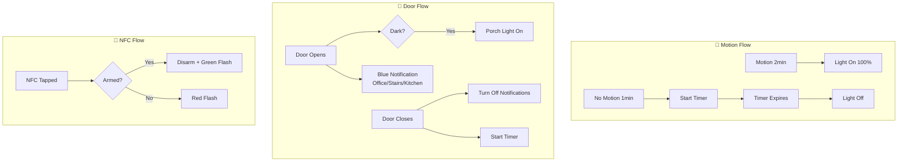

[<- Back to Rooms README](../README.md) · [Packages README](../../README.md) · [Main README](../../../README.md)

# Porch Package Documentation

This package manages the porch automation including motion-based lighting, front door monitoring, lock status indication, and NFC entry.

---

## Table of Contents

- [Overview](#overview)
- [Architecture](#architecture)
- [Automations](#automations)
  - [Motion Lighting](#motion-lighting)
  - [Front Door Monitoring](#front-door-monitoring)
  - [Light Control](#light-control)
- [Scenes](#scenes)
- [Scripts](#scripts)
- [Configuration](#configuration)
- [Entity Reference](#entity-reference)

---

## Overview

The porch automation provides entrance lighting, door state monitoring with multi-room notifications, and NFC-based alarm disarming.



---

## Architecture

### File Structure

```
packages/rooms/porch/
└── porch.yaml          # Main package file
```

### Key Components

| Component | Purpose |
|-----------|---------|
| `binary_sensor.porch_motion_occupancy` | Motion detection |
| `binary_sensor.front_door` | Door open/close state |
| `lock.front_door` | Smart lock status |
| `light.porch` | Main porch light |
| `sensor.door_entry_direction` | Entry/exit detection |

---

## Automations

### Motion Lighting

#### Porch: Motion Detected (On/Off)
**ID:** `1737283018710`

Consolidated motion handling with timer-based auto-off.



**Triggers:**
- Motion `on` for 2 minutes
- Motion `off` for 1 minute

**Condition:** `input_boolean.enable_porch_motion_triggers` must be `on`

**Actions:**
- **Motion on:** Turn light to 100%, cancel timer
- **Motion off:** Start 1-minute off timer

---

#### Porch: Light Timer Finished
**ID:** `1737283018709`

Turns off porch light when timer expires.

---

### Front Door Monitoring

#### Porch: Front Door Opened
**ID:** `1606157753577`

Comprehensive door open handling with lighting and logging.

**Actions:**
1. If dark (illuminance < 100):
   - Turn on porch light
   - Cancel porch timer
2. Increment door open counter
3. Log with counter value
4. 2-second delay (for camera capture)

---

#### Porch: Front Door Open Indicator
**ID:** `1611931052908`

Multi-room notification when door opens while someone is home.

**Conditions:**
- Someone is home (`group.tracked_people`)

**Actions:**
- Log message
- Activate `script.front_door_open_notification`
  - Saves current office light state
  - Turns office light blue
  - Turns stairs ambient blue
  - Turns kitchen RGB lights blue

---

#### Porch: Front Door Closed
**ID:** `1611931640441`

Cleans up notification lights when door closes.

**Actions:**
- Log message
- Activate `script.front_door_closed_notification`
  - Turns off stairs ambient
  - Turns off kitchen RGB
  - Turns off office light

---

#### Porch: Front Door Closed And Start Timer
**ID:** `1606157835544`

Extended door close handling with timer and fallback.

**Actions:**
- Start porch light timer (1 minute)
- Log message
- If stairs light is on, turn it off as fallback

---

#### Porch: Front Door Opened Once For More than 20 seconds
**ID:** `1614033445487`

Resets counter if door left open briefly.

**Triggers:**
- Door open for 20 seconds
- Counter below 2

**Actions:**
- Reset `counter.front_door_opened_closed` to 0

---

#### Porch: Front Door Closed For More than 20 seconds
**ID:** `1615224190495`

Resets counter after door closed for extended period.

---

### Light Control

#### Porch: Light Switch
**ID:** `1700940016581`

Physical switch toggle with timer cancellation.

**Triggers:**
- `binary_sensor.porch_main_light_input` state change

**Actions:**
- Log switch change
- Toggle porch light (on via scene, off with transition)
- Cancel porch timer

---

#### Porch: Light On And Door Is Shut
**ID:** `1708895092115`

Auto-off if light left on with closed door.

**Triggers:**
- Porch light on for 5 minutes

**Conditions:**
- Front door is closed
- No active timer

**Actions:**
- Log message
- Turn off porch light (2-second transition)

---

## Scenes

### Main Lighting Scenes

| Scene | Purpose | State |
|-------|---------|-------|
| `porch_lights_off` | Porch light off | Off |
| `porch_light_on` | Standard porch lighting | On, 178 brightness, 5025K |

### Lock Status Color Scenes

| Scene | Color | Meaning |
|-------|-------|---------|
| `porch_green_light` | Green | Door locked |
| `porch_red_light` | Red | Door unlocked |
| `porch_blue_light` | Blue | Lock transitioning |

### Notification Scene

| Scene | Purpose |
|-------|---------|
| `front_door_open_notification` | Blue notification in office and stairs |

---

## Scripts

### Front Door Open Notification
**Alias:** `front_door_open_notification`

Activates blue notification lights across multiple rooms.

**Actions:**
1. Save current office light state to scene
2. Turn on notification scene:
   - Office light: Blue
   - Stairs ambient: Blue
   - Kitchen cooker RGB: Blue
   - Kitchen table RGB: Blue

---

### Front Door Closed Notification
**Alias:** `front_door_closed_notification`

Cleans up notification lights.

**Actions:**
- Turn off stairs ambient
- Turn off kitchen cooker RGB
- Turn off kitchen table RGB
- Turn off office light

---

### NFC Front Door
**Alias:** `nfc_front_door`

NFC tag handler for alarm disarming.



**Logic:**
- If alarm is armed: Disarm it, flash lounge lights green
- If alarm is disarmed: Flash lounge lights red (already disarmed)

---

### Porch Override Notification
**Alias:** `porch_override_notification`

Visual override indicator with flash pattern.

**Actions:**
- Repeat 2 times:
  - Flash porch blue (255 brightness)
  - Flash porch white (178 brightness)
- Return to standard porch light scene

---

### Stop Lock Status Light
**Alias:** `stop_lock_status_light`

Stops lock status indication and turns off porch light.

**Actions:**
- Stop `script.front_door_lock_status`
- Turn off porch light

---

## Configuration

### Counters

| Entity | Purpose |
|--------|---------|
| `counter.front_door_opened_closed` | Tracks door open/close cycles |

### Timers

| Timer | Duration | Purpose |
|-------|----------|---------|
| `timer.porch_light` | 1 minute | Auto-off delay |

### Template Sensors

#### Door Entry Direction
**Entity:** `sensor.door_entry_direction`

Determines if someone is entering or leaving based on motion state.

| State | Condition |
|-------|-----------|
| `leaving` | Porch motion is on |
| `entering` | Porch motion is off |
| `unknown` | Motion unavailable |

**Icon:** Changes based on state (exit/enter/alert)

---

## Entity Reference

### Lights

| Entity | Purpose |
|--------|---------|
| `light.porch` | Main porch light (RGB capable) |
| `light.stairs_ambient` | Stairs ambient (notification) |
| `light.office_light` | Office light (notification) |
| `light.kitchen_cooker_rgb` | Kitchen RGB (notification) |
| `light.kitchen_table_rgb` | Kitchen RGB (notification) |

### Binary Sensors

| Entity | Purpose |
|--------|---------|
| `binary_sensor.porch_motion_occupancy` | Porch motion |
| `binary_sensor.front_door` | Front door state |
| `binary_sensor.porch_main_light_input` | Light switch input |

### Sensors

| Entity | Purpose |
|--------|---------|
| `sensor.porch_motion_illuminance` | Porch light level |
| `sensor.door_entry_direction` | Entry/exit detection |

### Lock

| Entity | Purpose |
|--------|---------|
| `lock.front_door` | Smart door lock |

### Alarm

| Entity | Purpose |
|--------|---------|
| `alarm_control_panel.house_alarm` | House alarm system |

### Groups

| Entity | Purpose |
|--------|---------|
| `group.tracked_people` | Home occupancy |

---

## Automation Flow Summary



---

## Related Documentation

| Document | Purpose |
|----------|---------|
| [PORCH-SETUP.md](PORCH-SETUP.md) | Hardware setup and device configuration |
| [Rooms Overview](../README.md) | Overview of all room packages |
| [Main Packages README](../../README.md) | Architecture and organization guidelines |

### Related Rooms

| Room | Connection |
|------|------------|
| [Office](../office/README.md) | Front door open triggers office light notification |
| [Stairs](../stairs/README.md) | Front door status affects stairs ambient light |
| [Kitchen](../kitchen/README.md) | Front door notifications trigger kitchen RGB lights |
| [Living Room](../living_room/README.md) | NFC tag handler flashes lounge lights |
| [Bedroom](../bedroom/README.md) | Bedroom door close triggers stairs lights off |

### Related Integrations

| Integration | Connection |
|-------------|------------|
| [Alarm](../../alarm.yaml) | NFC tag disarms house alarm |
| [Energy](../../integrations/energy/README.md) | EcoFlow kitchen plug notifications |

---

## Maintenance Notes

### Troubleshooting

| Issue | Check |
|-------|-------|
| Porch light not turning on | Motion sensor state, illuminance level |
| Door notifications not working | `group.tracked_people` state |
| NFC not disarming alarm | Alarm panel state, NFC tag registration |
| Notification lights stuck | Run `front_door_closed_notification` script |

### Entry Direction Logic

The entry direction sensor uses porch motion state at the time of door state change:
- **Motion ON** → Someone was in porch → **Leaving**
- **Motion OFF** → No one in porch → **Entering**

This assumes motion sensor covers the porch area effectively.

---

*Last updated: 2026-04-06*
