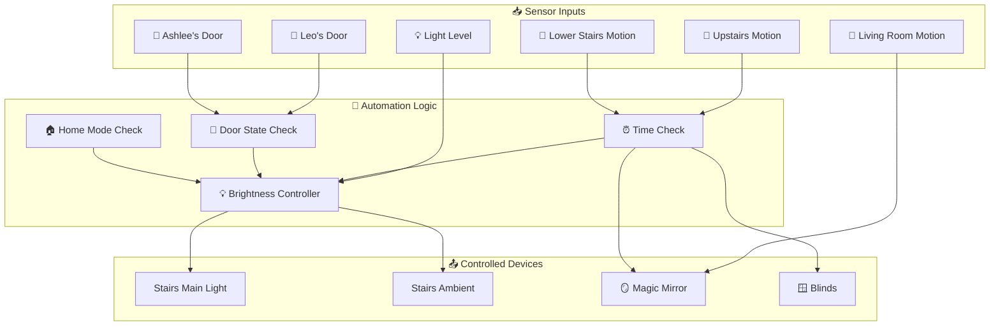
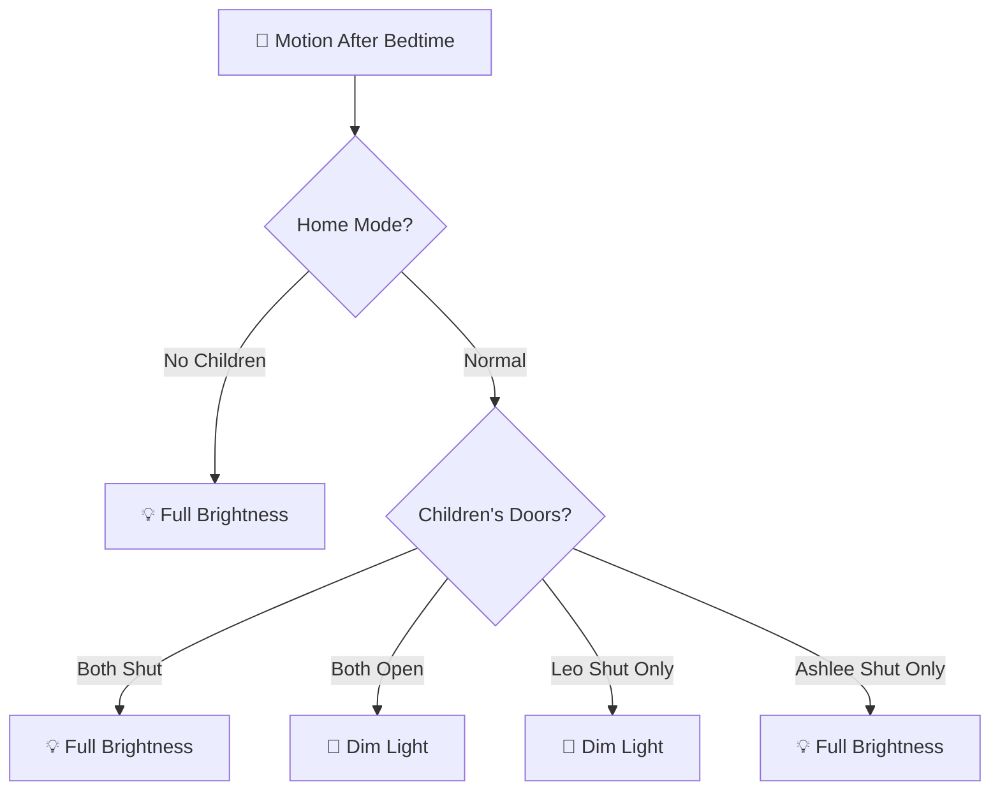
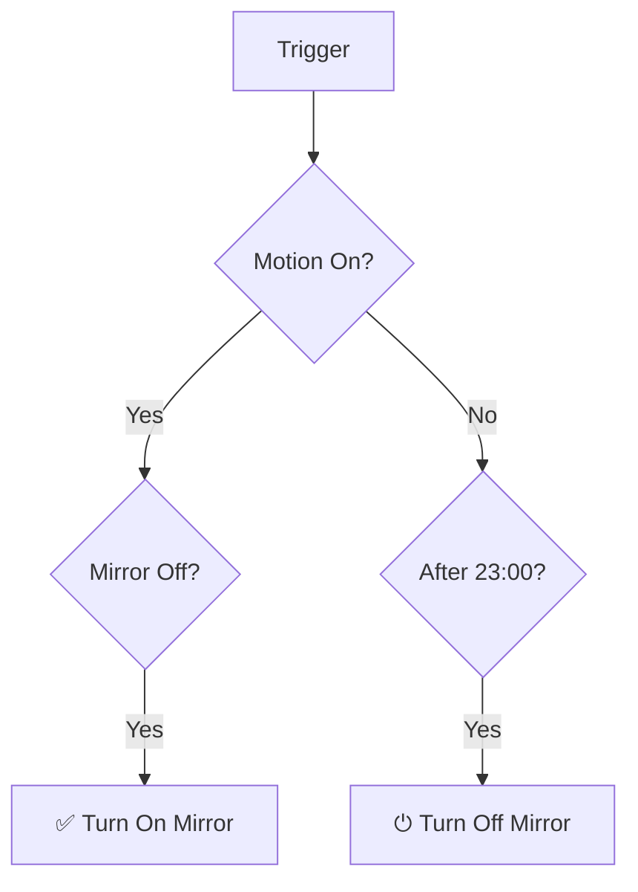
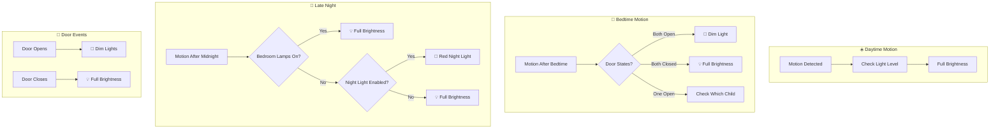

[<- Back to Rooms README](../README.md) · [Packages README](../../README.md) · [Main README](../../../README.md)

# Stairs Package Documentation

This package manages the stairs and landing automation including motion-based lighting with time-aware brightness, children's bedroom door integration, Magic Mirror control, and blind automation.

---

## Table of Contents

- [Overview](#overview)
- [Architecture](#architecture)
- [Automations](#automations)
  - [Motion Lighting](#motion-lighting)
  - [No Motion Handling](#no-motion-handling)
  - [Children's Door Integration](#childrens-door-integration)
  - [Magic Mirror Control](#magic-mirror-control)
  - [Blind Control](#blind-control)
  - [Security](#security)
- [Scenes](#scenes)
- [Configuration](#configuration)
- [Entity Reference](#entity-reference)

---

## Overview

The stairs automation provides intelligent lighting that adapts to time of day, children's bedroom door states, and occupancy. It also controls the Magic Mirror display and stair blinds.



---

## Architecture

### File Structure

```
packages/rooms/stairs/
└── stairs.yaml          # Main package file
```

### Key Components

| Component | Purpose |
|-----------|---------|
| `binary_sensor.upstairs_area_motion` | Upstairs motion detection |
| `binary_sensor.upstairs_motion_occupancy` | Fallback motion sensor |
| `binary_sensor.stairs_motion_occupancy` | Lower stairs motion |
| `sensor.stairs_motion_illuminance` | Light level for brightness decisions |
| `light.stairs` | Main stairs light |
| `light.stairs_2` | Lower stairs ambient |
| `cover.stairs_blinds` | Stair blinds |

---

## Automations

### Motion Lighting

#### Stairs: Motion Detected For Ambient Lights
**ID:** `1624918278463`

Lower stairs ambient lighting with day/night awareness.

**Triggers:**
- Lower stairs motion changes from `off` to `on`

**Conditions:**
- Motion triggers enabled

**Logic:**
| Time | Action |
|------|--------|
| After sunrise | Turn on ambient light (dim) |
| Before sunrise (night) | Dim ambient light |

---

#### Stairs: Motion Detected Before Kids Bed Time (Dark, Upstairs)
**ID:** `1598726353326`

Pre-bedtime full brightness motion lighting.

**Triggers:**
- Upstairs motion detected

**Conditions:**
- Dark (illuminance below threshold)
- Motion triggers enabled
- Between 07:00 and children's bedtime
- Light is off or very dim (<5 brightness)

**Actions:**
- Log with light level info
- Turn on stairs light at full brightness

---

#### Stairs: Dark, After Bed Time, Motion Detected Before Midnight
**ID:** `1587595659605`

Complex post-bedtime lighting with child-aware brightness.



**Logic Matrix:**

| Home Mode | Leo's Door | Ashlee's Door | Result |
|-----------|------------|---------------|--------|
| No Children | Any | Any | Full brightness |
| Normal | Shut | Shut | Full brightness |
| Normal | Open | Open | Dim |
| Normal | Shut | Open | Dim (Leo sleeping) |
| Normal | Open | Shut | Full (Ashlee sleeping) |

---

#### Stairs: Dark, After Bed Time, Motion Detected After Midnight
**ID:** `1587595659606`

Late night motion with bedroom awareness and night light option.

**Triggers:**
- Upstairs motion detected

**Conditions:**
- Dark (illuminance below threshold)
- Motion triggers enabled
- Before sunrise or before 07:00

**Logic:**
| Condition | Action |
|-----------|--------|
| Bedroom lamps on | Full brightness |
| Night light enabled | Night light scene (red, 5 brightness) |
| Default | Full brightness |

---

### No Motion Handling

#### Stairs: No Motion Detected (Lights Off)
**ID:** `1587595847618`

Consolidated no-motion handler for both stair sections.

**Triggers:**
- Upstairs motion off for 1 minute
- Lower stairs motion off for 1 minute

**Conditions:**
- Motion triggers enabled

**Actions:**
- **Upstairs off:** Turn off main stairs light
- **Lower off:** Turn off stairs_2 ambient

---

### Children's Door Integration

#### Stairs: Light On And Children's Door Open After Bedtime And Before Midnight
**ID:** `1615849889104`

Dims lights when children open doors after bedtime.

**Triggers:**
- Leo's door opens
- Ashlee's door opens

**Conditions:**
- Between bedtime and midnight
- Stairs light is on
- Not in "No Children" mode

**Actions:**
- Dim appropriate lights based on which door opened

---

#### Stairs: Light On And Children's Door Closed Before Midnight
**ID:** `1615850302527`

Restores full brightness when children close doors.

**Triggers:**
- Leo's door closes
- Ashlee's door closes

**Conditions:**
- Between bedtime and midnight
- Stairs light is on
- Normal home mode

**Actions:**
- Turn up lights to full brightness when both doors closed

---

### Magic Mirror Control

#### Stairs: Magic Mirror Control (Motion/Night)
**ID:** `1592062695452`

Smart mirror control based on motion and time.

**Triggers:**
- Living room motion on
- Lower stairs motion on
- Lower stairs motion off for 3 minutes
- Time: 23:30

**Conditions:**
- Magic Mirror automations enabled

**Logic:**


---

#### MagicMirror: Turn Off Based On Time During Weekday
**ID:** `1588856667889`

Weekday daytime mirror shutdown.

**Triggers:**
- No motion for 5 minutes

**Conditions:**
- Weekday 09:00-17:30
- Magic Mirror automations enabled

**Actions:**
- Turn off Magic Mirror

---

### Blind Control

#### Stairs: Close Blinds At Night
**ID:** `1630760046947`

Scheduled blind closure.

**Triggers:**
- Sunset + 1 hour

**Conditions:**
- Blinds are open
- Blind automations enabled

---

#### Stairs: Open Blinds In The Morning
**ID:** `1630760149356`

Morning blind opening.

**Triggers:**
- 08:00 daily

**Conditions:**
- Blinds are closed
- Blind automations enabled

---

### Security

#### Stairs: Person Detected
**ID:** `1630015410190`

Camera-based person detection when alarm armed.

**Triggers:**
- Person detected on stairs

**Conditions:**
- Alarm is in `armed_away` state

**Actions:**
- Capture camera snapshot
- Send notification with image

---

### Light Control

#### Stairs: Light Switch
**ID:** `1714869692076`

Physical switch toggle.

**Triggers:**
- Switch input state change

**Actions:**
- Toggle stairs light at full brightness

---

#### Stairs: Front Door Status On For Long Time
**ID:** `1743186662872`

Auto-off for ambient light when front door closed.

**Triggers:**
- Stairs ambient on for 3 or 5 minutes

**Conditions:**
- Front door is closed

**Actions:**
- Turn off stairs ambient light

---

## Scenes

### Main Stairs Scenes

| Scene | Brightness | Color Temp | Purpose |
|-------|------------|------------|---------|
| `stairs_light_on` | 155 | 3921K | Standard on |
| `stairs_light_off` | Off | - | Off state |
| `stairs_light_dim` | 20 | 3921K | Dimmed for night |

### Lower Stairs Scenes

| Scene | Brightness | Purpose |
|-------|------------|---------|
| `stairs_light_2_on` | 255 | Full brightness |
| `stairs_2_light_dim` | 38 | Dimmed |
| `stairs_light_2_off` | 0 | Off |

### Notification Scenes

| Scene | Color | Purpose |
|-------|-------|---------|
| `landing_set_light_to_blue` | Blue | Notification indicator |
| `landing_set_light_to_red` | Red | Alert indicator |

### Special Scenes

| Scene | Brightness | Color | Purpose |
|-------|------------|-------|---------|
| `stairs_night_light` | 5 | Red (358°) | Minimal night lighting |

---

## Configuration

### Input Booleans

| Entity | Purpose |
|--------|---------|
| `input_boolean.enable_stairs_motion_triggers` | Master motion lighting switch |
| `input_boolean.enable_leos_door_automations` | Enable Leo's door integration |
| `input_boolean.enable_ashlees_door_automations` | Enable Ashlee's door integration |
| `input_boolean.enable_stairs_night_light` | Enable night light mode |
| `input_boolean.enable_magic_mirror_automations` | Enable Magic Mirror control |
| `input_boolean.enable_stairs_blind_automations` | Enable blind automation |

### Input Numbers

| Entity | Purpose |
|--------|---------|
| `input_number.stairs_light_level_threshold` | Light level threshold for motion |

### Input Datetimes

| Entity | Purpose |
|--------|---------|
| `input_datetime.childrens_bed_time` | Children's bedtime for lighting logic |

### Input Selects

| Entity | Purpose |
|--------|---------|
| `input_select.home_mode` | Home mode (Normal, No Children, etc.) |

---

## Entity Reference

### Lights

| Entity | Purpose |
|--------|---------|
| `light.stairs` | Main stairs light |
| `light.stairs_2` | Lower stairs ambient |
| `light.stairs_ambient` | Landing ambient (RGB capable) |
| `light.bedroom_lamps` | Bedroom lamps (for night mode check) |

### Binary Sensors

| Entity | Purpose |
|--------|---------|
| `binary_sensor.upstairs_area_motion` | Upstairs area motion |
| `binary_sensor.upstairs_motion_occupancy` | Upstairs motion (fallback) |
| `binary_sensor.stairs_motion_occupancy` | Lower stairs motion |
| `binary_sensor.leos_bedroom_door_contact` | Leo's door state |
| `binary_sensor.ashlees_bedroom_door_contact` | Ashlee's door state |
| `binary_sensor.childrens_bedroom_doors` | Combined children's doors |
| `binary_sensor.living_room_area_motion` | Living room motion |
| `binary_sensor.stairs_person_detected` | Person detection (Frigate) |
| `binary_sensor.front_door` | Front door state |
| `binary_sensor.stairs_light_input_0_input` | Light switch input |

### Sensors

| Entity | Purpose |
|--------|---------|
| `sensor.stairs_motion_illuminance` | Light level |

### Covers

| Entity | Purpose |
|--------|---------|
| `cover.stairs_blinds` | Stair blinds |

### Switches

| Entity | Purpose |
|--------|---------|
| `switch.magic_mirror_plug` | Magic Mirror power |

### Alarm

| Entity | Purpose |
|--------|---------|
| `alarm_control_panel.house_alarm` | House alarm system |

### Groups

| Entity | Purpose |
|--------|---------|
| `group.tracked_people` | Home occupancy |

---

## Automation Flow Summary



---

## Related Documentation

| Document | Purpose |
|----------|---------|
| [STAIRS-SETUP.md](STAIRS-SETUP.md) | Hardware setup and device configuration |
| [Rooms Overview](../README.md) | Overview of all room packages |
| [Main Packages README](../../README.md) | Architecture and organization guidelines |

### Related Rooms

| Room | Connection |
|------|------------|
| [Bedroom](../bedroom/README.md) | Children's door states affect stairs lighting brightness |
| [Living Room](../living_room/README.md) | Living room motion triggers Magic Mirror |
| [Porch](../porch/README.md) | Front door status affects stairs ambient light |

### Related Integrations

| Integration | Connection |
|-------------|------------|
| [Alarm](../../alarm.yaml) | Person detection when alarm armed_away |
| [HVAC](../../integrations/hvac/README.md) | Central heating control via door open/close |

---

## Maintenance Notes

### Troubleshooting

| Issue | Check |
|-------|-------|
| Lights not responding to motion | `input_boolean.enable_stairs_motion_triggers` state |
| Wrong brightness at bedtime | Children's door states, `input_datetime.childrens_bed_time` |
| Night light not working | `input_boolean.enable_stairs_night_light` state |
| Magic Mirror not turning on | `input_boolean.enable_magic_mirror_automations` state |

### Seasonal Adjustments

- **Summer:** Consider adjusting bedtime if children stay up later
- **Winter:** May want earlier blind closure

### Child Door Logic

The automation assumes:
- **Door closed** = Child is sleeping (dim lights to avoid waking)
- **Door open** = Child is awake (full brightness acceptable)

This can be customized per child via their respective `enable_*_door_automations` booleans.

---

*Last updated: March 2026*
