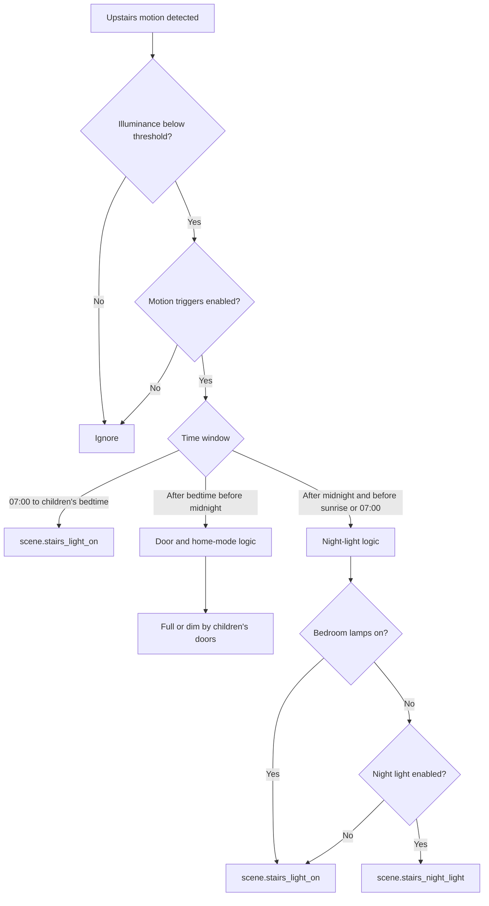

[<- Back to Rooms README](../README.md) · [Packages README](../../README.md) · [Main README](../../../README.md)

# Stairs Package Documentation

The stairs package keeps the stairway safe without making the house too bright at night. It reacts to upstairs and lower-stairs motion, changes brightness around children's bedtime, uses bedroom door state to protect sleep, controls the Magic Mirror, moves the stair blind, and captures a camera snapshot if a person is detected while the house alarm is armed away.

This documentation covers the YAML file in this folder:

| File | Purpose | Contents |
|------|---------|----------|
| `stairs.yaml` | Main stairs behavior | 14 automations, 9 scenes |

## Quick Summary

For non-technical users, the important behavior is:

| Area | What Happens |
|------|--------------|
| Lower stairs ambient light | Lower-stairs motion turns on `light.stairs_2`; after sunrise it uses the normal on scene, before sunrise it uses the dim scene. |
| Upstairs main light | Upstairs motion turns on `light.stairs` when it is dark and the light is off or almost off. Brightness depends on time, home mode, night-light setting, and children's bedroom doors. |
| No motion | After 1 minute with no upstairs motion, the main stairs light turns off; lower-stairs ambient also turns off when the bottom motion fallback branch runs. |
| Children's doors | Opening or closing children's bedroom doors after bedtime can dim or brighten the stairs while lights are already on. |
| Magic Mirror | Motion in the living room or lower stairs turns the Magic Mirror on. Late-night no motion or 23:30 shutdown can turn it off. Weekday no-motion during work hours also turns it off. |
| Blinds | Stair blinds open at 08:00 and close 1 hour after sunset when blind automation is enabled. |
| Security camera | Person detection on the stairs while the alarm is armed away takes a snapshot and posts it to the home log. |
| Front-door indicator cleanup | If `light.stairs_ambient` stays on while the front door is closed, it is turned off after 3 or 5 minutes. |

## How The Stairs Decide What To Do

```mermaid
flowchart TB
    LowerMotion[Lower stairs motion] --> Ambient[Ambient light control]
    UpstairsMotion[Upstairs motion and fallback motion] --> MainLight[Main stairs light control]
    Illuminance[Stairs illuminance] --> MainLight
    Bedtime[Children's bedtime helper] --> MainLight
    HomeMode[Home mode] --> MainLight
    ChildDoors[Children's bedroom doors] --> MainLight
    NightLight[Night-light helper] --> MainLight
    LivingMotion[Living room motion] --> Mirror[Magic Mirror]
    LowerMotion --> Mirror
    Sun[Sunset] --> Blinds[Stair blinds]
    Clock[08:00 and weekday windows] --> Blinds
    Person[Stairs person detection] --> Security[Camera snapshot]
    Door[Front door] --> AmbientCleanup[Front-door status cleanup]

    Ambient --> Stairs2[light.stairs_2]
    MainLight --> StairsMain[light.stairs]
    Mirror --> MagicMirror[switch.magic_mirror_plug]
    Blinds --> Cover[cover.stairs_blinds]
    Security --> Log[Home log with attachment]
    AmbientCleanup --> StairsAmbient[light.stairs_ambient]
```

## Main File

| Section | YAML Objects | Summary |
|---------|--------------|---------|
| Motion lighting | 5 automations | Lower ambient lighting, before-bedtime main lighting, before-midnight after-bedtime logic, after-midnight night-light logic, and no-motion shutoff. |
| Magic Mirror | 2 automations | Motion/night control and weekday daytime no-motion shutdown. |
| Manual and child doors | 3 automations | Physical switch toggle plus bedroom-door open/closed adjustments after bedtime. |
| Blinds | 2 automations | Close after sunset plus 1 hour, open at 08:00. |
| Security/status cleanup | 2 automations | Person-detected camera snapshot and front-door status light cleanup. |
| Scenes | 9 scenes | Main stairs on/off/dim/night, lower stairs on/dim/off, landing blue/red status. |

## User Controls

| Entity | Plain-English Purpose |
|--------|-----------------------|
| `input_boolean.enable_stairs_motion_triggers` | Master switch for stairs motion lighting and Magic Mirror motion-on checks. |
| `input_boolean.enable_stairs_night_light` | Enables the red ultra-dim night-light scene after midnight. |
| `input_boolean.enable_magic_mirror_automations` | Enables Magic Mirror on/off automations. |
| `input_boolean.enable_stairs_blind_automations` | Enables stair blind open/close automations. |
| `input_boolean.enable_leos_door_automations` | Allows Leo's door state to affect after-bedtime stair brightness. |
| `input_boolean.enable_ashlees_door_automations` | Allows Ashlee's door state to affect after-bedtime stair brightness. |
| `input_datetime.childrens_bed_time` | Boundary between daytime/pre-bedtime and after-bedtime stair lighting. |
| `input_number.stairs_light_level_threshold` | Illuminance threshold for upstairs dark-motion lighting. |
| `input_select.home_mode` | `No Children` bypasses child-door dimming logic in the before-midnight motion automation. |

## Everyday Behavior

### Motion Lighting

The main stairs motion automations only act when `light.stairs` is off or its brightness is below 5.

### Child-Aware Brightness

Before midnight after children's bedtime, the motion automation uses this effective matrix:

| Home/Door State | Result |
|-----------------|--------|
| `input_select.home_mode` is `No Children` | Full brightness. |
| Both children's door automations enabled and combined door group is closed | Full brightness. |
| Both children's door automations enabled and combined door group is open | Dim. |
| Leo's automation enabled, Ashlee's disabled, and Leo's door is closed | Dim. |
| Leo's automation disabled, Ashlee's enabled, and Ashlee's door is closed | Full brightness. |

Bedroom-door changes while the stairs light is already on also adjust brightness:

| Automation | Behavior |
|------------|----------|
| `Stairs: Light On And Children's Door Open After Bedtime And Before Midnight` | Leo's door opening dims the main light and turns `light.stairs_2` on. Ashlee's door opening turns the main light on and turns `light.stairs_2` on. |
| `Stairs: Light On And Children's Door Closed Before Midnight` | When relevant door automation conditions match, turns the main light and `light.stairs_2` on. |

### Lower Stairs And No Motion

| Automation | Behavior |
|------------|----------|
| `Stairs: Motion Detected For Ambient Lights` | Lower-stairs motion turns on `scene.stairs_light_2_on` after sunrise or `scene.stairs_light_2_dim` before sunrise, when motion triggers are enabled and `light.stairs_2` is off. |
| `Stairs: No Motion Detected (Lights Off)` | Upstairs no motion for 1 minute turns off `scene.stairs_light_off` and can also turn off `light.stairs_2`. Bottom no motion for 1 minute turns off `scene.stairs_light_2_off` through the fallback branch. |

Power-user note: the YAML defines two identical lower-stairs off triggers. The effective lower-stairs action is attached to `motion_off_bottom_fallback`.

### Magic Mirror, Blinds, And Security

| Automation | Behavior |
|------------|----------|
| `Stairs: Magic Mirror Control (Motion/Night)` | Turns on `switch.magic_mirror_plug` from living room or lower-stairs motion if mirror automations and stairs motion triggers are enabled. Turns it off from lower-stairs no motion for 3 minutes or the 23:30 trigger, but only between 23:00 and 05:00. |
| `MagicMirror: Turn Off Based On Time During Weekday` | Turns off the Magic Mirror when lower-stairs motion has been off for 5 minutes between 09:00 and 17:30 Monday-Friday. |
| `Stairs: Close Blinds At Night` | Closes `cover.stairs_blinds` 1 hour after sunset if currently open and blind automations are enabled. |
| `Stairs: Open Blinds In The Morning` | Opens `cover.stairs_blinds` at 08:00 if currently closed and blind automations are enabled. |
| `Stairs: Person Detected` | When the alarm is `armed_away`, snapshots `camera.stairs_high_resolution_channel` and posts the file path from `input_text.latest_frigate_upstairs_person_file_path`. |
| `Stairs: Front Door Status On For Long Time` | Turns off `light.stairs_ambient` after it has been on for 3 or 5 minutes while `binary_sensor.front_door` is closed. |

## Scenes

| Scene | Purpose |
|-------|---------|
| `scene.stairs_light_on` | Main stairs light on at brightness 155. |
| `scene.stairs_light_off` | Main stairs light off. |
| `scene.stairs_light_dim` | Main stairs light dim at brightness 20. |
| `scene.stairs_light_2_on` | Lower stairs ambient on bright. |
| `scene.stairs_light_2_dim` | Lower stairs ambient dim. |
| `scene.stairs_light_2_off` | Lower stairs ambient off scene. |
| `scene.landing_set_light_to_blue` | Landing/status ambient blue. |
| `scene.landing_set_light_to_red` | Landing/status ambient red. |
| `scene.stairs_night_light` | Main stairs red night light at brightness 5. |

## Troubleshooting

| Symptom | Check |
|---------|-------|
| Upstairs motion does not turn the light on | Confirm `input_boolean.enable_stairs_motion_triggers` is on, `sensor.stairs_motion_illuminance` is below threshold, and `light.stairs` is off or brightness below 5. |
| Night motion is too bright | Turn on `input_boolean.enable_stairs_night_light`; if `light.bedroom_lamps` is on, the automation intentionally uses full brightness. |
| Child-door behavior seems wrong | Check `input_select.home_mode`, both door contact states, and the two door automation enable booleans. |
| Magic Mirror does not turn on | Confirm both `input_boolean.enable_magic_mirror_automations` and `input_boolean.enable_stairs_motion_triggers` are on, and `switch.magic_mirror_plug` is off before motion. |
| Magic Mirror does not turn off at 23:30 | The night shutdown branch also requires the time condition to be between 23:00 and 05:00 and the plug to be on. |
| Stairs blind does not move | Check `input_boolean.enable_stairs_blind_automations` and the current `cover.stairs_blinds` state. |
| Person detection does not send a snapshot | The alarm must be `armed_away`, camera must be available, and `input_text.latest_frigate_upstairs_person_file_path` must point to a writable path. |
