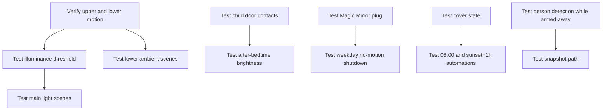

# Stairs Setup Documentation

[<- Stairs README](README.md) · [Rooms README](../README.md)

The stairs setup combines upper and lower motion sensors, a main stair light, a lower ambient light, landing status lighting, children's bedroom door contacts, a Magic Mirror plug, stair blinds, and a Frigate person-detection camera.

## Device Inventory

| Category | Entity | Purpose |
|----------|--------|---------|
| Upstairs motion | `binary_sensor.upstairs_area_motion`, `binary_sensor.upstairs_motion_occupancy` | Main and fallback motion triggers for the upper landing. |
| Lower motion | `binary_sensor.stairs_motion_occupancy` | Lower-stairs ambient lighting and Magic Mirror control. |
| Light level | `sensor.stairs_motion_illuminance` | Dark-condition check for main stair lighting. |
| Main light | `light.stairs` | Main stairway light. |
| Lower ambient | `light.stairs_2` | Lower-stairs ambient/accent light. |
| Landing status | `light.stairs_ambient` | Door/status indication light, also cleaned up by the stairs package. |
| Blinds | `cover.stairs_blinds` | Stairway blind opened/closed by schedule. |
| Children's doors | `binary_sensor.leos_bedroom_door_contact`, `binary_sensor.ashlees_bedroom_door_contact`, `binary_sensor.childrens_bedroom_doors` | Child-aware bedtime brightness decisions. |
| Manual switch | `binary_sensor.stairs_light_input_0_input` | Toggles `light.stairs` at full brightness. |
| Magic Mirror | `switch.magic_mirror_plug` | Display plug controlled by motion/time. |
| Security | `binary_sensor.stairs_person_detected`, `camera.stairs_high_resolution_channel`, `alarm_control_panel.house_alarm` | Person snapshot while armed away. |
| Front door | `binary_sensor.front_door` | Allows stale `light.stairs_ambient` cleanup only when the front door is closed. |

## Setup Flow

## Scene Reference

| Scene | Target | Notes |
|-------|--------|-------|
| `scene.stairs_light_on` | `light.stairs` | Brightness 155, warm white. |
| `scene.stairs_light_off` | `light.stairs` | Main light off. |
| `scene.stairs_light_dim` | `light.stairs` | Brightness 20. |
| `scene.stairs_night_light` | `light.stairs` | Red, brightness 5. |
| `scene.stairs_light_2_on` | `light.stairs_2` | Lower ambient bright. |
| `scene.stairs_light_2_dim` | `light.stairs_2` | Lower ambient brightness 38. |
| `scene.stairs_light_2_off` | `light.stairs_2` | Lower ambient off scene. |
| `scene.landing_set_light_to_blue` | `light.stairs_ambient` | Landing blue status. |
| `scene.landing_set_light_to_red` | `light.stairs_ambient` | Landing red status. |

## Maintenance Checks

| Check | Why |
|------|-----|
| Trigger `binary_sensor.upstairs_area_motion` and fallback occupancy | Confirms upper motion paths. |
| Trigger `binary_sensor.stairs_motion_occupancy` | Confirms lower ambient lighting and Magic Mirror on behavior. |
| Set `sensor.stairs_motion_illuminance` test conditions in Developer Tools | Confirms threshold behavior before tuning. |
| Toggle `input_boolean.enable_stairs_night_light` | Confirms after-midnight red-light branch. |
| Open and close each children's door after bedtime in a safe test | Confirms dim/bright door behavior. |
| Toggle `binary_sensor.stairs_light_input_0_input` | Confirms physical switch path. |
| Test `cover.stairs_blinds` open/closed state | Automations check current cover state before moving. |
| Test person detection while alarm state is controlled | Confirms snapshot and attachment path. |

## Troubleshooting

| Problem | Likely Cause |
|---------|--------------|
| Lower ambient does not turn on | `light.stairs_2` may already be on, or `input_boolean.enable_stairs_motion_triggers` is off. |
| Main light does not respond to motion | The room may not be dark enough, the light may already be above brightness 5, or the time window does not match any motion automation. |
| Lights go dim after bedtime | Child-door logic is active; check door contacts and `input_select.home_mode`. |
| Lights do not turn off | Confirm upstairs/lower motion sensors stay off for 1 minute. |
| Magic Mirror remains on during the day | The weekday shutdown only runs Monday-Friday between 09:00 and 17:30 after lower-stairs motion is off for 5 minutes. |
| Landing/status light remains on | `Stairs: Front Door Status On For Long Time` only turns it off when the front door is closed. |
