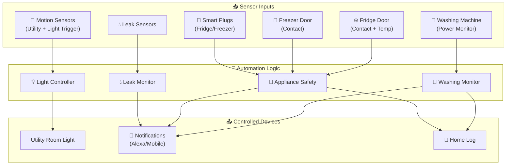
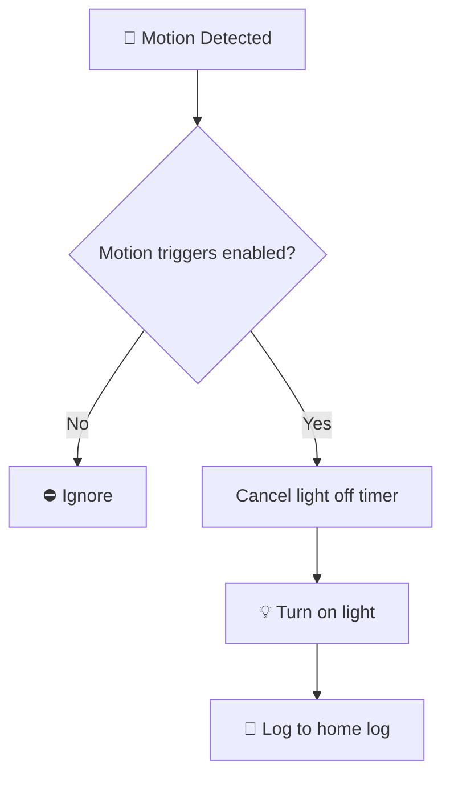
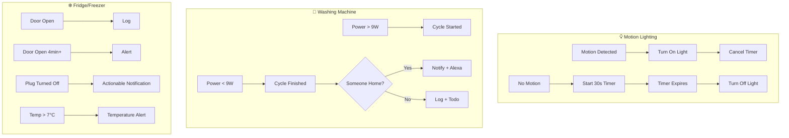

[<- Back to Rooms README](README.md) · [Packages README](../README.md) · [Main README](../../README.md)

# Utility Room Package Documentation

This package manages the utility room automation including lighting control, washing machine monitoring, appliance safety (fridge/freezer), and leak detection.

---

## Table of Contents

- [Overview](#overview)
- [Architecture](#architecture)
- [Automations](#automations)
  - [Lighting Control](#lighting-control)
  - [Washing Machine Monitoring](#washing-machine-monitoring)
  - [Fridge/Freezer Safety](#fridgefreezer-safety)
  - [Leak Detection](#leak-detection)
- [Scenes](#scenes)
- [Scripts](#scripts)
- [Sensors](#sensors)
- [Configuration](#configuration)
- [Entity Reference](#entity-reference)

---

## Overview

The utility room automation provides motion-activated lighting, washing machine cycle tracking with notifications, fridge/freezer door monitoring with temperature alerts, and integration with the house-wide leak detection system.



---

## Design Decisions

Key architectural decisions captured from the YAML configuration:

- **Utility Room: Motion Detected** has a master enable switch for easy disabling
- **Utility Room: No Motion Detected** has a master enable switch for easy disabling
- **Utility Room: No Motion Detected For Short Time** has a master enable switch for easy disabling
- **Utility: Freezer Door Open** triggers on state transitions (edge detection) rather than continuous state
- **Utility: Freezer Door Closed** triggers on state transitions (edge detection) rather than continuous state

---

## Architecture

### File Structure

```
packages/rooms/utility/
├── utility.yaml          # Main package file
└── README.md             # This documentation
```

### Key Components

| Component | Purpose |
|-----------|---------|
| `binary_sensor.utility` | Primary utility room motion |
| `binary_sensor.utility_room_motion_occupancy` | Additional motion sensor |
| `binary_sensor.utility_room_light_trigger` | Light trigger sensor |
| `light.utility_room_light` | Main utility room light |
| `binary_sensor.washing_machine_powered_on` | Washing machine cycle detection |
| `sensor.washing_machine_current_consumption` | Power monitoring |
| `binary_sensor.utility_fridge_door_contact` | Fridge door state |
| `binary_sensor.utility_freezer_door_contact` | Freezer door state |
| `sensor.utility_fridge_interior_temperature` | Fridge temperature |
| `switch.utility_fridge` / `switch.freezer` | Smart plugs for appliances |

---

## Automations

### Lighting Control

#### Utility Room: Motion Detected
**ID:** `1741438466512`

Turns on utility room light when motion is detected.



**Triggers:**
- `binary_sensor.utility` changes to `on`
- `binary_sensor.utility_room_motion_occupancy` changes to `on`
- `binary_sensor.utility_room_light_trigger` changes to `on`

**Conditions:**
- `input_boolean.enable_utility_motion_trigger` must be `on`

**Actions:**
1. Log debug message to home log
2. Turn on `light.utility_room_light`
3. Cancel `timer.utility_room_light_off`

---

#### Utility Room: No Motion Detected
**ID:** `1741438515603`

Starts countdown timer when motion stops.

**Triggers:**
- `binary_sensor.utility_room_light_trigger` changes to `off`

**Conditions:**
- `input_boolean.enable_utility_motion_trigger` must be `on`

**Actions:**
1. Log debug message to home log
2. Start `timer.utility_room_light_off` for 30 seconds

---

#### Utility Room: No Motion Detected For Short Time
**ID:** `1741438515604`

Turns off light when timer expires.

**Triggers:**
- `timer.utility_room_light_off` finishes

**Conditions:**
- `input_boolean.enable_utility_motion_trigger` must be `on`

**Actions:**
1. Log debug message to home log
2. Turn off `light.utility_room_light` with retry logic (3 retries, exponential backoff)

---

### Washing Machine Monitoring

#### Utility: Washing Machine Started
**ID:** `1595679010794`

Detects when washing machine cycle begins.

**Triggers:**
- `binary_sensor.washing_machine_powered_on` changes to `on`

**Actions:**
- Log debug message: "🧺 Washing Machine ▶️ Started"

---

#### Utility: Washing Machine Finished
**ID:** `1595679010795`

Sends notification when washing machine cycle completes.

**Triggers:**
- `binary_sensor.washing_machine_powered_on` changes from `on` to `off`

**Actions:**
- Execute `script.washing_complete_notification` with completion message

---

### Fridge/Freezer Safety

#### Utility: Freezer Door Open
**ID:** `1595678795894`

Logs when freezer door opens.

**Triggers:**
- `binary_sensor.utility_freezer_door_contact` changes from `off` to `on`

**Actions:**
- Log debug message: "🚪 ❄️ Freezer door is open"

---

#### Utility: Freezer Door Closed
**ID:** `1595678900777`

Logs when freezer door closes.

**Triggers:**
- `binary_sensor.utility_freezer_door_contact` changes from `on` to `off`

**Actions:**
- Log debug message: "🚪 ❄️ Freezer door closed"

---

#### Utility: Freezer Open For A Long Period Of Time
**ID:** `1595679010792`

Escalating alerts for freezer door left open.

**Triggers (escalating):**
- Door open for 4 minutes
- Door open for 30 minutes
- Door open for 45 minutes
- Door open for 1 hour

**Actions:**
1. Send direct notification with duration
2. Alexa announcement (no quiet hour suppression)

---

#### Utility: Freezer Plug Turned Off
**ID:** `1657801925106`

Alert when freezer smart plug is turned off.

**Triggers:**
- `switch.freezer` changes to `off` for 1 minute

**Actions:**
1. Log to home log (Normal level)
2. Send actionable notification with option to turn freezer back on

---

#### Utility: Fridge Open For A Long Period Of Time
**ID:** `1595679010892`

Escalating alerts for fridge door left open.

**Triggers (escalating):**
- Door open for 4 minutes
- Door open for 30 minutes
- Door open for 45 minutes
- Door open for 1 hour

**Actions:**
1. Send direct notification with duration
2. Alexa announcement (no quiet hour suppression)

---

#### Utility: Fridge Plug Turned Off
**ID:** `1737107000001`

Alert when fridge smart plug is turned off.

**Triggers:**
- `switch.utility_fridge` changes to `off` for 1 minute

**Actions:**
1. Log to home log (Normal level)
2. Send actionable notification with option to turn fridge back on

---

#### Fridge: High Temperature
**ID:** `1762804331887`

Alert when fridge temperature exceeds safe threshold.

**Triggers:**
- `sensor.utility_fridge_interior_temperature` goes above 7°C

**Actions:**
- Send direct notification to all household members with current temperature reading

---

### Leak Detection

Leak detection is primarily handled by the water integration (`packages/integrations/water.yaml`). The utility room may contain leak sensors that feed into the house-wide leak detection system.

**Related Automations:**
- `Water: Critical Leak Alert` - Sends critical notification when leak detected
- `Water: Leak Cleared` - Notification when all leaks resolved

---

## Scenes

No scenes are defined in this package. Lighting is controlled directly through automation actions.

---

## Scripts

### Washing Complete Notification
**Alias:** `washing_complete_notification`

Smart notification for washing machine completion with home/away detection.

**Fields:**
| Field | Required | Description |
|-------|----------|-------------|
| `message` | Yes | Message to post |
| `title` | No | Optional title for the message |

**Variables:**
- `people_home`: List of people currently at home (derived from `group.tracked_people`)

**Behavior:**

| Condition | Action |
|-----------|--------|
| Someone home + Daytime (09:00-22:00) | Direct notification + Alexa announcement |
| Nobody home OR Nighttime | Log to home log + Add to todo list |

**Alexa Message:**
- Emoji stripped from message for voice clarity

---

## Sensors

### History Stats Sensors - Washing Machine

| Sensor | Unique ID | Period |
|--------|-----------|--------|
| `sensor.washing_machine_running_time_today` | `8e7b3f2e-d65b-4b73-929d-7425bf08e610` | Midnight to now |
| `sensor.washing_machine_running_time_last_24_hours` | `9bd7e07f-91bf-46a6-bc5d-c3f418874633` | Rolling 24h |
| `sensor.washing_machine_running_time_yesterday` | `a6729412-5121-49b8-b4fc-d6cd4e9f836e` | Previous day |
| `sensor.washing_machine_running_time_this_week` | `2f44e30c-a022-47a2-8c76-bc6561687b4b` | Since Monday |
| `sensor.washing_machine_running_time_last_30_days` | `3e744fc4-6631-4aed-ad62-8464b3ae24db` | Rolling 30 days |

**Configuration:**
- Platform: `history_stats`
- Entity: `binary_sensor.washing_machine_powered_on`
- State: `on`
- Type: `time`

---

### Template Binary Sensors

#### Washing Machine Powered On
**Entity:** `binary_sensor.washing_machine_powered_on`

Detects washing machine running state based on power consumption.

| Attribute | Value |
|-----------|-------|
| Unique ID | `ac5bc0d6-2199-4a2a-8d23-c2f81e8fe0dd` |
| Device Class | `running` |
| Icon | Dynamic: `mdi:washing-machine` when running, `mdi:washing-machine-off` when off |

**State Logic:**
```
ON when: sensor.washing_machine_current_consumption > 9W
OFF when: sensor.washing_machine_current_consumption <= 9W
```

**Triggers:**
- Power goes above 2.4W for 45 seconds
- Power goes below 2.5W for 1 minute 45 seconds
- Home Assistant start event

---

## Configuration

### Input Booleans

| Entity | Purpose |
|--------|---------|
| `input_boolean.enable_utility_motion_trigger` | Master switch for motion lighting |

### Timers

| Timer | Duration | Purpose |
|-------|----------|---------|
| `timer.utility_room_light_off` | 30 seconds | Auto-off delay after no motion |

---

## Entity Reference

### Lights

| Entity | Purpose |
|--------|---------|
| `light.utility_room_light` | Main utility room light |

### Binary Sensors

| Entity | Purpose |
|--------|---------|
| `binary_sensor.utility` | Primary motion sensor |
| `binary_sensor.utility_room_motion_occupancy` | Secondary motion sensor |
| `binary_sensor.utility_room_light_trigger` | Light trigger sensor |
| `binary_sensor.washing_machine_powered_on` | Washing machine running state |
| `binary_sensor.utility_fridge_door_contact` | Fridge door state |
| `binary_sensor.utility_freezer_door_contact` | Freezer door state |

### Sensors

| Entity | Purpose |
|--------|---------|
| `sensor.washing_machine_current_consumption` | Washing machine power draw |
| `sensor.washing_machine_running_time_today` | Today's runtime |
| `sensor.washing_machine_running_time_last_24_hours` | Last 24h runtime |
| `sensor.washing_machine_running_time_yesterday` | Yesterday's runtime |
| `sensor.washing_machine_running_time_this_week` | This week's runtime |
| `sensor.washing_machine_running_time_last_30_days` | Last 30 days runtime |
| `sensor.utility_fridge_interior_temperature` | Fridge internal temperature |

### Switches

| Entity | Purpose |
|--------|---------|
| `switch.utility_fridge` | Fridge smart plug |
| `switch.freezer` | Freezer smart plug |

### Timers

| Entity | Purpose |
|--------|---------|
| `timer.utility_room_light_off` | Light auto-off timer |

---

## Automation Flow Summary



---

## Related Documentation

| Document | Purpose |
|----------|---------|
| [Rooms Overview](README.md) | Overview of all room packages |
| [Main Packages README](../README.md) | Architecture and organization guidelines |

### Related Rooms

| Room | Connection |
|------|------------|
| [Kitchen](../kitchen/README.md) | Shared appliance monitoring patterns |

### Related Integrations

| Integration | Connection |
|-------------|------------|
| [Water](../../water.yaml) | Leak detection system integration |
| [Energy](../../integrations/energy/README.md) | Smart plug power monitoring |

---

## Maintenance Notes

### Troubleshooting

| Issue | Check |
|-------|-------|
| Light not responding to motion | `input_boolean.enable_utility_motion_trigger` state |
| Washing machine not detecting cycles | Power sensor availability and threshold (>9W) |
| Fridge/Freezer alerts not working | Contact sensor state, door alignment |
| No notifications when away | `group.tracked_people` state |

### Power Thresholds

The washing machine detection uses a 9W threshold. If your washing machine has different power characteristics, you may need to adjust:
- The template sensor in `binary_sensor.washing_machine_powered_on`
- The trigger thresholds in the template configuration

### Temperature Monitoring

Fridge high temperature alert triggers at 7°C. This is a food safety threshold. Adjust in automation `1762804331887` if needed for your specific fridge.

---

*Last updated: 2026-04-08*
