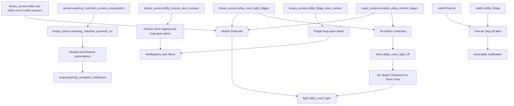
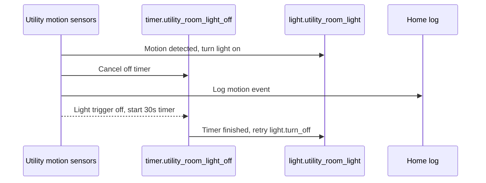

[<- Back to Rooms README](README.md) · [Packages README](../README.md) · [Main README](../../README.md)

# Utility Room Package Documentation

The utility room package manages motion lighting, fridge/freezer safety, and washing machine completion alerts. It turns the utility light on for movement, warns if cold-storage doors or plugs are unsafe, and tracks washing machine runtime from power consumption.

## Quick Summary

For non-technical users, the important behavior is:

| Area | What Happens |
|------|--------------|
| Motion lighting | Motion turns on `light.utility_room_light`; no motion starts a 30-second off timer. |
| Fridge/freezer doors | Long-open fridge and freezer doors send phone notifications and Alexa announcements at 4, 30, 45, and 60 minutes. |
| Fridge/freezer plugs | If a fridge or freezer smart plug stays off for 1 minute, Danny gets an actionable notification asking whether to turn it back on. |
| Washing machine | Power usage creates a running/not-running sensor, logs cycle starts, and sends smart completion notifications. |
| Runtime stats | Five history sensors track washing machine runtime over useful periods. |

## Package Contents

| File | Purpose | Contents |
|------|---------|----------|
| `utility.yaml` | Utility lighting, appliance safety, washing machine tracking | 11 automations, 1 script, 5 history sensors, 1 template binary sensor |

## How The Utility Room Decides What To Do

## User Controls

| Entity | Plain-English Purpose |
|--------|-----------------------|
| `input_boolean.enable_utility_motion_trigger` | Master switch for utility-room motion lighting and timer-off behavior. |
| `timer.utility_room_light_off` | 30-second countdown after the light trigger turns off. |

## Everyday Behavior

### Motion Lighting

| Automation | Trigger | Result |
|------------|---------|--------|
| `Utility Room: Motion Detected` | `binary_sensor.utility`, `binary_sensor.utility_room_motion_occupancy`, or `binary_sensor.utility_room_light_trigger` turns `on` | If motion lighting is enabled, logs, turns on `light.utility_room_light`, and cancels the timer. |
| `Utility Room: No Motion Detected` | `binary_sensor.utility_room_light_trigger` turns `off` | If motion lighting is enabled, starts `timer.utility_room_light_off` for 30 seconds. |
| `Utility Room: No Motion Detected For Short Time` | `timer.utility_room_light_off` finishes | If motion lighting is enabled, turns off `light.utility_room_light` using `retry.action` with 3 retries. |

### Fridge And Freezer Safety

| Automation | Trigger | Result |
|------------|---------|--------|
| `Utility: Freezer Door Open` | Freezer door changes from `off` to `on` | Logs that the freezer door is open. |
| `Utility: Freezer Door Closed` | Freezer door changes from `on` to `off` | Logs that the freezer door closed. |
| `Utility: Freezer Open For A Long Period Of Time` | Freezer door remains open for 4, 30, 45, or 60 minutes | Sends a direct notification and Alexa announcement. |
| `Utility: Fridge Open For A Long Period Of Time` | Fridge door remains open for 4, 30, 45, or 60 minutes | Sends a direct notification and Alexa announcement. |
| `Utility: Freezer Plug Turned Off` | `switch.freezer` is off for 1 minute | Logs and sends Danny an actionable notification with Yes/No buttons. |
| `Utility: Fridge Plug Turned Off` | `switch.utility_fridge` is off for 1 minute | Logs and sends Danny an actionable notification with Yes/No buttons. |

Power-user note: this YAML does not include fridge temperature or leak automations. Those should not be assumed from this package.

### Washing Machine

`binary_sensor.washing_machine_powered_on` is a template binary sensor based on `sensor.washing_machine_current_consumption`.

| Behavior | Detail |
|----------|--------|
| Template state | `on` when current consumption is above 9W; otherwise `off`. |
| Template triggers | Power above 2.4W for 45 seconds, power below 2.5W for 1 minute 45 seconds, and Home Assistant start. |
| Start automation | Logs when the binary sensor turns `on`. |
| Finish automation | Calls `script.washing_complete_notification` when the binary sensor changes from `on` to `off`. |

### Washing Completion Notifications

`script.washing_complete_notification` works differently depending on presence and time.

| Situation | Result |
|-----------|--------|
| `group.tracked_people` is `home` and time is between 09:00 and 22:00 | Sends a direct notification to the people currently home and makes an Alexa announcement with emoji removed. |
| Nobody home or outside 09:00-22:00 | Logs the message and adds it to `todo.danny_s_notifications`. |

## Sensors

| Sensor | Platform | Period |
|--------|----------|--------|
| `sensor.washing_machine_running_time_today` | `history_stats` | Midnight to now. |
| `sensor.washing_machine_running_time_last_24_hours` | `history_stats` | Rolling 24 hours. |
| `sensor.washing_machine_running_time_yesterday` | `history_stats` | Previous 24-hour day ending at midnight. |
| `sensor.washing_machine_running_time_this_week` | `history_stats` | Since Monday midnight. |
| `sensor.washing_machine_running_time_last_30_days` | `history_stats` | Rolling 30 days ending at midnight. |
| `binary_sensor.washing_machine_powered_on` | `template` | Washing machine running state from power draw. |

## Power-User Details

| Automation | ID | Mode | Notes |
|------------|----|------|-------|
| `Utility Room: Motion Detected` | `1741438466512` | `single` | Requires `input_boolean.enable_utility_motion_trigger`. |
| `Utility Room: No Motion Detected` | `1741438515603` | default | Starts a 30-second timer. |
| `Utility Room: No Motion Detected For Short Time` | `1741438515604` | `single` | Uses `retry.action` for light-off reliability. |
| `Utility: Freezer Door Open` | `1595678795894` | `single` | Logging only. |
| `Utility: Freezer Door Closed` | `1595678900777` | `single` | Logging only. |
| `Utility: Freezer Open For A Long Period Of Time` | `1595679010792` | `single` | Repeats at multiple open durations. |
| `Utility: Freezer Plug Turned Off` | `1657801925106` | `single` | Action name `switch_on_freezer`. |
| `Utility: Fridge Open For A Long Period Of Time` | `1595679010892` | `single` | Repeats at multiple open durations. |
| `Utility: Fridge Plug Turned Off` | `1737107000001` | `single` | Action name `switch_on_fridge`. |
| `Utility: Washing Machine Started` | `1595679010794` | `single` | Logs start. |
| `Utility: Washing Machine Finished` | `1595679010795` | `single` | Delegates notification behavior to the script. |

## Entity Reference

| Entity | Purpose |
|--------|---------|
| `binary_sensor.utility` | Utility-room motion trigger. |
| `binary_sensor.utility_room_motion_occupancy` | Additional motion trigger. |
| `binary_sensor.utility_room_light_trigger` | Light trigger used for motion-on and no-motion timer start. |
| `light.utility_room_light` | Main utility-room light. |
| `binary_sensor.utility_freezer_door_contact` | Freezer door contact. |
| `binary_sensor.utility_fridge_door_contact` | Fridge door contact. |
| `switch.freezer` | Freezer smart plug. |
| `switch.utility_fridge` | Fridge smart plug. |
| `sensor.washing_machine_current_consumption` | Washing machine power draw. |
| `binary_sensor.washing_machine_powered_on` | Derived washing machine running state. |
| `group.tracked_people` | Presence group used by washing completion script. |
| `todo.danny_s_notifications` | Todo list used when completion should not be announced. |

## Troubleshooting

| Issue | Check |
|-------|-------|
| Utility light does not respond | Check `input_boolean.enable_utility_motion_trigger` and the three motion/light-trigger sensors. |
| Light does not turn off | Check whether `timer.utility_room_light_off` finishes and whether `retry.action` is available. |
| Fridge/freezer long-open alerts missing | Check contact sensor states and confirm the door remained `on` long enough for a trigger point. |
| Plug-off action button does not turn appliance back on | Check the shared notification action handler for `switch_on_freezer` or `switch_on_fridge`. |
| Washing machine start/finish is wrong | Check `sensor.washing_machine_current_consumption` against the 9W template state threshold. |
