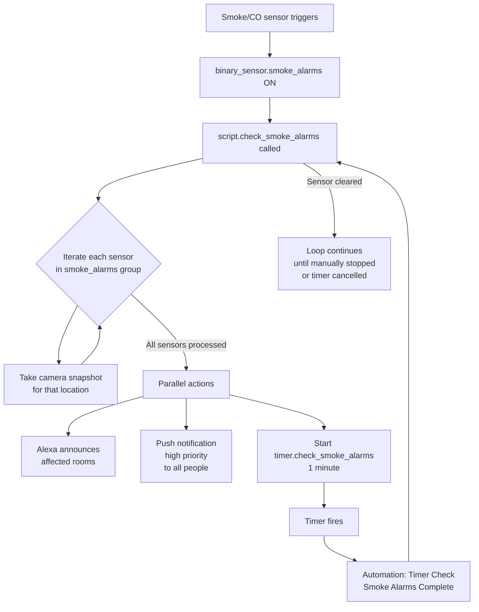

[<- Back to Packages README](README.md) · [Main README](../README.md)

# Smoke Alarms

*Last updated: 2026-04-05*

Central smoke and CO alarm coordination. This package complements the Nest Protect integration at `packages/integrations/smoke_alarm.yaml`, which handles the physical device integration. This package implements the response logic: capturing camera evidence, notifying occupants via Alexa and mobile push, and repeating alerts until the condition clears.

---

## Contents

- [Automations](#automations)
- [Scripts](#scripts)
- [Detection Flow](#detection-flow)
- [Camera Coverage](#camera-coverage)

---

## Automations

### `Timer: Check Smoke Alarms Complete`

| Property | Value |
|---|---|
| ID | `1757836826542` |
| Trigger | `timer.check_smoke_alarms` fires (`timer.start` event) |
| Condition | None |
| Action | Calls `script.check_smoke_alarms` |
| Mode | Single |

This automation forms the repeat loop: the script starts the timer, and when the timer fires this automation calls the script again, sustaining alerts for as long as `binary_sensor.smoke_alarms` (or any member sensor) is active.

---

## Scripts

### `script.check_smoke_alarms`

**Alias:** Check Smoke Alarms
**Mode:** `single`

The core response script. It iterates over every entity listed in `binary_sensor.smoke_alarms` and for each one:

1. Takes a timestamped camera snapshot regardless of whether that individual sensor is alarming (both the `then` and `else` branches capture snapshots, ensuring a complete picture is recorded).
2. Saves the image to a path constructed from `input_text.camera_external_folder_path` and a subdirectory matching the sensor location.
3. After iterating all sensors, runs the following **in parallel**:
   - Alexa announcement naming all active alarm areas (always plays, `suppress_if_quiet: false`).
   - Mobile push notification to all household members with high priority.
   - Starts `timer.check_smoke_alarms` for 1 minute — triggering the repeat loop via the automation above.

#### Camera Snapshot Mapping

| Smoke sensor | Camera | Subdirectory |
|---|---|---|
| `binary_sensor.kitchen_smoke_alarm_smoke` | `camera.kitchen_high_resolution_channel` | `kitchen/` |
| `binary_sensor.nest_protect_living_room_smoke_status` | `camera.living_room_high_resolution_channel` | `lounge/` |
| `binary_sensor.nest_protect_office_smoke_status` | `camera.office_high_resolution_channel` | `office/` |
| `binary_sensor.nest_protect_upstairs_smoke_status` | `camera.stairs_high_resolution_channel` | `stairs/` |

Snapshot filenames use the format `YYYY-MM-DD HH.MM.SS.jpg`.

---

## Detection Flow

> **Note:** The clear/cancel logic is present in the YAML as commented-out code. Currently the repeat loop runs indefinitely until `timer.check_smoke_alarms` is manually cancelled or the script is stopped.

---

## Dependencies

| Entity | Purpose |
|---|---|
| `binary_sensor.smoke_alarms` | Group sensor; `entity_id` attribute lists all member sensors |
| `timer.check_smoke_alarms` | 1-minute repeat timer |
| `input_text.camera_external_folder_path` | Root path for snapshot storage |
| `script.alexa_announce` | Household Alexa announcement |
| `script.send_direct_notification` | Mobile push to named people |
