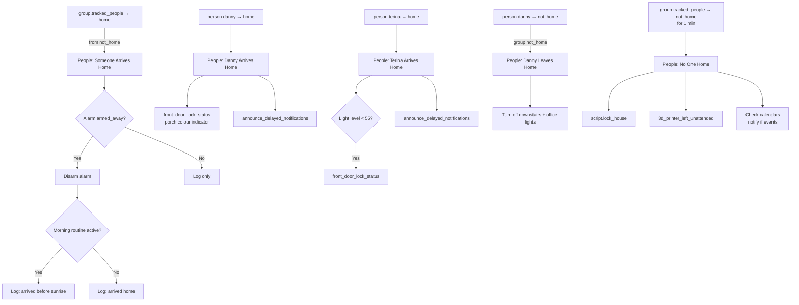
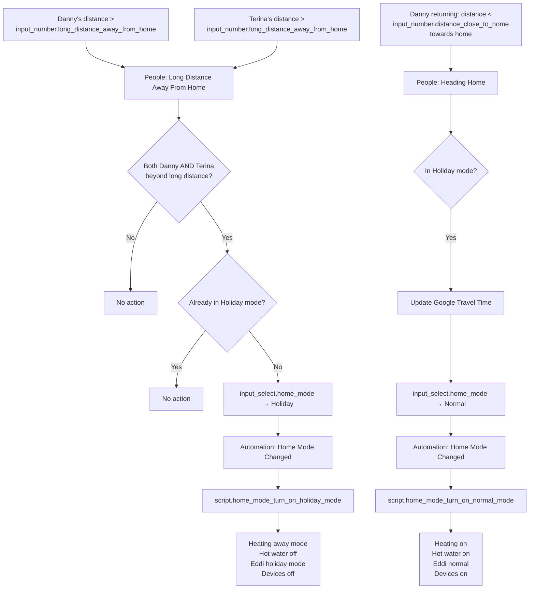

[<- Back to Packages README](../README.md) · [Main README](../../README.md)

# Tracker

*Last updated: 2026-04-06*

Presence detection, arrival and departure automation, adaptive music following, and device-tracking groups for every household member. This package coordinates everything that happens when people come and go — alarm management, lighting, holiday mode transitions, and per-person personalisation.

---

## Contents

- [Groups](#groups)
- [Automations](#automations)
  - [Arriving Home](#arriving-home)
  - [Leaving Home](#leaving-home)
  - [Per-Person: Danny](#per-person-danny)
  - [Per-Person: Terina](#per-person-terina)
  - [Per-Person: Leo and Children](#per-person-leo-and-children)
  - [Special Modes](#special-modes)
  - [Music Following](#music-following)
- [Scripts](#scripts)
- [Arrival and Departure Flow](#arrival-and-departure-flow)
- [Holiday Mode Entry Trigger](#holiday-mode-entry-trigger)

---

## Groups

| Group entity | Name | Members |
|---|---|---|
| `group.adult_people` | Adults | `person.danny`, `person.terina` |
| `group.all_adult_people` | AllAdults (all: true) | `person.danny`, `person.terina` |
| `group.all_tracked_people` | All Tracked People (all: true) | `person.danny`, `person.leo`, `person.terina` |
| `group.anyone` | Anyone Home | `person.danny`, `person.terina`, `person.leo`, `person.ashlee` |
| `group.children_people` | Children | `person.leo`, `person.ashlee` |
| `group.tracked_people` | Tracked People | `person.danny`, `person.leo`, `person.terina` |
| `group.dannys_work_computer` | Danny's Work Computers | `device_tracker.laptop_5h1t10r6`, `device_tracker.laptop_5h1t10r6_2` |
| `group.terinas_work_computer` | Terina's Work Computers | `device_tracker.lap_ctc1404` |
| `group.family_computer` | Family Computer | `device_tracker.doug` |
| `group.jd_computer` | JD Computer | `device_tracker.jd` |
| `group.sam_computer` | Sam Computer | `device_tracker.sam`, `device_tracker.sam_2` |
| `group.turk_computer` | Turk Computer | `device_tracker.turk` |

`all_adult_people` and `all_tracked_people` use `all: true`, meaning the group is only `home` when every member is home.

---

## Automations

### Arriving Home

#### `People: Someone Arrives Home`

| Property | Value |
|---|---|
| ID | `1588609147280` |
| Trigger | `group.tracked_people` changes from `not_home` to `home` |
| Conditions | Alarm is `armed_away`; `input_boolean.enable_home_presence_detection` is on |
| Mode | Single |

Disarms the alarm in parallel with a log entry. The log message distinguishes between a normal arrival and an arrival before sunrise (when `enable_morning_routine` is still `on`). Also checks if heating is off and re-enables it.

---

#### `People: Heading Home`

| Property | Value |
|---|---|
| ID | `1655063863297` |
| Trigger | Danny's or Terina's nearest distance drops below `input_number.distance_close_to_home` |
| Mode | Single |

When in Holiday mode and the person is travelling towards home:
1. Sets `input_text.origin_address` to the person's entity and `input_text.destination_address` to `zone.home`.
2. Forces a refresh of `sensor.google_travel_time_by_car`.
3. Logs estimated arrival time.
4. Switches `input_select.home_mode` to `Normal`.

When in Holiday mode but direction is not towards home: sends a direct notification to Danny with travel time (no mode change).

---

#### `People: Near Home`

| Property | Value |
|---|---|
| ID | `1680450183660` |
| Trigger | Danny's or Terina's nearest distance drops below `input_number.distance_almost_to_home` |
| Conditions | Person is travelling towards home; at least one of Danny/Terina is already home |
| Mode | Single |

Updates Google Travel Time sensor and notifies the person already at home with the arriving person's ETA.

---

### Leaving Home

#### `People: No One Home`

| Property | Value |
|---|---|
| ID | `1595524992207` |
| Trigger | `group.tracked_people` is `not_home` for **1 minute** |
| Conditions | Presence detection enabled; UDM Pro is not unavailable |
| Mode | (default) |

1. Calls `script.lock_house` and `script.3d_printer_left_unattended` in parallel.
2. Queries `calendar.tsang_children` and `calendar.family` for events in the next hour.
3. Sends a direct notification to Danny if a family calendar event is found with no location set.
4. Sends a direct notification to Danny if a children's calendar event is found.

---

#### `People: Long Distance Away From Home`

| Property | Value |
|---|---|
| ID | `1655063863296` |
| Trigger | Danny's or Terina's nearest distance exceeds `input_number.long_distance_away_from_home` |
| Mode | Queued (max 10) |

If **both** Danny and Terina are beyond the long-distance threshold and home mode is not already `Holiday`, switches `input_select.home_mode` to `Holiday` and logs the change.

---

### Per-Person: Danny

#### `People: Danny Arriving Home`

| Property | Value |
|---|---|
| ID | `1674735382445` |
| Trigger | Danny's nearest distance drops below `input_number.arriving_home_threshold` |
| Conditions | Alarm automations enabled; alarm is `armed_home`; Danny is travelling towards home |
| Mode | Single |

Disarms the alarm in parallel with a log entry. This covers the scenario where Danny is arriving while the alarm is in night/home mode.

---

#### `People: Danny Arrives Home`

| Property | Value |
|---|---|
| ID | `1581867286886` |
| Trigger | `person.danny` changes from `not_home` to `home` |
| Condition | Presence detection enabled |
| Mode | Single |

In parallel:
- If living room lamps are off, calls `script.front_door_lock_status` (porch colour indicator).
- Logs arrival.
- Calls `script.announce_delayed_notifications` for Danny.

---

#### `People: Danny Leaves Home`

| Property | Value |
|---|---|
| ID | `1582456019025` |
| Trigger | `person.danny` changes from `home` to `not_home` |
| Condition | `group.tracked_people` is `not_home` (Danny is last to leave) |

Turns on `scene.turn_off_downstairs_lights` and `scene.office_all_lights_off` in parallel with a log entry.

---

### Per-Person: Terina

#### `People: Terina Arriving Home`

| Property | Value |
|---|---|
| ID | `1674735382446` |
| Trigger | Terina's nearest distance drops below `input_number.arriving_home_threshold` |
| Conditions | Alarm automations enabled; alarm is `armed_home`; `sensor.terina_home_nearest_direction_of_travel` is `towards` |
| Mode | Single |

Disarms the alarm in parallel with a log entry.

---

#### `People: Terina Arrives Home`

| Property | Value |
|---|---|
| ID | `1582754128581` |
| Trigger | `person.terina` changes from `not_home` to `home` |
| Condition | `sensor.apollo_r_pro_1_w_ef755c_ltr390_light` below 55 (dark outside) |

In parallel:
- If living room lamps are off, calls `script.front_door_lock_status`.
- Logs arrival.
- Calls `script.announce_delayed_notifications` for Terina.

---

#### `People: Terina Leaves Home`

| Property | Value |
|---|---|
| ID | `1582456025977` |
| Trigger | `person.terina` changes from `home` to `not_home` |
| Condition | `group.tracked_people` is `not_home` (Terina is last to leave) |

Activates `scene.turn_off_downstairs_lights` and `scene.office_all_lights_off`, logs departure.

---

### Per-Person: Leo and Children

#### `People: Leo Arrives Home`

| Property | Value |
|---|---|
| ID | `1674735382447` |
| Trigger | `person.leo` changes from `not_home` to `home` |
| Conditions | Alarm automations enabled; alarm is `armed_home` |
| Mode | Single |

Disarms the alarm in parallel with a log entry. Covers the scenario where Leo arrives while the alarm is in overnight/home mode.

---

#### `People: Leo Leaves Home`

| Property | Value |
|---|---|
| ID | `1582456025978` |
| Trigger | `person.leo` changes from `home` to `not_home` |
| Condition | `group.tracked_people` is `not_home` (Leo is last to leave) |

Activates `scene.turn_off_downstairs_lights` and `scene.office_all_lights_off`, logs departure.

---

#### `People: Ashlee Leaves Home`

| Property | Value |
|---|---|
| ID | `1674735382448` |
| Trigger | `person.ashlee` changes from `home` to `not_home` |
| Condition | `group.tracked_people` is `not_home` (adults already away) |

Logs Ashlee's departure when no tracked adults remain at home.

---

### Special Modes

#### `People: Children Home And In No Children Mode`

| Property | Value |
|---|---|
| ID | `1712574983598` |
| Trigger | `device_tracker.leos_nintendo_switch` transitions to `home` |
| Mode | Single |

If home mode is `No Children`, switches `input_select.home_mode` to `Normal` and logs the change. Leo's Nintendo Switch arriving on the network is used as a proxy for Leo returning home.

---

### Music Following

#### `People: Music Follow Danny`

| Property | Value |
|---|---|
| ID | `1722162099476` |
| Trigger | `sensor.dannys_phone_ble_area` changes to any value other than `unknown` |
| Condition | `media_player.spotify_danny` is `playing` |
| Mode | Single |

Reads Danny's current BLE area and maps it to a Spotify Connect source:

| BLE area | Spotify source |
|---|---|
| `office` (JD computer home) | `JD` |
| `office` (JD computer away) | `Office Echo Show` |
| `living room` | `DO NOT CAST` (no transfer) |
| Any other | Area name as-is |

If the resolved source differs from the current Spotify source and exists in the source list, transfers Spotify playback to that source.

---

## Scripts

### `script.everybody_leave_home`

**Alias:** Everybody Leave Home
**Mode:** `single`

Logs that everyone has left, then calls `script.turn_everything_off`.

---

### `script.front_door_lock_status`

**Alias:** Front Door Lock Status
**Mode:** `single`

Sets the porch light colour to reflect the front door lock state:

| Lock state | Porch light scene |
|---|---|
| `locked` | `scene.porch_red_light` |
| `unlocked` | `scene.porch_light_green` |
| `locking` or `unlocking` | `scene.porch_blue_light` |

---

### `script.check_terinas_work_laptop_status`

**Alias:** Check If Terina's Work Laptop Status
**Icon:** `mdi:laptop`
**Mode:** `single`

Checks `group.terinas_work_computer`:
- If `home` → calls `script.terinas_work_laptop_turned_on`
- Otherwise → calls `script.terinas_work_laptop_turned_off`

---

### `script.terinas_work_laptop_turned_off`

**Alias:** People Terina's Work Laptop Turned Off
**Icon:** `mdi:laptop-off`
**Mode:** `single`

When Terina's laptop is not on the network (she is not working from home), the living room motion light thresholds are raised so lights trigger more readily in lower light:

| Entity | Value set |
|---|---|
| `input_number.living_room_light_level_2_threshold` | `30` |
| `input_number.living_room_light_level_4_threshold` | `25` |

---

### `script.terinas_work_laptop_turned_on`

**Alias:** People Terina's Work Laptop Turned On
**Icon:** `mdi:laptop`
**Mode:** `single`

When Terina is working from home (laptop on network), the living room motion light thresholds are lowered so lights only trigger in significantly darker conditions (avoids lights coming on during a video call):

| Entity | Value set |
|---|---|
| `input_number.living_room_light_level_2_threshold` | `81` |
| `input_number.living_room_light_level_4_threshold` | `65` |

---

### `script.get_peope_in_group_by_status`

**Alias:** Get people in group by state
**Icon:** `mdi:account-multiple`
**Mode:** `single`

Utility script that returns a dictionary of people in a group matching a given status. Result format is `id:entity_id` (e.g. `danny:person.danny`). Used as a response-variable script by other scripts that need to enumerate home/away people.

| Field | Required | Description |
|---|---|---|
| `group_id` | Yes | Group entity to check (domain: group) |
| `status` | Yes | State to match (e.g. `home`) |

---

## Arrival and Departure Flow

---

## Holiday Mode Entry Trigger

---

## Dependencies

| Entity | Purpose |
|---|---|
| `group.tracked_people` | Primary presence group; triggers arrive/leave automations |
| `input_boolean.enable_home_presence_detection` | Guards most presence automations |
| `input_boolean.enable_alarm_automations` | Guards alarm disarm on arrival |
| `alarm_control_panel.house_alarm` | Alarm state read and modified on arrival |
| `input_select.home_mode` | Home mode; set to Holiday/Normal by this package |
| `sensor.danny_home_nearest_distance` | Danny's GPS distance from home |
| `sensor.terina_home_nearest_distance` | Terina's GPS distance from home |
| `sensor.danny_home_nearest_direction_of_travel` | Danny's travel direction |
| `sensor.terina_home_nearest_direction_of_travel` | Terina's travel direction |
| `input_number.distance_close_to_home` | Distance threshold for "heading home" |
| `input_number.distance_almost_to_home` | Distance threshold for "near home" |
| `input_number.long_distance_away_from_home` | Distance threshold for holiday mode trigger |
| `input_number.arriving_home_threshold` | Very close distance for alarm pre-disarm |
| `sensor.dannys_phone_ble_area` | BLE room detection for music following |
| `media_player.spotify_danny` | Spotify player for music following |
| `device_tracker.leos_nintendo_switch` | Proxy for Leo's arrival (No Children mode exit) |
| `sensor.google_travel_time_by_car` | ETA sensor refreshed when heading home |
| `input_text.origin_address` / `input_text.destination_address` | Travel time sensor inputs |
| `calendar.tsang_children` / `calendar.family` | Checked when no one is home |
| `lock.front_door` | Lock state for porch colour indicator |
| `group.terinas_work_computer` | Terina's laptop presence |
| `input_number.living_room_light_level_2_threshold` | Adjusted by laptop status |
| `input_number.living_room_light_level_4_threshold` | Adjusted by laptop status |
| `script.lock_house` | Called when no one is home |
| `script.turn_everything_off` | Called by everybody_leave_home |
| `script.set_alarm_to_disarmed_mode` | Disarms alarm on arrival |
| `script.announce_delayed_notifications` | Delivers queued notifications on arrival |
| `script.send_to_home_log` | Home log writer |
| `script.send_direct_notification` | Direct push to named people |
